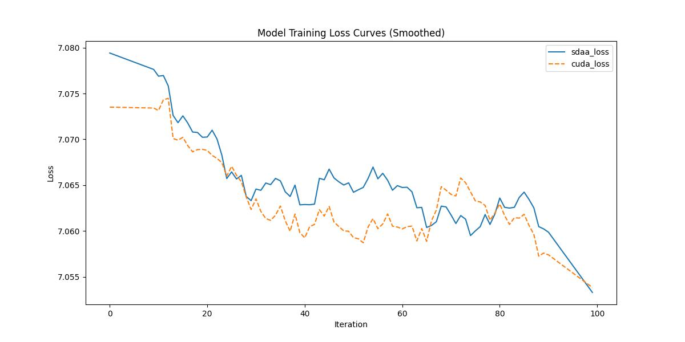

###  SE-ResNet-34

**1.模型概述** 

SE-ResNet-34 是一种结合了 Squeeze-and-Excitation（SE）模块的 ResNet-34 模型。ResNet-34 是一种经典的卷积神经网络（CNN），由 Microsoft Research 团队在 2015 年提出。SE-ResNet-34 在 ResNet-34 的基础上引入了 SE 模块，通过通道注意力机制进一步提升了模型的性能。官网参考：[https://github.com/gregtyminski/pytorch-image-models](https://github.com/gregtyminski/pytorch-image-models "pytorch-image-models")。

**2.快速开始**

使用本模型执行训练的主要流程如下：

基础环境安装：介绍训练前需要完成的基础环境检查和安装。

获取数据集：介绍如何获取训练所需的数据集。

启动训练：介绍如何运行训练。

**2.1 基础环境安装**

注意激活自身环境
（注意克隆torch.sdaa库）

**2.2 获取数据集**

imagenet数据集可以在官网进行下载；共享存储路径：/mnt/dataset/imagenet

**2.3 启动训练**

运行脚本在当前文件下，该模型在可以支持4卡分布式训练

1.安装依赖

    pip install -r requirements.txt

2.运行指令

**单机单卡**

    ./distributed_train.sh 4 /mnt_qne00/dataset/imagenet --model seresnet34 --sched cosine --epochs 150 --warmup-epochs 5 --lr 0.4 --reprob 0.5 --remode pixel --batch-size 256 --log-interval 1 -j 4

**2.4 训练结果**

100step的loss对齐图

