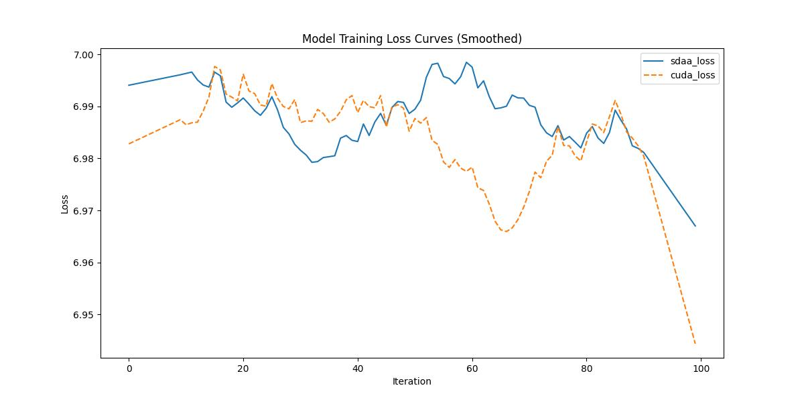

###  SENET154

**1.模型概述** 

SENet154 是一种深度卷积神经网络，属于 Squeeze-and-Excitation Networks（SENet）系列。SENet 通过引入通道注意力机制（Squeeze-and-Excitation，SE）来增强特征表示，从而提高模型的性能。官网参考：[https://github.com/gregtyminski/pytorch-image-models](https://github.com/gregtyminski/pytorch-image-models "pytorch-image-models")。

**2.快速开始**

使用本模型执行训练的主要流程如下：

基础环境安装：介绍训练前需要完成的基础环境检查和安装。

获取数据集：介绍如何获取训练所需的数据集。

启动训练：介绍如何运行训练。

**2.1 基础环境安装**

注意激活自身环境
（注意克隆torch.sdaa库）

**2.2 获取数据集**

imagenet数据集可以在官网进行下载；共享存储路径：/mnt/dataset/imagenet

**2.3 启动训练**

运行脚本在当前文件下，该模型在可以支持4卡分布式训练

1.安装依赖

    pip install -r requirements.txt

2.运行指令

**单机单卡**

    ./distributed_train.sh 4 /mnt_qne00/dataset/imagenet --model senet154  --epochs 150 --warmup-epochs 5 --lr 0.4 --reprob 0.5 --remode pixel --log-interval 1 -j 4

**2.4 训练结果**

100step的loss对齐图

