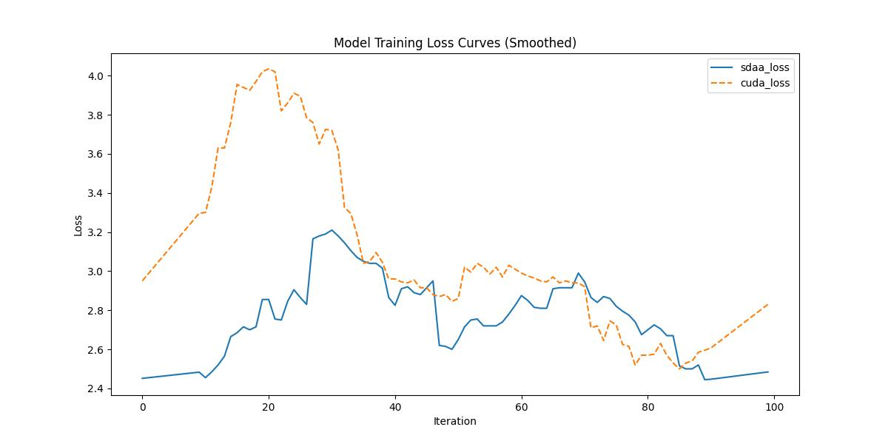

###  DAMO-YOLO

**1.模型概述** 

DAMO-YOLO是由阿里巴巴达摩院智能计算实验室TinyML团队开发的一个兼顾速度与精度的目标检测框架,其效果超越了目前的一众YOLO系列方法，在实现SOTA的同时，保持了很高的推理速度。DAMO-YOLO是在YOLO框架基础上引入了一系列新技术，对整个检测框架进行了大幅的修改。具体包括：基于NAS搜索的高效检测骨干网络，更深的多尺度特征融合检测颈部，精简的检测头结构，以及引入蒸馏技术实现效果的进一步提升，官网参考：[https://github.com/tinyvision/DAMO-YOLO](https://github.com/tinyvision/DAMO-YOLO "DAMO-YOLO")。

**2.快速开始**

使用本模型执行训练的主要流程如下：

基础环境安装：介绍训练前需要完成的基础环境检查和安装。

获取数据集：介绍如何获取训练所需的数据集。

启动训练：介绍如何运行训练。

**2.1 基础环境安装**

注意激活自身环境
（注意克隆torch.sdaa库）

**2.2 获取数据集**

COCO数据集可以在官网进行下载；共享存储路径：/mnt/dataset/coco.tar 

**2.3 启动训练**

运行脚本在当前文件下，该模型在可以支持4卡分布式训练

1.安装依赖

    pip install -r requirements.txt

2.运行指令

注意将数据集放入datasets/coco

**单机单卡**

    python -m torch.distributed.launch --nproc_per_node=4  tools/train.py -f configs/damoyolo_tinynasL25_S.py > damoyolo_tinynasL25_S.log 2>&1 &

**2.4 训练结果**

100step的loss对齐图
