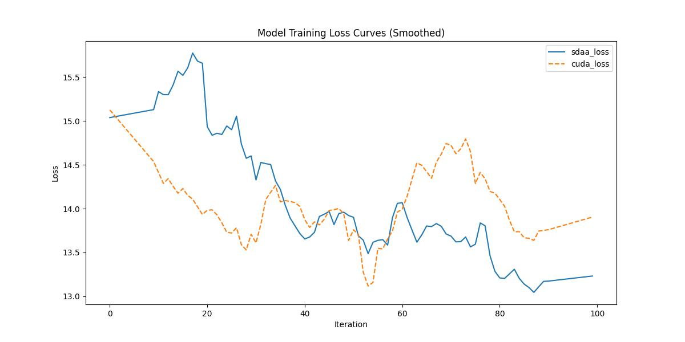

###  YOLOv1

**1.模型概述** 

实时通用目标检测(Real-time General Object Detection)在尝试基于YOLO的核心理念来构建我们的实时通用目标检测代码库。我们复现了绝大部分的YOLO系列。另外，我们还写了一本YOLO的入门教程，我们希望通过学习YOLO这一十分受欢迎的通用目标检测框架可以让初学者掌握研究通用目标检测所必须的基础知识。官网参考：[https://github.com/yjh0410/RT-ODLab/](https://github.com/yjh0410/RT-ODLab/ "RT-ODLab")。

**2.快速开始**

使用本模型执行训练的主要流程如下：

基础环境安装：介绍训练前需要完成的基础环境检查和安装。

获取数据集：介绍如何获取训练所需的数据集。

启动训练：介绍如何运行训练。

**2.1 基础环境安装**

注意激活自身环境
（注意克隆torch.sdaa库）

**2.2 获取数据集**

COCO数据集可以在官网进行下载；共享存储路径：/mnt/dataset/coco.tar 


**2.3 启动训练**

运行脚本在当前文件下，该模型在可以支持4卡分布式训练

1.安装依赖

    pip install -r requirements.txt

2.运行指令

- 下载 COCO.
```Shell
cd dataset/scripts/
sh COCO2017.sh
```

- 清洗COCO
```Shell
cd tools/
python clean_coco.py --root path/to/coco --image_set val
python clean_coco.py --root path/to/coco --image_set train
```

- 检查 COCO
```Shell
python dataset/coco.py
```

**单机单卡**

    python train.py --cuda -d coco --root ./dataset -m yolov1 -bs 4 --max_epoch 1 --wp_epoch 1 --eval_epoch 10 --fp16 --ema --multi_scale > yolov1.log 2>&1 &

**2.4 训练结果**

100step的loss对齐图

