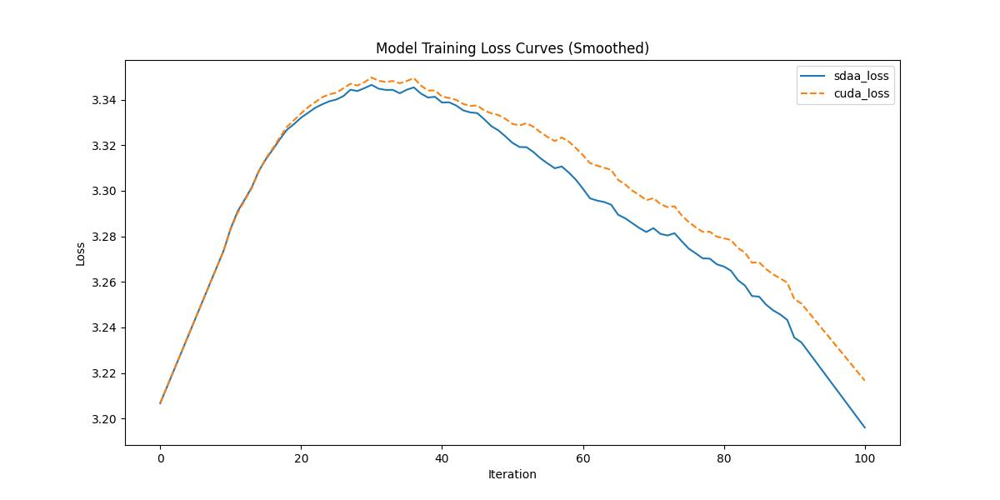

###  YOLOv6

**1.模型概述** 

YOLOv6 是一款面向工业应用研发的目标检测框架，致力于提供极致的检测精度和推理效率。其包括丰富的目标检测算法以及相关的组件模块，官网参考：[https://github.com/meituan/YOLOv6](https://github.com/meituan/YOLOv6 "YOLOv6")。

**2.快速开始**

使用本模型执行训练的主要流程如下：

基础环境安装：介绍训练前需要完成的基础环境检查和安装。

获取数据集：介绍如何获取训练所需的数据集。

启动训练：介绍如何运行训练。

**2.1 基础环境安装**

注意激活自身环境
（注意克隆torch.sdaa库）

**2.2 获取数据集**

COCO数据集可以在官网进行下载；共享存储路径：/mnt/dataset/coco.tar 

**2.3 启动训练**

运行脚本在当前文件下，该模型在可以支持4卡分布式训练

1.安装依赖

    pip install -r requirements.txt

2.运行指令

注意修改data/coco.yaml的coco数据集路径，修改为自己本地的数据集路径

**单机单卡**

    python -m torch.distributed.launch --nproc_per_node 4 tools/train.py --batch 128 --img-size 416 --conf configs/yolov6_lite/yolov6_lite_s.py --data data/coco.yaml --epoch 2 --device 0,1,2,3 --name yolov6_lite_s_coco > yolov6_lite_s.log 2>&1 &

**2.4 训练结果**

100step的loss对齐图

