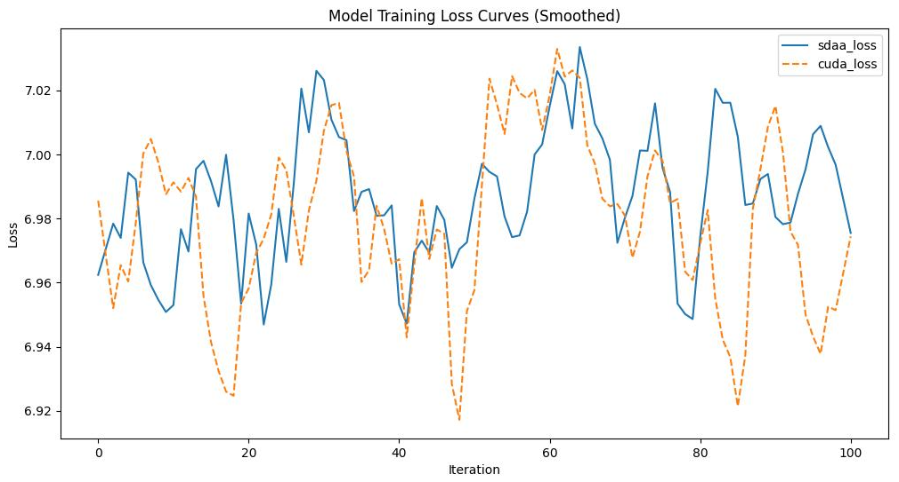

# Deit
## 1. 模型概述
CaiT (Class-Attention in Image Transformers) 是由Facebook AI Research于2021年提出的一种改进型视觉Transformer模型，专注于提升Transformer在图像分类任务中的训练稳定性和精度表现。通过引入类注意力机制（Class-Attention）与分层的训练深度策略（LayerScale 和 Talking-Heads Attention），CaiT能够有效地训练更深层的Transformer架构，在无需卷积结构的情况下实现与CNN竞争的性能表现。

- 论文链接：[[2103.17239\] Going deeper with Image Transformers](https://arxiv.org/abs/2103.17239)
- 仓库链接：[facebookresearch/deit: Official DeiT repository](https://github.com/facebookresearch/deit)

## 2. 快速开始
使用本模型执行训练的主要流程如下：
1. 基础环境安装：介绍训练前需要完成的基础环境检查和安装。
2. 获取数据集：介绍如何获取训练所需的数据集。
3. 构建环境：介绍如何构建模型运行所需要的环境
4. 启动训练：介绍如何运行训练。

### 2.1 基础环境安装

请参考基础环境安装章节，完成训练前的基础环境检查和安装。

### 2.2 准备数据集
#### 2.2.1 获取数据集
Deit 使用 ImageNet 数据集，该数据集为开源数据集，可从 [ImageNet](https://image-net.org/) 下载

#### 2.2.2 处理数据集
具体配置方式可参考：https://blog.csdn.net/xzxg001/article/details/142465729


### 2.3 构建环境

所使用的环境下已经包含PyTorch框架虚拟环境
1. 执行以下命令，启动虚拟环境。
    ```
    conda activate torch_env
    ```

>  当前提供给生态用户的环境已经包含paddle和torch框架，启动即可以使用。
2. 安装python依赖
    ```
    pip install -r requirements.txt
    ```
> 请不要再requirements.txt中添加paddle和torch，添加其他x86上的依赖即可。
3. 添加环境变量

```
export TORCH_SDAA_AUTOLOAD=cuda_migrate
export LD_LIBRARY_PATH=/root/miniconda3/envs/deit/lib/python3.10/site-packages/torch_sdaa/lib:$LD_LIBRARY_PATH
export USER=your_user_name
```

### 2.4 启动训练

1. 在构建好的环境中，进入训练脚本所在目录。
    ```
    cd <ModelZoo_path>/PyTorch/contrib/Classification/Cait/run_scripts
    ```

2. 运行训练。该模型支持单机单卡，或多机多卡训练

    ```
    python run_demo.py \
      --model cait_S24_224 \
      --data-path /data/teco-data/imagenet \
      --device sdaa\
      --epochs 100\
      --ngpus 1 \
      --nodes 1
   ```
    更多训练参数参考 run_scripts/argument.py 和 run_scripts/argument0.py

### 2.5 训练结果
输出训练loss曲线及结果（参考使用[loss.py](./run_scripts/loss.py)）: 



MeanRelativeError: 0.001251484563571443

MeanAbsoluteError: 0.008302797185312403

Rule,mean_relative_error 0.001251484563571443

pass mean_relative_error=0.001251484563571443 <= 0.05 or mean_absolute_error=0.008302797185312403 <= 0.0002