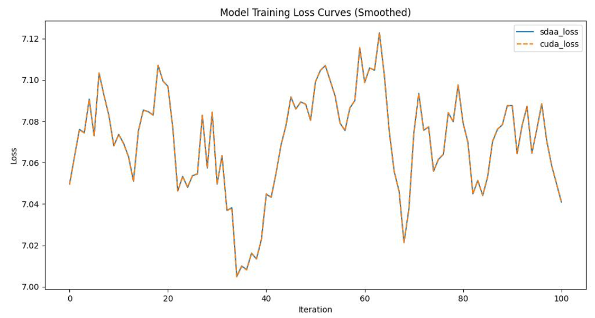

# DeiT-III
## 1. 模型概述
DeiT-III（Data-efficient image Transformers III）是由Meta AI于2023年提出的最新一代视觉Transformer模型，旨在进一步提升模型在中等规模数据集上的训练效率和性能。DeiT-III摒弃了原始蒸馏过程，转而采用纯监督训练，并通过改进的训练策略、增强的数据处理流程和更优的架构初始化方法，实现了在不引入额外教师模型的前提下，显著提升模型精度和收敛速度。该模型展示了ViT架构在数据受限环境中的持续潜力与扩展性。

- 论文链接：[[2204.07118\] DeiT III: Revenge of the ViT](https://arxiv.org/abs/2204.07118)
- 仓库链接：[facebookresearch/deit: Official DeiT repository](https://github.com/facebookresearch/deit)

## 2. 快速开始
使用本模型执行训练的主要流程如下：
1. 基础环境安装：介绍训练前需要完成的基础环境检查和安装。
2. 获取数据集：介绍如何获取训练所需的数据集。
3. 构建环境：介绍如何构建模型运行所需要的环境。
4. 启动训练：介绍如何运行训练。

### 2.1 基础环境安装

请参考基础环境安装章节，完成训练前的基础环境检查和安装。

### 2.2 准备数据集
#### 2.2.1 获取数据集
Deit 使用 ImageNet 数据集，该数据集为开源数据集，可从 [ImageNet](https://image-net.org/) 下载。

#### 2.2.2 处理数据集
具体配置方式可参考：https://blog.csdn.net/xzxg001/article/details/142465729。


### 2.3 构建环境

所使用的环境下已经包含PyTorch框架虚拟环境。
1. 执行以下命令，启动虚拟环境。
    ```
    conda activate torch_env
    ```
2. 安装python依赖。
    ```
    pip install -r requirements.txt
    pip install -e .
    ```
3. 添加环境变量。

```
export TORCH_SDAA_AUTOLOAD=cuda_migrate
```

### 2.4 启动训练

1. 在构建好的环境中，进入训练脚本所在目录。
    ```
    cd <ModelZoo_path>/PyTorch/contrib/Classification/Deit-III/run_scripts
    ```

2. 运行训练。该模型支持单机单卡训练。

    ```
    python run_deit_III.py \
     --model deit_base_patch16_LS \
     --data-path /data/teco-data/imagenet \
     --device sdaa \
     --epochs 100
   ```
    更多训练参数参考 run_scripts/argument.py

### 2.5 训练结果
输出训练loss曲线及结果（参考使用[loss.py](./run_scripts/loss.py)）: 



MeanRelativeError: 1.998963584510742e-06

MeanAbsoluteError: 1.4116268346805383e-05

Rule,mean_relative_error 1.998963584510742e-06

pass mean_relative_error=1.998963584510742e-06 <= 0.05 or mean_absolute_error=1.4116268346805383e-05 <= 0.0002