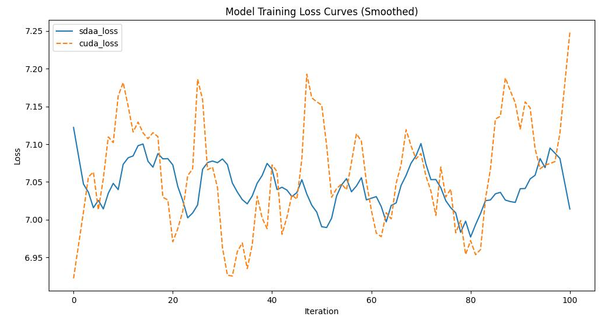

# Deit
## 1. 模型概述
DeiT(Data-efficient image Transformers)是由Facebook AI Research于2021年提出的视觉Transformer模型，用于图片分类，专注于解决ViT对大规模数据的依赖问题。通过引入蒸馏令牌、注意力蒸馏和强数据增强技术，DeiT能在较小数据集上高效训练。

- 论文链接：[[2012.12877\] Training data-efficient image transformers & distillation through attention](https://arxiv.org/abs/2012.12877)
- 仓库链接：[facebookresearch/deit: Official DeiT repository](https://github.com/facebookresearch/deit)

## 2. 快速开始
使用本模型执行训练的主要流程如下：
1. 基础环境安装：介绍训练前需要完成的基础环境检查和安装。
2. 获取数据集：介绍如何获取训练所需的数据集。
3. 构建环境：介绍如何构建模型运行所需要的环境
4. 启动训练：介绍如何运行训练。

### 2.1 基础环境安装

请参考基础环境安装章节，完成训练前的基础环境检查和安装。

### 2.2 准备数据集
#### 2.2.1 获取数据集
Deit 使用 ImageNet 数据集，该数据集为开源数据集，可从 [ImageNet](https://image-net.org/) 下载。

#### 2.2.2 处理数据集
具体配置方式可参考：https://blog.csdn.net/xzxg001/article/details/142465729。


### 2.3 构建环境

所使用的环境下已经包含PyTorch框架虚拟环境。
1. 执行以下命令，启动虚拟环境。
    ```
    conda activate torch_env
    ```
2. 安装python依赖。
    ```
    pip install -r requirements.txt
    pip install -e .
    ```
3. 添加环境变量。

```
export TORCH_SDAA_AUTOLOAD=cuda_migrate
```

### 2.4 启动训练

1. 在构建好的环境中，进入训练脚本所在目录。
    ```
    cd <ModelZoo_path>/PyTorch/contrib/Classification/Deit/run_scripts
    ```

2. 运行训练。该模型支持单机单卡。

    ```
    python run_demo.py \
     --model deit_base_patch16_224 \
     --data-path /data/teco-data/imagenet \
     --device sdaa\
     --epochs 100\
     --ngpus 1 \
     --nodes 1
   ```
    更多训练参数参考 run_scripts/argument.py 和 run_scripts/argument0.py

### 2.5 训练结果
输出训练loss曲线及结果（参考使用[loss.py](./run_scripts/loss.py)）: 



MeanRelativeError: -0.0018020912200352789

MeanAbsoluteError: -0.016037284737766378

Rule,mean_absolute_error -0.016037284737766378

pass mean_relative_error=-0.0018020912200352789 <= 0.05 or mean_absolute_error=-0.016037284737766378 <= 0.0002