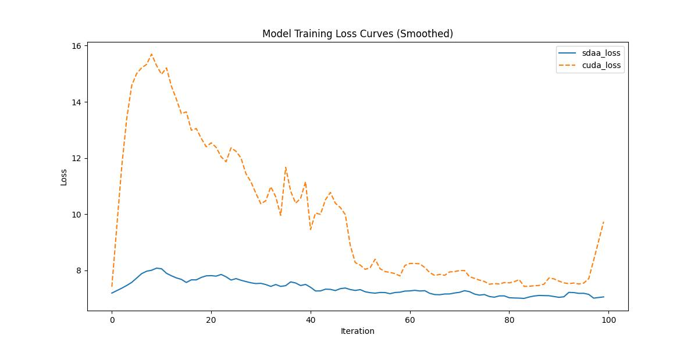

# ResNeSt
## 1. 模型概述
ResNeSt 是一种基于 ResNet 的改进深度学习模型，通过引入 Split-Attention 模块和特征分组策略，增强了图像分类任务的性能，同时保持高效的计算复杂度。它由 UC San Diego 和 Amazon 团队于 2020 年提出。
- 论文链接：[Revisiting ResNets: Improved Training and Scaling Strategies](https://arxiv.org/abs/2103.07579)
- 仓库链接：[nachiket273/pytorch_resnet_rs](https://github.com/zhanghang1989/ResNeSt)

## 2. 快速开始
使用本模型执行训练的主要流程如下：
1. 基础环境安装：介绍训练前需要完成的基础环境检查和安装。
2. 获取数据集：介绍如何获取训练所需的数据集。
3. 构建环境：介绍如何构建模型运行所需要的环境。
4. 启动训练：介绍如何运行训练。

### 2.1 基础环境安装

请参考基础环境安装章节，完成训练前的基础环境检查和安装。

### 2.2 准备数据集
#### 2.2.1 获取数据集
ResNeSt 使用 ImageNet 数据集，该数据集为开源数据集，可从 [ImageNet](https://image-net.org/) 下载

#### 2.2.2 处理数据集
具体配置方式可参考：https://blog.csdn.net/xzxg001/article/details/142465729


### 2.3 构建环境
所使用的环境下已经包含 PyTorch 框架虚拟环境。
1. 执行以下命令，启动虚拟环境。 
```
conda activate torch_env
```

2. 安装python依赖
```
pip install -r requirements.txt
```

### 2.4 启动训练
1. 在构建好的环境中，进入训练脚本所在目录。
```
cd <ModelZoo_path>/PyTorch/contrib/Classification/ResNeSt/run_scripts
```
2. 运行训练. 该模型支持单机单卡。
```shell
python run_resnest.py \
--dataset_path /data/teco-data/imagenet \
--batch_size 32 \
--epochs 1 \
--lr 0.01 \
--amp \
--save_path ../checkpoints \
--max_step 100
--device sdaa
```
更多训练参数参考 run_scripts/argument.py

### 2.5 训练结果
输出训练 loss 曲线及结果（参考使用[loss.py](./run_scripts/loss.py)）：



```text
MeanRelativeError: -0.20796918147870638
MeanAbsoluteError: -2.525646529197693
Rule,mean_absolute_error -2.525646529197693
pass mean_relative_error=-0.20796918147870638 <= 0.05 or mean_absolute_error=-2.525646529197693 <= 0.0002
```
