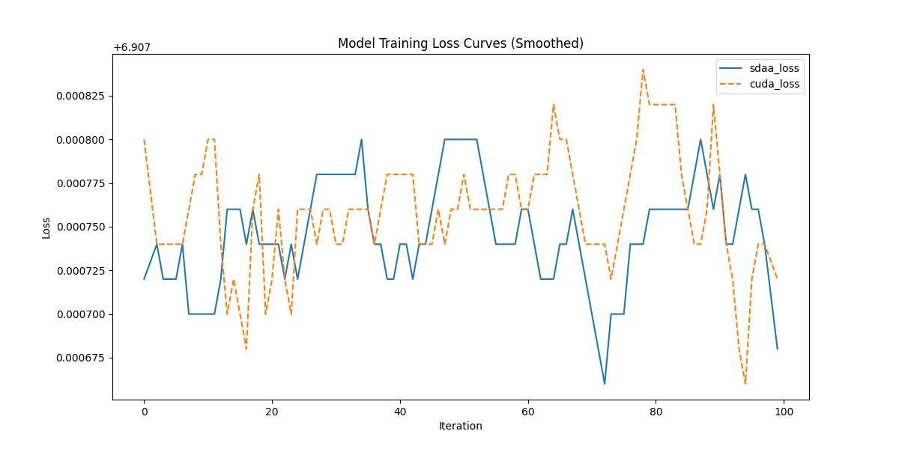

# ResNeXt
## 1. 模型概述
ResNeXt50_32x4d 是 ResNeXt 系列中的一种高性能卷积神经网络模型, 由Facebook AI Research (FAIR) 团队在2017年提出.

- 论文链接: [Aggregated Residual Transformations for Deep Neural Networks](https://arxiv.org/abs/1611.05431)
- 仓库链接: [huggingface pytorch-image-models](https://github.com/huggingface/pytorch-image-models)

## 2. 快速开始
使用本模型执行训练的主要流程如下: 
1. 基础环境安装: 介绍训练前需要完成的基础环境检查和安装. 
2. 获取数据集: 介绍如何获取训练所需的数据集. 
3. 构建环境: 介绍如何构建模型运行所需要的环境.
4. 启动训练: 介绍如何运行训练. 

### 2.1 基础环境安装

请参考基础环境安装章节，完成训练前的基础环境检查和安装. 

### 2.2 准备数据集
#### 2.2.1 获取数据集
Deit 使用 ImageNet 数据集，该数据集为开源数据集，可从 [ImageNet](https://image-net.org/) 下载

#### 2.2.2 处理数据集
具体配置方式可参考: https://blog.csdn.net/xzxg001/article/details/142465729


### 2.3 构建环境

所使用的环境下已经包含 PyTorch 框架虚拟环境
1. 执行以下命令，启动虚拟环境. 
```
conda activate torch_env
```
>  当前提供给生态用户的环境已经包含 paddle 和 torch 框架，启动即可以使用. 
2. 安装python依赖
```
pip install -r requirements.txt
```
> 请不要再 requirements.txt 中添加 paddle 和 torch, 添加其他 x86 上的依赖即可. 

### 2.4 启动训练
1. 在构建好的环境中，进入训练脚本所在目录. 
```
cd <ModelZoo_path>/PyTorch/contrib/Classification/ResNeXt50_32x4d/run_scripts
```
2. 运行训练. 该模型支持单机单卡, 或多机多卡训练
```shell
python run_resnext50_32_4d.py \
--dataset_path /data/teco-data/imagenet \
--batch_size 32 \
--epochs 1 \
--lr 0.01 \
--amp \
--save_path ../checkpoints \
--max_step 100
--device sdaa
```
或者使用:
```shell
# 使用 cuad 进行训练
python ../train.py \
    --dataset_path /root/data/imagenet \
    --batch_size 16 \
    --epochs 1 \
    --lr 0.01 \
    --amp \
    --save_path ../checkpoints \
    --max_step 100 \
    --device cuda

# 使用 sdaa 设备进行训练
python ../train.py \
    --dataset_path /data/teco-data/imagenet \
    --batch_size 32 \
    --epochs 1 \
    --lr 0.01 \
    --amp \
    --save_path ../checkpoints \
    --max_step 100
```
更多训练参数参考 run_scripts/argument.py

### 2.5 训练结果
输出训练 loss 曲线及结果（参考使用[loss.py](./run_scripts/loss.py)）: 



```text
MeanRelativeError: -1.7370157905760018e-06
MeanAbsoluteError: -1.1999999999945387e-05
Rule,mean_absolute_error -1.1999999999945387e-05
pass mean_relative_error=np.float64(-1.7370157905760018e-06) <= 0.05 or mean_absolute_error=np.float64(-1.1999999999945387e-05) <= 0.0002
```
