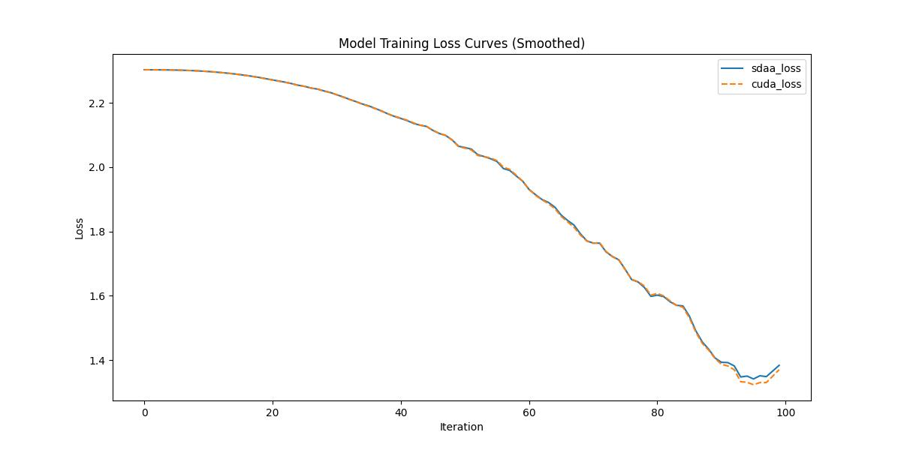

# Vision Transformer

## 1. 模型概述
Vision Transformer（ViT）是2020年提出的一种将Transformer架构直接应用于图像分类任务的模型，旨在打破传统卷积神经网络（CNN）在视觉领域的主导地位。ViT将图像划分为固定大小的图像块（patch），并将其序列化后输入Transformer结构进行建模，从而捕捉全局依赖关系。通过完全基于注意力机制而非卷积操作，ViT展现出在大规模数据集上出色的性能，开创了视觉Transformer发展的新方向。

- 论文链接：[[2010.11929\] An Image is Worth 16x16 Words: Transformers for Image Recognition at Scale](https://arxiv.org/abs/2010.11929)
- 仓库链接：[jeonsworld/ViT-pytorch: Pytorch reimplementation of the Vision Transformer (An Image is Worth 16x16 Words: Transformers for Image Recognition at Scale)](https://github.com/jeonsworld/ViT-pytorch)

## 2. 快速开始
使用本模型执行训练的主要流程如下：
1. 基础环境安装：介绍训练前需要完成的基础环境检查和安装。
2. 获取数据集：介绍如何获取训练所需的数据集。
3. 构建环境：介绍如何构建模型运行所需要的环境。
4. 启动训练：介绍如何运行训练。

### 2.1 基础环境安装

请参考基础环境安装章节，完成训练前的基础环境检查和安装。

### 2.2 准备数据集
#### 2.2.1 获取数据集
Vision Transformer 使用 Cifar 数据集，该数据集为开源数据集，可从 http://www.cs.toronto.edu/~kriz/cifar-10-python.tar.gz 下载。

#### 2.2.2 处理数据集
具体配置方式可参考：[CIFAR-10数据集（介绍、下载读取、可视化显示、另存为图片）_cifar10数据集-CSDN博客](https://blog.csdn.net/qq_40755283/article/details/125209463?ops_request_misc=%7B%22request%5Fid%22%3A%223aab7ab8bf44a13c53ce39786533e422%22%2C%22scm%22%3A%2220140713.130102334..%22%7D&request_id=3aab7ab8bf44a13c53ce39786533e422&biz_id=0&utm_medium=distribute.pc_search_result.none-task-blog-2~all~top_positive~default-1-125209463-null-null.142^v102^pc_search_result_base6&utm_term=Cifar &spm=1018.2226.3001.4187)。


### 2.3 构建环境

所使用的环境下已经包含PyTorch框架虚拟环境。
1. 执行以下命令，启动虚拟环境。
    ```
    conda activate torch_env
    ```
2. 安装python依赖。
    ```
    pip install -r requirements.txt
    ```
3. 添加环境变量。

```
export TORCH_SDAA_AUTOLOAD=cuda_migrate
```
4. 下载预训练权重。

```
cd checkpoint
wget https://storage.googleapis.com/vit_models/imagenet21k/ViT-B_16.npz
```

### 2.4 启动训练

1. 在构建好的环境中，进入训练脚本所在目录。
    ```
    cd <ModelZoo_path>/PyTorch/contrib/Classification/ViT-pytorch/run_scripts
    ```

2. 运行训练。该模型支持单机单卡。

    ```
    python train.py \
     --name cifar10-100_500 \
     --dataset cifar10 \
     --model_type ViT-B_16 \
     --pretrained_dir checkpoint/ViT-B_16.npz \
     --train_batch_size 64 \
     --fp16_opt_level 01 \
    --num_steps 100
   ```
    更多训练参数参考 run_scripts/argument.py，数据集路径设置参考 utils/data_utils.py。

### 2.5 训练结果
输出训练loss曲线及结果（参考使用[loss.py](./run_scripts/loss.py)）: 



MeanRelativeError: 0.0013006236212555371

MeanAbsoluteError: 0.0018261265754699707

Rule,mean_relative_error 0.0013006236212555371

pass mean_relative_error=0.0013006236212555371 <= 0.05 or mean_absolute_error=0.0018261265754699707 <= 0.0002