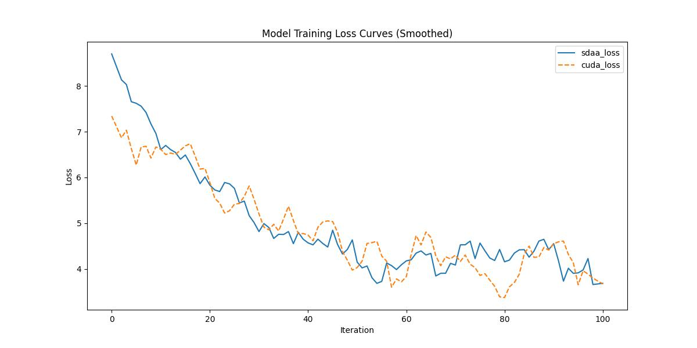

#bisenetv1
## 1. 模型概述
语义分割需要丰富的空间信息和较大的感受野。然而，现代方法通常会牺牲空间分辨率以实现实时推理速度，从而导致性能不佳。本文提出了一种新颖的双边分割网络 (BiSeNet) 来解决这一难题。我们首先设计一条步长较小的空间路径来保留空间信息并生成高分辨率特征。同时，采用具有快速下采样策略的上下文路径来获得足够的感受野。在两条路径的基础上，我们引入了一个新的特征融合模块来有效地组合特征。该架构在 Cityscapes、CamVid 和 COCO-Stuff 数据集上实现了速度和分割性能之间的良好平衡。具体而言，对于 2048x1024 的输入，我们在 Cityscapes 测试数据集上实现了 68.4% 的平均 IOU，在一块 NVIDIA Titan XP 卡上的速度为 105 FPS，这比现有性能相当的方法要快得多。

- 论文链接：[1808.00897\]BiSeNet: Bilateral Segmentation Network for Real-time Semantic Segmentation(https://arxiv.org/abs/1808.00897)
- 仓库链接：https://github.com/open-mmlab/mmsegmentation/tree/main/configs/bisenetv1

## 2. 快速开始
使用本模型执行训练的主要流程如下：
1. 基础环境安装：介绍训练前需要完成的基础环境检查和安装。
2. 获取数据集：介绍如何获取训练所需的数据集。
3. 构建环境：介绍如何构建模型运行所需要的环境。
4. 启动训练：介绍如何运行训练。

### 2.1 基础环境安装

请参考基础环境安装章节，完成训练前的基础环境检查和安装。

### 2.2 准备数据集
#### 2.2.1 获取数据集
 使用 Cityspaces 数据集，该数据集为开源数据集，可从 (https://opendatalab.com/) 下载。

#### 2.2.2 处理数据集
具体配置方式可参考：https://github.com/open-mmlab/mmsegmentation/blob/main/docs/en/advanced_guides/datasets.md。


### 2.3 构建环境

所使用的环境下已经包含PyTorch框架虚拟环境。
1. 执行以下命令，启动虚拟环境。
    ```
    conda activate torch_env
    ```
2. 安装python依赖。
    ```
    pip3 install  -U openmim 
    pip3 install git+https://gitee.com/xiwei777/mmengine_sdaa.git 
    pip3 install opencv_python mmcv --no-deps
    mim install -e .
    pip install -r requirements.txt

    ```

### 2.4 启动训练

1. 在构建好的环境中，进入训练脚本所在目录。
    ```
    cd <ModelZoo_path>/PyTorch/contrib/Classification/upernet/run_scripts
    ```

2. 运行训练。该模型支持单机单卡。
    ```
python run_bisenetv1.py --config ../configs/bisenetv1/bisenetv1_r18-d32_4xb4-160k_cityscapes-1024x1024.py \
       --launcher pytorch --nproc-per-node 1 --amp 2>&1 | tee sdaa.log
   ```
    更多训练参数参考 run_scripts/argument.py

### 2.5 训练结果
输出训练loss曲线及结果（参考使用[loss.py](./run_scripts/loss.py)）: 



MeanRelativeErr0r:0.0383767571104797
MeanAbsoluteError:0.07873004733925999
Rule,mean_absolute_error 0.0383767571104797
pass mean_relative_error=0.0383767571104797 < = 0.05 or mean_absolute_error=0.0383767571104797<=0.0002


