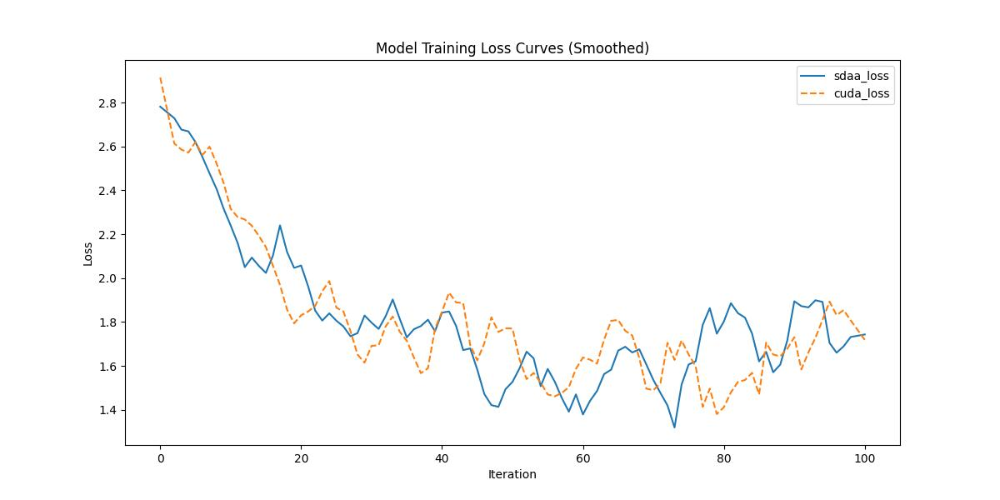

# Erfnet
## 1. 模型概述
语义分割是一项极具挑战性的任务，它能够以统一的方式满足智能车辆（IV）的大部分感知需求。深度神经网络擅长于此任务，因为它们可以进行端到端训练，从而在像素级对图像中的多个对象类别进行精确分类。然而，目前最先进的语义分割方法尚未在高质量和计算资源之间取得良好的平衡，这限制了它们在实际车辆中的应用。本文提出了一种能够实时运行并提供精确语义分割的深度架构。该架构的核心是一个新颖的层，它使用残差连接和分解卷积，以便在保持高效性的同时，保持卓越的精度。我们的方法在单个 Titan X 上能够以超过 83 FPS 的速度运行，在 Jetson TX1（嵌入式设备）上能够以 7 FPS 的速度运行。在公开的 Cityscapes 数据集上进行的一系列全面实验表明，我们的系统达到了与现有技术水平相当的精度，同时计算速度比其他达到最高精度的架构快几个数量级。

- 论文链接：ERFNet: Efficient Residual Factorized ConvNet for Real-time Semantic Segmentation(http://www.robesafe.uah.es/personal/eduardo.romera/pdfs/Romera17tits.pdf)
- 仓库链接：https://github.com/open-mmlab/mmsegmentation/tree/main/configs/erfnet

## 2. 快速开始
使用本模型执行训练的主要流程如下：
1. 基础环境安装：介绍训练前需要完成的基础环境检查和安装。
2. 获取数据集：介绍如何获取训练所需的数据集。
3. 构建环境：介绍如何构建模型运行所需要的环境。
4. 启动训练：介绍如何运行训练。

### 2.1 基础环境安装

请参考基础环境安装章节，完成训练前的基础环境检查和安装。

### 2.2 准备数据集
#### 2.2.1 获取数据集
 使用 Cityspaces 数据集，该数据集为开源数据集，可从 (https://opendatalab.com/) 下载。

#### 2.2.2 处理数据集
具体配置方式可参考：https://github.com/open-mmlab/mmsegmentation/blob/main/docs/en/advanced_guides/datasets.md。


### 2.3 构建环境

所使用的环境下已经包含PyTorch框架虚拟环境。
1. 执行以下命令，启动虚拟环境。
    ```
    conda activate torch_env
    ```
2. 安装python依赖。
    ```
    pip3 install  -U openmim 
    pip3 install git+https://gitee.com/xiwei777/mmengine_sdaa.git 
    pip3 install opencv_python mmcv --no-deps
    mim install -e .
    pip install -r requirements.txt

    ```

### 2.4 启动训练

1. 在构建好的环境中，进入训练脚本所在目录。
    ```
    cd <ModelZoo_path>/PyTorch/contrib/Classification/erfnet/run_scripts
    ```

2. 运行训练。该模型支持单机单卡。
    ```
ppython run_erfnet.py --config ../configs/erfnet/erfnet_fcn_4xb4-160k_cityscapes-512x1024.py \
       --launcher pytorch --nproc-per-node 1 --amp 2>&1 | tee sdaa.log
   ```
    更多训练参数参考 run_scripts/argument.py

### 2.5 训练结果
输出训练loss曲线及结果（参考使用[loss.py](./run_scripts/loss.py)）: 



MeanRelativeErr0r:0.024034680184484687
MeanAbsoluteError:0.0023273843349796712
Rule,mean_absolute_error 0.0023273843349796712
fail mean_relative_error=0.024034680184484687 < = 0.05 or mean_absolute_error=0.0023273843349796712<=0.0002


