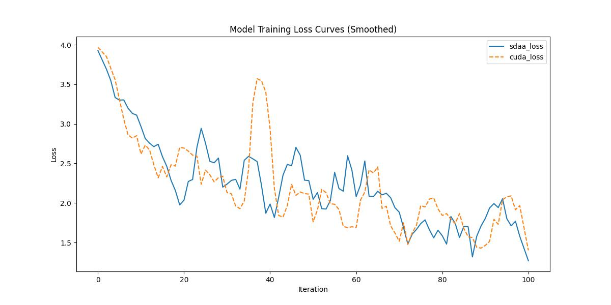

# Upernet
## 1. 模型概述
卷积网络是强大的视觉模型，能够生成层次化的特征。我们证明了，经过端到端、像素到像素训练的卷积网络本身，在语义分割领域已经超越了最先进的技术。核心洞见是构建“全卷积”网络，该网络能够接受任意大小的输入，并通过高效的推理和学习生成相应大小的输出。将当代分类网络（AlexNet、VGG 网络和 GoogLeNet）改编成全卷积网络，并通过微调将其学习到的表征迁移到分割任务中。然后，我们定义了一种新颖的架构，将来自深层粗层（coarse layer）的语义信息与来自浅层细层（fine layer）的外观信息相结合，从而生成准确而细致的分割结果。我们的完全卷积网络实现了 PASCAL VOC（相对提高 20%，即 2012 年的 62.2% 平均 IU）、NYUDv2 和 SIFT Flow 的最先进的分割，而对于典型图像，推理只需三分之一秒。

- 论文链接：[1411.4038\]Fully Convolutional Networks for Semantic Segmentation(https://arxiv.org/abs/1411.4038)
- 仓库链接：https://github.com/open-mmlab/mmsegmentation/tree/main/configs/fcn

## 2. 快速开始
使用本模型执行训练的主要流程如下：
1. 基础环境安装：介绍训练前需要完成的基础环境检查和安装。
2. 获取数据集：介绍如何获取训练所需的数据集。
3. 构建环境：介绍如何构建模型运行所需要的环境。
4. 启动训练：介绍如何运行训练。

### 2.1 基础环境安装

请参考基础环境安装章节，完成训练前的基础环境检查和安装。

### 2.2 准备数据集
#### 2.2.1 获取数据集
 使用 Cityspaces 数据集，该数据集为开源数据集，可从 (https://opendatalab.com/) 下载。

#### 2.2.2 处理数据集
具体配置方式可参考：https://github.com/open-mmlab/mmsegmentation/blob/main/docs/en/advanced_guides/datasets.md。


### 2.3 构建环境

所使用的环境下已经包含PyTorch框架虚拟环境。
1. 执行以下命令，启动虚拟环境。
    ```
    conda activate torch_env
    ```
2. 安装python依赖。
    ```
    pip3 install  -U openmim 
    pip3 install git+https://gitee.com/xiwei777/mmengine_sdaa.git 
    pip3 install opencv_python mmcv --no-deps
    mim install -e .
    pip install -r requirements.txt

    ```

### 2.4 启动训练

1. 在构建好的环境中，进入训练脚本所在目录。
    ```
    cd <ModelZoo_path>/PyTorch/contrib/Classification/fcn/run_scripts
    ```

2. 运行训练。该模型支持单机单卡。
    ```
python run_fcn.py --config ../configs/fcn/fcn_r50-d8_4xb2-80k_cityscapes-512x1024.py \
       --launcher pytorch --nproc-per-node 1 --amp 2>&1 | tee sdaa.log
   ```
    更多训练参数参考 run_scripts/argument.py

### 2.5 训练结果
输出训练loss曲线及结果（参考使用[loss.py](./run_scripts/loss.py)）: 



MeanRelativeErr0r:0.09919946925968141
MeanAbsoluteError:0.00920074174899866
Rule,mean_absolute_error 0.0092007417899866
fail mean_relative_error=0.09919946925968141 < = 0.05 or mean_absolute_error=0.0092007417899866<=0.0002


