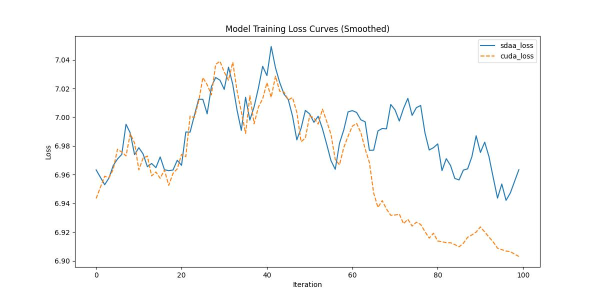

# PoolFormer

## 1. 模型概述
PoolFormer（Pool-based Vision Transformer）是2022年提出的一种轻量级视觉Transformer模型，旨在简化Transformer中的注意力机制。该模型用简单的池化操作替代自注意力模块，显著降低了计算复杂度和参数量，同时保持良好的图像分类性能。通过设计简洁的Token Mixer模块，PoolFormer在不依赖复杂结构的前提下实现了高效的特征建模，展现出优秀的速度与精度权衡能力。

- 论文链接：[[2111.11418\] MetaFormer Is Actually What You Need for Vision](https://arxiv.org/abs/2111.11418)
- 仓库链接：[sail-sg/poolformer: PoolFormer: MetaFormer Is Actually What You Need for Vision (CVPR 2022 Oral)](https://github.com/sail-sg/poolformer?tab=readme-ov-file)

## 2. 快速开始
使用本模型执行训练的主要流程如下：
1. 基础环境安装：介绍训练前需要完成的基础环境检查和安装。
2. 获取数据集：介绍如何获取训练所需的数据集。
3. 构建环境：介绍如何构建模型运行所需要的环境
4. 启动训练：介绍如何运行训练。

### 2.1 基础环境安装

请参考基础环境安装章节，完成训练前的基础环境检查和安装。

### 2.2 准备数据集
#### 2.2.1 获取数据集
PoolFormer 使用 ImageNet 数据集，该数据集为开源数据集，可从 [ImageNet](https://image-net.org/) 下载。

#### 2.2.2 处理数据集
具体配置方式可参考：https://blog.csdn.net/xzxg001/article/details/142465729。


### 2.3 构建环境

所使用的环境下已经包含PyTorch框架虚拟环境。
1. 执行以下命令，启动虚拟环境。
    ```
    conda activate torch_env
    ```
2. 安装python依赖。
    ```
    pip install -r requirements.txt
    pip install git+https://github.com/rwightman/pytorch-image-models.git@9d6aad44f8fd32e89e5cca503efe3ada5071cc2a
    pip install git+https://gitee.com/xiwei777/tcap_dllogger.git
    ```
3. 添加环境变量。

```
export TORCH_SDAA_AUTOLOAD=cuda_migrate
```

### 2.4 启动训练

1. 在构建好的环境中，进入训练脚本所在目录。
    ```
    cd <ModelZoo_path>/PyTorch/contrib/Classification/poolformer/run_scripts
    ```

2. 运行训练。该模型支持单机单卡。

    ```
    python run_poolformer.py \
     /data/teco-data/imagenet \
     --model poolformer_s12 \
     --epochs 1 \
     --warmup-epochs 0 \
     --cooldown-epochs 0 \
     --amp
   ```
    更多训练参数参考 run_scripts/argument.py

### 2.5 训练结果
输出训练loss曲线及结果（参考使用[loss.py](./run_scripts/loss.py)）: 



MeanRelativeError: 0.0031164220717346675

MeanAbsoluteError: 0.02143075466156006

Rule,mean_relative_error 0.0031164220717346675

pass mean_relative_error=0.0031164220717346675 <= 0.05 or mean_absolute_error=0.02143075466156006 <= 0.0002