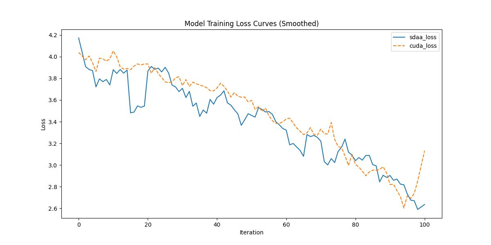

# Pspnet
## 1. 模型概述
对于不受限制的开放词汇和多样化场景，场景解析极具挑战性。结合金字塔池化模块和提出的金字塔场景解析网络（PSPNet），通过基于不同区域的上下文聚合，充分利用全局上下文信息。全局先验表征能够有效地在场景解析任务中产生高质量的结果，而PSPNet则为像素级预测任务提供了卓越的框架。所提出的方法在各种数据集上均取得了最佳性能，并在2016年ImageNet场景解析挑战赛、PASCAL VOC 2012基准测试和Cityscapes基准测试中均夺得冠军。单个PSPNet在PASCAL VOC 2012数据集上分别创下了85.4%和80.2%的mIoU准确率的新纪录。

- 论文链接：[1612.01105\]Pyramid Scene Parsing Network(https://arxiv.org/abs/1612.01105)
- 仓库链接：https://github.com/open-mmlab/mmsegmentation/tree/main/configs/pspnet

## 2. 快速开始
使用本模型执行训练的主要流程如下：
1. 基础环境安装：介绍训练前需要完成的基础环境检查和安装。
2. 获取数据集：介绍如何获取训练所需的数据集。
3. 构建环境：介绍如何构建模型运行所需要的环境。
4. 启动训练：介绍如何运行训练。

### 2.1 基础环境安装

请参考基础环境安装章节，完成训练前的基础环境检查和安装。

### 2.2 准备数据集
#### 2.2.1 获取数据集
 使用 Cityspaces 数据集，该数据集为开源数据集，可从 (https://opendatalab.com/) 下载。

#### 2.2.2 处理数据集
具体配置方式可参考：https://github.com/open-mmlab/mmsegmentation/blob/main/docs/en/advanced_guides/datasets.md。


### 2.3 构建环境

所使用的环境下已经包含PyTorch框架虚拟环境。
1. 执行以下命令，启动虚拟环境。
    ```
    conda activate torch_env
    ```
2. 安装python依赖。
    ```
    pip3 install  -U openmim 
    pip3 install git+https://gitee.com/xiwei777/mmengine_sdaa.git 
    pip3 install opencv_python mmcv --no-deps
    mim install -e .
    pip install -r requirements.txt

    ```

### 2.4 启动训练

1. 在构建好的环境中，进入训练脚本所在目录。
    ```
    cd <ModelZoo_path>/PyTorch/contrib/Classification/pspnet/run_scripts
    ```

2. 运行训练。该模型支持单机单卡。
    ```
python run_pspnet.py --config ../configs/pspnet/pspnet_r50-d8-rsb_4xb2-adamw-80k_cityscapes-512x1024.py \
       --launcher pytorch --nproc-per-node 1 --amp 2>&1 | tee sdaa.log
   ```
    更多训练参数参考 run_scripts/argument.py

### 2.5 训练结果
输出训练loss曲线及结果（参考使用[loss.py](./run_scripts/loss.py)）: 



MeanRelativeErr0r:-0.02093203891420321
MeanAbsoluteError:-0.088096101685325
Rule,mean_absolute_error -0.0880961016853257
fail mean_relative_error=0.02093203891420321 < = 0.05 or mean_absolute_error=0.0880961016853257 <= 0.0002


