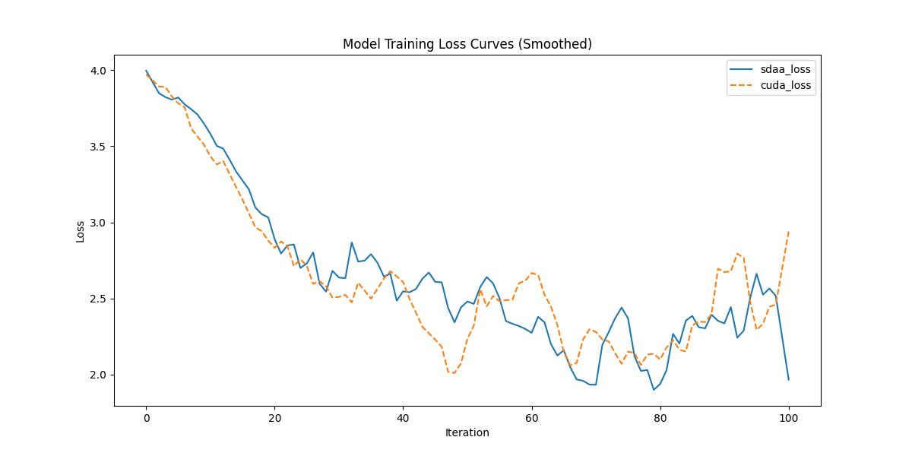

# Unet
## 1. 模型概述
众所周知，成功训练深度网络需要数千个带注释的训练样本。在本文中，我们提出了一种网络和训练策略，它依赖于强大的数据增强来更有效地利用可用的带注释样本。该架构由一条用于捕捉上下文的收缩路径和一条用于实现精确定位的对称扩展路径组成。我们证明了这种网络可以从很少的图像中进行端到端训练，并且在 ISBI 挑战赛中优于先前用于分割电子显微镜堆栈中神经元结构的最佳方法（滑动窗口卷积网络）。使用在透射光显微镜图像（相衬和 DIC）上训练的相同网络，我们在 2015 年 ISBI 细胞追踪挑战赛的这些类别中以大幅优势获胜。此外，该网络速度很快。在最新的 GPU 上，分割 512x512 图像只需不到一秒钟。

- 论文链接：[1505.04597\]U-Net: Convolutional Networks for Biomedical Image Segmentation(https://arxiv.org/abs/1505.04597)
- 仓库链接：https://github.com/open-mmlab/mmsegmentation/tree/main/configs/upernet

## 2. 快速开始
使用本模型执行训练的主要流程如下：
1. 基础环境安装：介绍训练前需要完成的基础环境检查和安装。
2. 获取数据集：介绍如何获取训练所需的数据集。
3. 构建环境：介绍如何构建模型运行所需要的环境。
4. 启动训练：介绍如何运行训练。

### 2.1 基础环境安装

请参考基础环境安装章节，完成训练前的基础环境检查和安装。

### 2.2 准备数据集
#### 2.2.1 获取数据集
 使用 Cityspaces 数据集，该数据集为开源数据集，可从 (https://opendatalab.com/) 下载。

#### 2.2.2 处理数据集
具体配置方式可参考：https://github.com/open-mmlab/mmsegmentation/blob/main/docs/en/advanced_guides/datasets.md。


### 2.3 构建环境

所使用的环境下已经包含PyTorch框架虚拟环境。
1. 执行以下命令，启动虚拟环境。
    ```
    conda activate torch_env
    ```
2. 安装python依赖。
    ```
    pip3 install  -U openmim 
    pip3 install git+https://gitee.com/xiwei777/mmengine_sdaa.git 
    pip3 install opencv_python mmcv --no-deps
    mim install -e .
    pip install -r requirements.txt

    ```

### 2.4 启动训练

1. 在构建好的环境中，进入训练脚本所在目录。
    ```
    cd <ModelZoo_path>/PyTorch/contrib/Classification/unet/run_scripts
    ```

2. 运行训练。该模型支持单机单卡。
    ```
python run_unet3d.py --config ../configs/unet/unet-s5-d16_fcn_4xb4-160k_cityscapes-512x1024.py \
       --launcher pytorch --nproc-per-node 1 --amp 2>&1 | tee sdaa.log
   ```
    更多训练参数参考 run_scripts/argument.py

### 2.5 训练结果
输出训练loss曲线及结果（参考使用[loss.py](./run_scripts/loss.py)）: 



MeanRelativeErr0r:0.02599908909948028
MeanAbsoluteError:0.01701916208361635
Rule,mean_absolute_error 0.01701916208361635
pass mean_relative_error=0.02599908909948028 < = 0.05 or mean_absolute_error=0.01701916208361635<=0.0002


