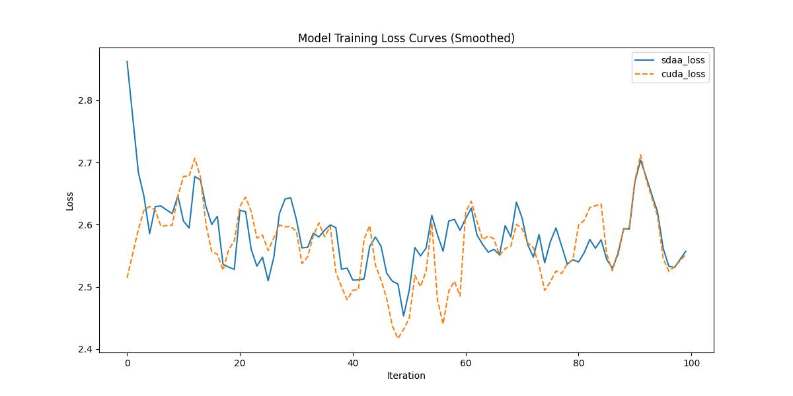

# AIRDet-S
## 1. 模型概述

AIRDet是一个面向工业落地的目标检测框架，目的是针对复杂多变的工业场景提供开箱即用的目标检测能力。

- 仓库链接：https://github.com/QSLee-Net/AIRDet?tab=readme-ov-file

## 2. 快速开始
使用本模型执行训练的主要流程如下：
1. 基础环境安装：介绍训练前需要完成的基础环境检查和安装。
2. 获取数据集：介绍如何获取训练所需的数据集。
3. 构建环境：介绍如何构建模型运行所需要的环境。
4. 启动训练：介绍如何运行训练。

### 2.1 基础环境安装

请参考基础环境安装章节，完成训练前的基础环境检查和安装。

### 2.2 准备数据集
#### 2.2.1 获取数据集
AIRDet使用 COCO2017 数据集，该数据集为开源数据集，可从 [COCO](https://cocodataset.org/#download) 下载。

#### 2.2.2 处理数据集
1.COCO文件目录结构具体配置方式可参考：https://github.com/Atten4Vis/ConditionalDETR/blob/main/README.md。
2.或者按下述：
├── datasets #根目录
  ├── coco 
      ├── annotations #json标注目录
      │   └── instances_val2017.json #对应目标检测、分割任务的验证集标注文件
      ├── images
      │   ├── train2017 #训练集图片，约118287张
      │   └── val2017 #验证集图片，约5000张
      ├── labels  #txt标注目录
      │   ├── train2017 #对应目标检测的训练集txt标注文件
      │   └── val2017 #对应目标检测的验证集txt标注文件
      ├── train2017.txt #训练集图片路径
      └── val2017.txt #验证集图片路径
PS:需要在项目文件中修改数据集链接（Sympoliclink），在airdet/config/paths_catalog.py中,按照你的数据集路径修改链接。


### 2.3 构建环境

所使用的环境下已经包含PyTorch框架虚拟环境。
1. 执行以下命令，启动虚拟环境。
    ```
    conda activate torch_env
    ```
2. 安装python依赖。
    ```
    pip install -r requirements.txt
    export PYTHONPATH=$PWD:$PYTHONPATH # 导入环境变量
    ```

### 2.4 启动训练
1. 在构建好的环境中，进入训练脚本所在目录。
    ```
    cd <ModelZoo_path>/PyTorch/contrib/Detection/AIRDet-s/run_scripts
    ```
2. 运行训练。该模型支持单机单卡。
    ```
    python -m torch.distributed.launch \
     --nproc_per_node = 4 \
     tools/train.py \
     -f configs <配置文件> 
   ```
   示例：python -m torch.distributed.launch --nproc_per_node=1 tools/train.py -f configs/airdet_s.py （该示例直接在根目录下运行）
更多训练参数参考 run_scripts/argument.py

### 2.5 训练结果
输出训练loss曲线及结果（参考使用[loss.py](./run_scripts/loss.py)）: 
  


MeanRelativeError: 0.007574099904031596
MeanAbsoluteError: 0.01516486406326294
Rule,mean_relative_error 0.007574099904031596
pass mean_relative_error=0.007574099904031596 <= 0.05 or mean_absolute_error=0.01516486406326294 <= 0.000