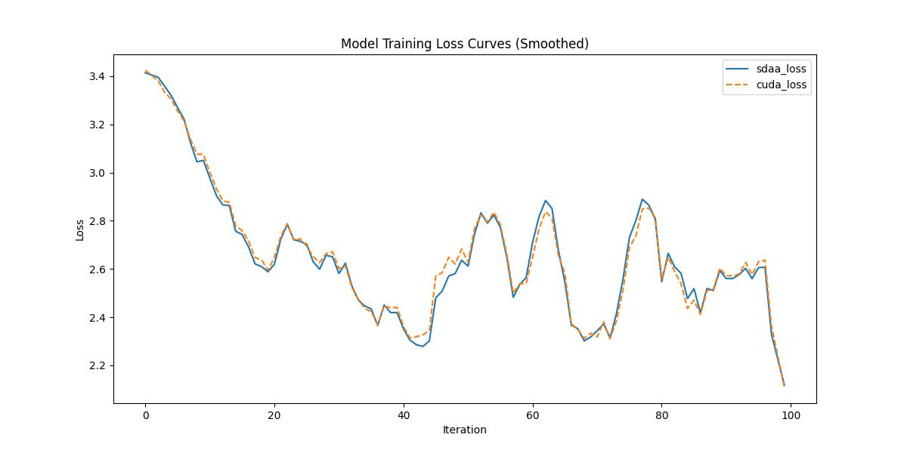

# ALM-pedestrian-attribute
## 1. 模型概述  
ALM（Attribute Localization Module）是由中国科学院计算技术研究所团队聚焦监控场景下的细粒度属性分析（如性别、背包、衣着），解决遮挡、低分辨率及多尺度变化挑战。通过提出弱监督多尺度定位与特征对齐机制在PETA/RAP数据集上mA达85.1%，关键属性识别精度提升3.5%
> **论文链接**：[Improving Pedestrian Attribute Recognition With Weakly-Supervised Multi-Scale Attribute-Specific Localization](https://arxiv.org/abs/1910.04562)  
> **仓库链接**：https://github.com/chufengt/ALM-pedestrian-attribute   

## 2. 快速开始  
使用本模型执行训练的主要流程如下：  
1. 基础环境安装：介绍训练前需要完成的基础环境检查和安装。  
2. 获取数据集：介绍如何获取训练所需的数据集。  
3. 构建环境：介绍如何构建模型运行所需要的环境。  
4. 启动训练：介绍如何运行训练。  

### 2.1 基础环境安装  

请参考基础环境安装章节，完成训练前的基础环境检查和安装。  

### 2.2 准备数据集  
#### 2.2.1 获取数据集  
> 下载训练数据到指定文件夹：```/data/teco-data/peta```。  
> 数据集下载链接：[cuhk](http://mmlab.ie.cuhk.edu.hk/projects/PETA.html) 
> 修改./utils/dataset.py中数据集路径：
```
train_dataset = MultiLabelDataset(root='/data/teco-data/peta',
                    label='/data/teco-data/peta/PETA_train_list.txt', transform=transform_train)
        val_dataset = MultiLabelDataset(root='/data/teco-data/peta',
                    label='/data/teco-data/peta/PETA_train_list.txt', transform=transform_test)
```


### 2.3 构建环境

所使用的环境下已经包含PyTorch框架虚拟环境  
1. 执行以下命令，启动虚拟环境。  
    ```
    conda activate torch_env  
    ```
2. 安装python依赖  
    ```
    cd <ModelZoo_path>/PyTorch/contrib/Detection/ALM-pedestrian-attribute/
	pip install -r requirement.txt
    ```
### 2.4 启动训练  
1. 在构建好的环境中，进入训练脚本所在目录。  
    ```
    cd <ModelZoo_path>/PyTorch/contrib/Detection/ALM-pedestrian-attribute/run_scripts
    ```

2. 运行训练。该模型支持单机单卡。

    -  单机单卡
    ```
   python run_ALM.py \
    --approach inception_iccv \
    --experiment peta \
    --epochs 1 \
    --batch_size 4\
    2>&1 | tee sdaa.log
    
   ```
    更多训练参数参考[README](run_scripts/README.md)

### 2.5 训练结果
输出训练loss曲线及结果（参考使用[loss.py](./run_scripts/loss.py)）: 


MeanRelativeError: -0.0016660199986437566
MeanAbsoluteError: -0.005064936876296997
Rule,mean_absolute_error -0.005064936876296997
pass mean_relative_error=-0.0016660199986437566 <= 0.05 or mean_absolute_error=-0.005064936876296997 <= 0.0002
