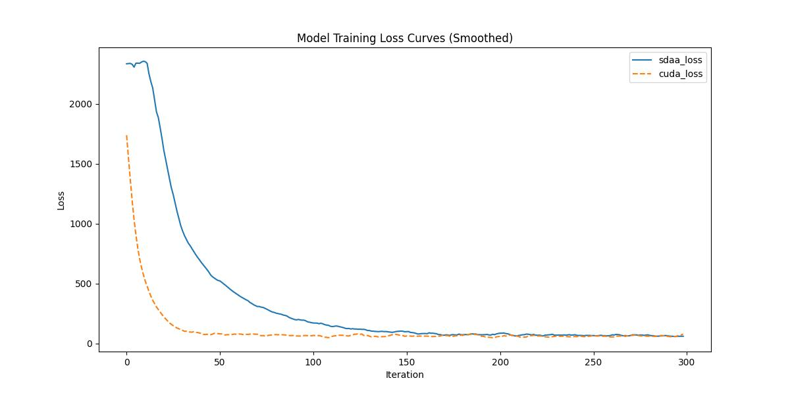

# Lightweight OpenPose
## 1. 模型概述  
Lightweight OpenPose模型由英特尔实验室主导（论文作者：Daniil Osokin等）的CPU实时多人姿态估计，面向移动端/边缘计算场景。主要提出了轻量化设计：修改VGG网络为更小卷积核，压缩模型体积；PAF简化策略：减少部分亲和力字段计算量，加速关节点关联；多分支融合：联合优化关节点定位与连接精度。实验结果：在COCO数据集上AP达41%（原OpenPose的85%），CPU推理速度22FPS（比原版快10倍），模型仅15MB，支持低功耗设备部署。
> **论文链接**：[Real-time 2D Multi-Person Pose Estimation on CPU: Lightweight OpenPose](https://arxiv.org/pdf/1811.12004.pdf)  
> **仓库链接**：https://github.com/Daniil-Osokin/lightweight-human-pose-estimation.pytorch   

## 2. 快速开始  
使用本模型执行训练的主要流程如下：  
1. 基础环境安装：介绍训练前需要完成的基础环境检查和安装。  
2. 获取数据集：介绍如何获取训练所需的数据集。  
3. 构建环境：介绍如何构建模型运行所需要的环境。  
4. 启动训练：介绍如何运行训练。  

### 2.1 基础环境安装  

请参考基础环境安装章节，完成训练前的基础环境检查和安装。  

### 2.2 准备数据集  
#### 2.2.1 获取数据集  
> 下载训练数据到指定文件夹：```/data/teco-data/COCO```。  
> 数据集下载链接：[cocodataset](http://cocodataset.org/#download)
> 将其解压到`/data/teco-data/COCO`文件夹中。


### 2.3 构建环境

所使用的环境下已经包含PyTorch框架虚拟环境  
1. 执行以下命令，启动虚拟环境。  
    ```
    conda activate torch_env  
    ```
2. 安装python依赖  
    ```bash
    cd <ModelZoo_path>/PyTorch/contrib/Detection/Lightweight_OpenPose/
	pip install -r requirement.txt
	python scripts/prepare_train_labels.py --labels /data/teco-data/COCO/annotations/person_keypoints_train2017.json
    ```
### 2.4 启动训练  
1. 在构建好的环境中，进入训练脚本所在目录。  
    ```bash
    cd <ModelZoo_path>/PyTorch/contrib/Detection/SINet/run_scripts
    ```

2. 运行训练。该模型支持单机单卡。

    -  单机单卡
    ```bash
   python run_Lightweight_OpenPose.py \
    --train-images-folder  /data/teco-data/COCO/images/train2017/ \
    --prepared-train-labels prepared_train_annotation.pkl \
    --val-labels val_subset.json \
    --val-images-folder  /data/teco-data/COCO/images/val2017/ \
    --checkpoint-path ./mobilenet_sgd_68.848.pth.tar \
    --from-mobilenet \
    2>&1 | tee sdaa.log
    
   ```
    更多训练参数参考[README](run_scripts/README.md)

### 2.5 训练结果
输出训练loss曲线及结果（参考使用[loss.py](./run_scripts/loss.py)）: 


MeanRelativeError: 1.734375787116352
MeanAbsoluteError: 233.25965749938354
