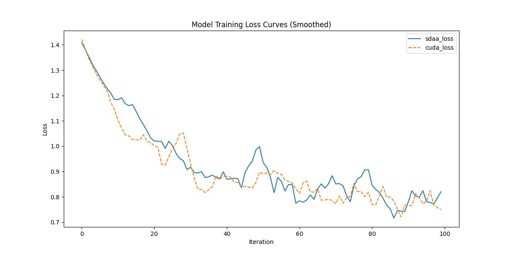

# SINet
## 1. 模型概述  
SINet针对伪装目标检测（如与环境高度相似的生物/物体），提出搜索-识别双模块协同框架。核心通过搜索模块模拟生物捕食行为（粗定位潜在目标区域），结合识别模块聚合多层次特征细化边界，并引入循环反馈机制迭代优化预测。创新点在于双流注意力机制（特征增强）与边缘感知损失（强化轮廓学习）。在COD10K等数据集上mAP显著超越传统模型5%以上，应用于生态研究（昆虫保护）、医学显微图像检测（寄生虫）及军事目标识别，在复杂环境中实现高精度定位。
> **论文链接**：[Camouflaged Object Detection](https://openaccess.thecvf.com/content_CVPR_2020/papers/Fan_Camouflaged_Object_Detection_CVPR_2020_paper.pdf)  
> **仓库链接**：https://github.com/DengPingFan/SINet   

## 2. 快速开始  
使用本模型执行训练的主要流程如下：  
1. 基础环境安装：介绍训练前需要完成的基础环境检查和安装。  
2. 获取数据集：介绍如何获取训练所需的数据集。  
3. 构建环境：介绍如何构建模型运行所需要的环境。  
4. 启动训练：介绍如何运行训练。  

### 2.1 基础环境安装  

请参考基础环境安装章节，完成训练前的基础环境检查和安装。  

### 2.2 准备数据集  
#### 2.2.1 获取数据集  
> 下载训练数据到指定文件夹：```/data/teco-data/COD10K_CAMO```。  
> 数据集下载链接：[Google Drive link](https://drive.google.com/file/d/1D9bf1KeeCJsxxri6d2qAC7z6O1X_fxpt/view?usp=sharing) or [Baidu Pan link](https://pan.baidu.com/s/1XL6OjpDF-MVnXOY6-bdaBg)
> 解压后数据集路径：
```
--train_img_dir /data/teco-data/COD10K_CAMO/TrainDataset/Image/  
--train_gt_dir /data/teco-data/COD10K_CAMO/TrainDataset/GT/
```


### 2.3 构建环境

所使用的环境下已经包含PyTorch框架虚拟环境  
1. 执行以下命令，启动虚拟环境。  
    ```
    conda activate torch_env  
    ```
2. 安装python依赖  
    ```
    cd <ModelZoo_path>/PyTorch/contrib/Detection/SINet/
	pip install -r requirement.txt
    ```
### 2.4 启动训练  
1. 在构建好的环境中，进入训练脚本所在目录。  
    ```
    cd <ModelZoo_path>/PyTorch/contrib/Detection/SINet/run_scripts
    ```

2. 运行训练。该模型支持单机单卡。

    -  单机单卡
    ```
   python run_SINet.py --epoch 2 --batchsize 36 --gpu 0 --train_img_dir /data/teco-data/COD10K_CAMO/TrainDataset/Image/ --train_gt_dir /data/teco-data/COD10K_CAMO/TrainDataset/GT/
    
   ```
    更多训练参数参考[README](run_scripts/README.md)

### 2.5 训练结果
输出训练loss曲线及结果（参考使用[loss.py](./run_scripts/loss.py)）: 


MeanRelativeError: 0.031581643710111476
MeanAbsoluteError: 0.021792290210723878
Rule,mean_absolute_error 0.021792290210723878
pass mean_relative_error=0.031581643710111476 <= 0.05 or mean_absolute_error=0.021792290210723878 <= 0.0002
