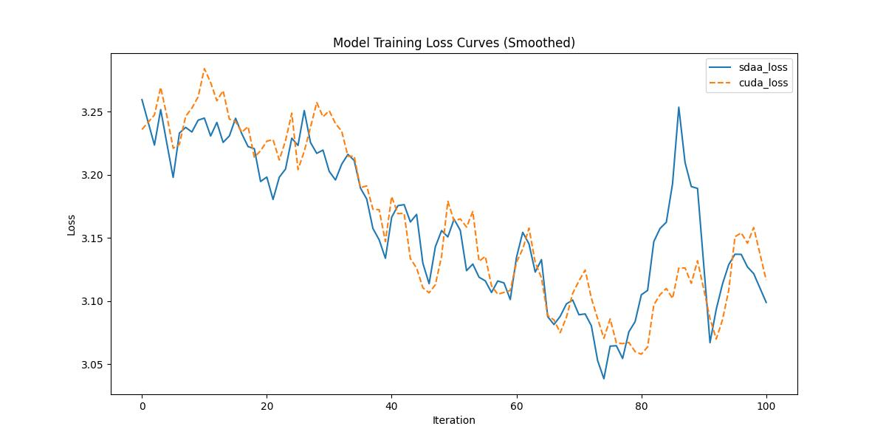

# **YOLOv6**
## 1. 模型概述  
YOLOv6 由美团视觉智能团队提出，是一种面向工业级应用的高性能实时目标检测模型。其核心创新在于结合 Anchor-free 检测头、RepOptimizer 优化策略 与 高效的解耦头设计（Efficient Decoupled Head），在保证模型推理速度的同时显著提升检测精度。YOLOv6 在架构层面采用自研的 EfficientRep Backbone 与 Rep-PAN 颈部结构，通过结构重参数化（Structural Re-parameterization）实现训练-推理解耦，使得推理阶段网络更轻量、更快。优化方面引入了 SimOTA 动态标签分配策略 与 高效的任务自适应损失（TaskAligned Assign），显著提升了收敛速度与检测鲁棒性。在 COCO 数据集上，YOLOv6 各尺寸模型（N/S/M/L）均在相同推理速度下超越同类模型（如 YOLOv5、YOLOX、PP-YOLOE 等），在边缘端（TensorRT/ONNXRuntime 部署）表现尤为突出。其工业级部署能力已广泛应用于美团外卖、无人配送与实时监控等业务场景。
> **论文链接**：https://arxiv.org/abs/2301.05586 
> **仓库链接**：https://github.com/meituan/YOLOv6  

## 2. 快速开始  
使用本模型执行训练的主要流程如下：  
1. 基础环境安装：介绍训练前需要完成的基础环境检查和安装。  
2. 获取数据集：介绍如何获取训练所需的数据集。  
3. 构建环境：介绍如何构建模型运行所需要的环境。  
4. 启动训练：介绍如何运行训练。  

### 2.1 基础环境安装  

请参考基础环境安装章节，完成训练前的基础环境检查和安装。  

### 2.2 准备数据集  
> 下载数据集到指定文件夹：```/data/teco-data/coco2017/```  
> 数据集下载链接：
```
http://cocodataset.org/
https://github.com/meituan/YOLOv6/releases/download/0.1.0/coco2017labels.zip
```
> 解压数据集：
```
unzip /data/teco-data/coco2017/coco2017labels.zip
unzip /data/teco-data/coco2017/train2017.zip
unzip /data/teco-data/coco2017/var2017.zip
```


### 2.3 构建环境

所使用的环境下已经包含PyTorch框架虚拟环境  
1. 执行以下命令，启动虚拟环境。  
    ```
    conda activate torch_env  
    ```
2. 安装python依赖  
    ```
    cd <ModelZoo_path>/PyTorch/contrib/Detection/YOLOv6
    pip install -r requirements.txt
    ```
### 2.4 启动训练  
1. 在构建好的环境中，进入训练脚本所在目录。  
    ```
    cd <ModelZoo_path>/PyTorch/contrib/Detection/YOLOv6/run_scripts
    ```

2. 运行训练。该模型支持单机单卡。

    -  单机单卡
    ```
    python run_yolov6.py \
    --batch-size 4  \
    --conf-file "configs/yolov6s.py" \
    --data-path "data/coco.yaml" \
    --device 0 \
    2>&1 | tee sdaa.log
   ```
    更多训练参数参考[README](run_scripts/README.md)

### 2.5 训练结果
输出训练loss曲线及结果（参考使用[loss.py](./run_scripts/loss.py)）: 


MeanRelativeError: -0.00018997754377344075
MeanAbsoluteError: -0.0015601720057179871
Rule,mean_absolute_error -0.0015601720057179871
pass mean_relative_error=-0.00018997754377344075 <= 0.05 or mean_absolute_error=-0.0015601720057179871 <= 0.0002
