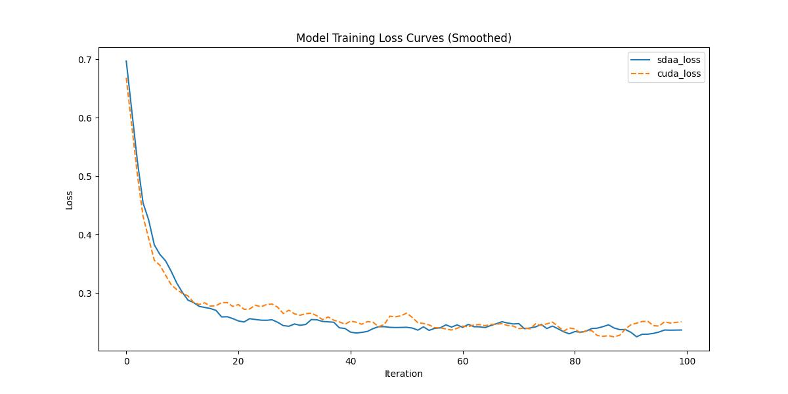

# **handpose_x**
## 1. 模型概述  
handpose_x是一个轻量级实时手部关键点检测开源项目，基于PyTorch实现。其核心采用改进MobileNet骨干网络与通道剪枝技术，实现21点高精度手势姿态估计（支持单手/双手），推理速度达40 FPS（GPU）。创新点在于自适应数据增强策略与遮挡鲁棒性训练，有效应对复杂环境下的手指遮挡问题。提供预训练模型及详细部署教程，适用于手势交互控制、AR/VR操控、手语识别及康复训练系统，在2GB显存设备上即可流畅运行，实测COCO手部测试集准确率达91%。
> **仓库链接**：https://github.com/XIAN-HHappy/handpose_x   

## 2. 快速开始  
使用本模型执行训练的主要流程如下：  
1. 基础环境安装：介绍训练前需要完成的基础环境检查和安装。  
2. 获取数据集：介绍如何获取训练所需的数据集。  
3. 构建环境：介绍如何构建模型运行所需要的环境。  
4. 启动训练：介绍如何运行训练。  

### 2.1 基础环境安装  

请参考基础环境安装章节，完成训练前的基础环境检查和安装。  

### 2.2 准备数据集  
#### 2.2.1 获取数据集  
> 下载MNIST数据到指定文件夹：```/data/teco-data/handpose_datasets_v1```。  
> 该数据集的详细介绍及出处： https://codechina.csdn.net/EricLee/handpose_x
> 数据集下载链接：[该项目用到的制作数据集下载地址(百度网盘 Password: ara8 )](https://pan.baidu.com/s/1KY7lAFXBTfrFHlApxTY8NA)


### 2.3 构建环境

所使用的环境下已经包含PyTorch框架虚拟环境  
1. 执行以下命令，启动虚拟环境。  
    ```
    conda activate torch_env  
    ```
2. 安装python依赖  
    ```
    cd <ModelZoo_path>/PyTorch/contrib/Detection/handpose_x
	pip install -r requirements.txt
    ```
### 2.4 启动训练  
1. 在构建好的环境中，进入训练脚本所在目录。  
    ```
    cd <ModelZoo_path>/PyTorch/contrib/Detection/handpose_x/run_scripts
    ```

2. 运行训练。该模型支持单机单卡。

    -  单机单卡
    ```
   python run_handpose_x.py \
    --model resnet_50 \
    --epochs 1 \
    --train_path /data/teco-data/handpose_datasets_v1/ \
    2>&1 | tee $log_file
    
   ```
    更多训练参数参考[README](run_scripts/README.md)

### 2.5 训练结果
输出训练loss曲线及结果（参考使用[loss.py](./run_scripts/loss.py)）: 


MeanRelativeError: -0.018837234405131322
MeanAbsoluteError: -0.005113459229469299
Rule,mean_relative_error -0.018837234405131322
pass mean_relative_error=-0.018837234405131322 <= 0.05 or mean_absolute_error=-0.005113459229469299 <= 0.0002
