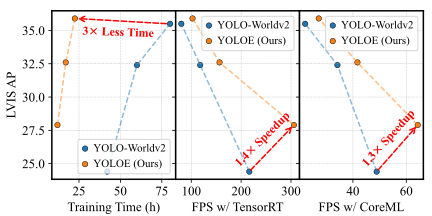
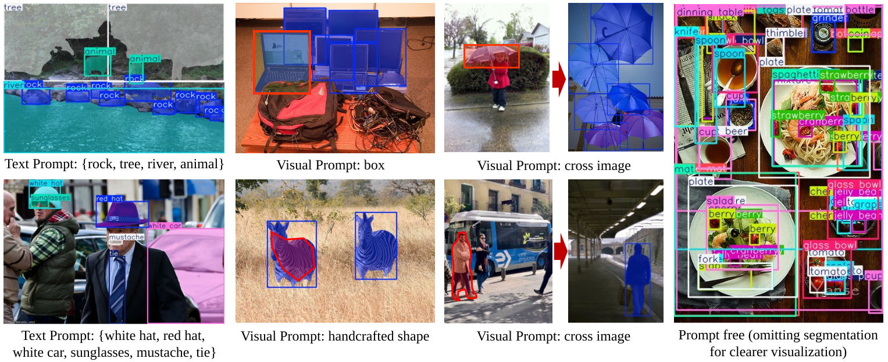

# 论文链接：[YOLOE: 实时看见万物](https://arxiv.org/abs/2503.07465)
源码链接：https://github.com/THU-MIG/yoloe/tree/main
YOLOE 的官方 PyTorch 实现。ICCV 2025。

<p align="center">
   <br>
  在开放文本提示场景下，YOLOE（本文）与 YOLO-Worldv2 在性能、训练成本和推理效率上的对比。
</p>

[YOLOE: Real-Time Seeing Anything](https://arxiv.org/abs/2503.07465).\
Ao Wang*, Lihao Liu*, Hui Chen, Zijia Lin, Jungong Han, and Guiguang Ding\
[](https://arxiv.org/abs/2503.07465) [](https://huggingface.co/jameslahm/yoloe/tree/main) [](https://huggingface.co/spaces/jameslahm/yoloe) [](https://colab.research.google.com/github/roboflow-ai/notebooks/blob/main/notebooks/zero-shot-object-detection-and-segmentation-with-yoloe.ipynb) [](https://huggingface.co/collections/jameslahm/yoloe-67d5110aabaefbe129c15917) [](https://openbayes.com/console/public/tutorials/BQhUorEqyVX)

 **YOLOE(ye)**，一个在不同提示机制（如文本提示、视觉提示以及无提示范式）下，像“人眼”一样工作的高效、统一且开放的目标检测与分割模型。与封闭类别的 YOLO 系列相比，YOLOE 在推理与迁移时具有**零额外开销**。

<!-- <p align="center">
   <br>
</p> -->

<p align="center">
   <br>
</p>

<details>
  <summary>
  <font size="+1">摘要</font>
  </summary>
目标检测与分割被广泛应用于计算机视觉领域，但传统模型如 YOLO 系列虽然高效准确，却受限于预定义类别，在开放场景下适应性不足。近期开放集方法通过文本提示、视觉线索或无提示范式来克服这一限制，但往往因高计算开销或部署复杂度而在性能与效率间妥协。本文提出 YOLOE，将多种开放提示机制下的检测与分割统一到一个高效模型中，做到实时“看见万物”。在文本提示方面，我们提出可重参数化的区域-文本对齐（RepRTA）策略：通过可重参数化的轻量辅助网络精炼预训练文本嵌入，并在推理与迁移**零开销**的前提下增强视觉-文本对齐。在视觉提示方面，我们提出语义激活的视觉提示编码器（SAVPE）：采用解耦的语义与激活分支，以最小复杂度带来更优的视觉嵌入与精度。在无提示场景下，我们提出 Lazy Region-Prompt Contrast（LRPC）策略：利用内置的大词表与专用嵌入识别所有目标，避免昂贵的语言模型依赖。大量实验表明，YOLOE 在保持高推理效率与低训练成本的同时，具备卓越的零样本性能与可迁移性。值得注意的是，在 LVIS 上，YOLOE-v8-S 以约 3 倍更少的训练成本与 1.4 倍的推理加速，相比 YOLO-Worldv2-S 提升 3.5 AP；在迁移至 COCO 时，YOLOE-v8-L 相比封闭集的 YOLOv8-L 在几乎 4 倍更少训练时间下，分别提升 0.6 $AP^b$ 与 0.4 $AP^m$。
</details>
<p></p>
<p align="center">
   <br>
</p>

## 性能

### 零样本检测评测

- 在 LVIS `minival` 集上，以文本（T）/ 视觉（V）提示汇报 *固定 AP*（Fixed AP）。
- 训练时间针对文本提示的检测，在 8 张 Nvidia RTX4090 上统计。
- FPS 分别在 T4（TensorRT）与 iPhone 12（CoreML）上测得。
- 训练数据中，OG 表示 Objects365v1 与 GoldG。
- YOLOE 经过重参数化后可变为 YOLO，且**推理与迁移零额外开销**。

| 模型 | 尺寸 | 提示 | 参数量 | 数据 | 训练时长 | FPS | $AP$ | $AP_r$ | $AP_c$ | $AP_f$ | 日志 |
|---|---|---|---|---|---|---|---|---|---|---|---|
| [YOLOE-v8-S](https://huggingface.co/jameslahm/yoloe/blob/main/yoloe-v8s-seg.pt) | 640 | T / V | 12M / 13M | OG | 12.0h | 305.8 / 64.3 | 27.9 / 26.2 | 22.3 / 21.3 | 27.8 / 27.7 | 29.0 / 25.7 | [T](./logs/yoloe-v8s-seg) / [V](./logs/yoloe-v8s-seg-vp) |
| [YOLOE-v8-M](https://huggingface.co/jameslahm/yoloe/blob/main/yoloe-v8m-seg.pt) | 640 | T / V | 27M / 30M | OG | 17.0h | 156.7 / 41.7 | 32.6 / 31.0 | 26.9 / 27.0 | 31.9 / 31.7 | 34.4 / 31.1 | [T](./logs/yoloe-v8m-seg) / [V](./logs/yoloe-v8m-seg-vp) |
| [YOLOE-v8-L](https://huggingface.co/jameslahm/yoloe/blob/main/yoloe-v8l-seg.pt) | 640 | T / V | 45M / 50M | OG | 22.5h | 102.5 / 27.2 | 35.9 / 34.2 | 33.2 / 33.2 | 34.8 / 34.6 | 37.3 / 34.1 | [T](./logs/yoloe-v8l-seg) / [V](./logs/yoloe-v8l-seg-vp) |
| [YOLOE-11-S](https://huggingface.co/jameslahm/yoloe/blob/main/yoloe-11s-seg.pt) | 640 | T / V | 10M / 12M | OG | 13.0h | 301.2 / 73.3 | 27.5 / 26.3 | 21.4 / 22.5 | 26.8 / 27.1 | 29.3 / 26.4 | [T](./logs/yoloe-11s-seg) / [V](./logs/yoloe-11s-seg-vp) |
| [YOLOE-11-M](https://huggingface.co/jameslahm/yoloe/blob/main/yoloe-11m-seg.pt) | 640 | T / V | 21M / 27M | OG | 18.5h | 168.3 / 39.2 | 33.0 / 31.4 | 26.9 / 27.1 | 32.5 / 31.9 | 34.5 / 31.7 | [T](./logs/yoloe-11m-seg) / [V](./logs/yoloe-11m-seg-vp) |
| [YOLOE-11-L](https://huggingface.co/jameslahm/yoloe/blob/main/yoloe-11l-seg.pt) | 640 | T / V | 26M / 32M | OG | 23.5h | 130.5 / 35.1 | 35.2 / 33.7 | 29.1 / 28.1 | 35.0 / 34.6 | 36.5 / 33.8 | [T](./logs/yoloe-11l-seg) / [V](./logs/yoloe-11l-seg-vp) |

### 零样本分割评测

- 模型与上节 [零样本检测评测](#零样本检测评测) 相同。
- 在 LVIS `val` 集上，以文本（T）/ 视觉（V）提示汇报 *标准 $AP^m$*。

| 模型 | 尺寸 | 提示 | $AP^m$ | $AP_r^m$ | $AP_c^m$ | $AP_f^m$ |
|---|---|---|---|---|---|---|
| YOLOE-v8-S | 640 | T / V | 17.7 / 16.8 | 15.5 / 13.5 | 16.3 / 16.7 | 20.3 / 18.2 |
| YOLOE-v8-M | 640 | T / V | 20.8 / 20.3 | 17.2 / 17.0 | 19.2 / 20.1 | 24.2 / 22.0 |
| YOLOE-v8-L | 640 | T / V | 23.5 / 22.0 | 21.9 / 16.5 | 21.6 / 22.1 | 26.4 / 24.3 |
| YOLOE-11-S | 640 | T / V | 17.6 / 17.1 | 16.1 / 14.4 | 15.6 / 16.8 | 20.5 / 18.6 |
| YOLOE-11-M | 640 | T / V | 21.1 / 21.0 | 17.2 / 18.3 | 19.6 / 20.6 | 24.4 / 22.6 |
| YOLOE-11-L | 640 | T / V | 22.6 / 22.5 | 19.3 / 20.5 | 20.9 / 21.7 | 26.0 / 24.1 |

### 无提示评测（Prompt-free）

- 除了使用专用的提示嵌入外，模型与 [零样本检测评测](#零样本检测评测) 相同。
- 在 LVIS `minival` 集上汇报 *固定 AP*，FPS 在 Nvidia T4 + PyTorch 上测得。

| 模型 | 尺寸 | 参数量 | $AP$ | $AP_r$ | $AP_c$ | $AP_f$ | FPS | 日志 |
|---|---|---|---|---|---|---|---|---|
| [YOLOE-v8-S](https://huggingface.co/jameslahm/yoloe/blob/main/yoloe-v8s-seg-pf.pt) | 640 | 13M | 21.0 | 19.1 | 21.3 | 21.0 | 95.8 | [PF](./logs/yoloe-v8s-seg-pf/) |
| [YOLOE-v8-M](https://huggingface.co/jameslahm/yoloe/blob/main/yoloe-v8m-seg-pf.pt) | 640 | 29M | 24.7 | 22.2 | 24.5 | 25.3 | 45.9 | [PF](./logs/yoloe-v8m-seg-pf/) |
| [YOLOE-v8-L](https://huggingface.co/jameslahm/yoloe/blob/main/yoloe-v8l-seg-pf.pt) | 640 | 47M | 27.2 | 23.5 | 27.0 | 28.0 | 25.3 | [PF](./logs/yoloe-v8l-seg-pf/) |
| [YOLOE-11-S](https://huggingface.co/jameslahm/yoloe/blob/main/yoloe-11s-seg-pf.pt) | 640 | 11M | 20.6 | 18.4 | 20.2 | 21.3 | 93.0 | [PF](./logs/yoloe-11s-seg-pf/) |
| [YOLOE-11-M](https://huggingface.co/jameslahm/yoloe/blob/main/yoloe-11m-seg-pf.pt) | 640 | 24M | 25.5 | 21.6 | 25.5 | 26.1 | 42.5 | [PF](./logs/yoloe-11m-seg-pf/) |
| [YOLOE-11-L](https://huggingface.co/jameslahm/yoloe/blob/main/yoloe-11l-seg-pf.pt) | 640 | 29M | 26.3 | 22.7 | 25.8 | 27.5 | 34.9 | [PF](./logs/yoloe-11l-seg-pf/) |

### 在 COCO 上的下游迁移

- 在迁移阶段，YOLOE-v8 / YOLOE-11 与 YOLOv8 / YOLO11 **完全一致**。
- “线性探测（Linear probing）”：仅分类头最后一层卷积可训练。
- “全量微调（Full tuning）”：所有参数可训练。

| 模型 | 尺寸 | 轮数 | $AP^b$ | $AP^b_{50}$ | $AP^b_{75}$ | $AP^m$ | $AP^m_{50}$ | $AP^m_{75}$ | 日志 |
|---|---|---|---|---|---|---|---|---|---|
| 线性探测 | | | | | | | | | |
| [YOLOE-v8-S](https://huggingface.co/jameslahm/yoloe/blob/main/yoloe-v8s-seg-coco-pe.pt) | 640 | 10 | 35.6 | 51.5 | 38.9 | 30.3 | 48.2 | 32.0 | [LP](./logs/yoloe-v8s-seg-coco-pe/) |
| [YOLOE-v8-M](https://huggingface.co/jameslahm/yoloe/blob/main/yoloe-v8m-seg-coco-pe.pt) | 640 | 10 | 42.2 | 59.2 | 46.3 | 35.5 | 55.6 | 37.7 | [LP](./logs/yoloe-v8m-seg-coco-pe/) |
| [YOLOE-v8-L](https://huggingface.co/jameslahm/yoloe/blob/main/yoloe-v8l-seg-coco-pe.pt) | 640 | 10 | 45.4 | 63.3 | 50.0 | 38.3 | 59.6 | 40.8 | [LP](./logs/yoloe-v8l-seg-coco-pe/) |
| [YOLOE-11-S](https://huggingface.co/jameslahm/yoloe/blob/main/yoloe-11s-seg-coco-pe.pt) | 640 | 10 | 37.0 | 52.9 | 40.4 | 31.5 | 49.7 | 33.5 | [LP](./logs/yoloe-11s-seg-coco-pe/) |
| [YOLOE-11-M](https://huggingface.co/jameslahm/yoloe/blob/main/yoloe-11m-seg-coco-pe.pt) | 640 | 10 | 43.1 | 60.6 | 47.4 | 36.5 | 56.9 | 39.0 | [LP](./logs/yoloe-11m-seg-coco-pe/) |
| [YOLOE-11-L](https://huggingface.co/jameslahm/yoloe/blob/main/yoloe-11l-seg-coco-pe.pt) | 640 | 10 | 45.1 | 62.8 | 49.5 | 38.0 | 59.2 | 40.6 | [LP](./logs/yoloe-11l-seg-coco-pe/) |
| 全量微调 | | | | | | | | | |
| [YOLOE-v8-S](https://huggingface.co/jameslahm/yoloe/blob/main/yoloe-v8s-seg-coco.pt) | 640 | 160 | 45.0 | 61.6 | 49.1 | 36.7 | 58.3 | 39.1 | [FT](./logs/yoloe-v8s-seg-coco/) |
| [YOLOE-v8-M](https://huggingface.co/jameslahm/yoloe/blob/main/yoloe-v8m-seg-coco.pt) | 640 | 80 | 50.4 | 67.0 | 55.2 | 40.9 | 63.7 | 43.5 | [FT](./logs/yoloe-v8m-seg-coco/) |
| [YOLOE-v8-L](https://huggingface.co/jameslahm/yoloe/blob/main/yoloe-v8l-seg-coco.pt) | 640 | 80 | 53.0 | 69.8 | 57.9 | 42.7 | 66.5 | 45.6 | [FT](./logs/yoloe-v8l-seg-coco/) |
| [YOLOE-11-S](https://huggingface.co/jameslahm/yoloe/blob/main/yoloe-11s-seg-coco.pt) | 640 | 160 | 46.2 | 62.9 | 50.0 | 37.6 | 59.3 | 40.1 | [FT](./logs/yoloe-11s-seg-coco/) |
| [YOLOE-11-M](https://huggingface.co/jameslahm/yoloe/blob/main/yoloe-11m-seg-coco.pt) | 640 | 80 | 51.3 | 68.3 | 56.0 | 41.5 | 64.8 | 44.3 | [FT](./logs/yoloe-11m-seg-coco/) |
| [YOLOE-11-L](https://huggingface.co/jameslahm/yoloe/blob/main/yoloe-11l-seg-coco.pt) | 640 | 80 | 52.6 | 69.7 | 57.5 | 42.4 | 66.2 | 45.2 | [FT](./logs/yoloe-11l-seg-coco/) |

## 安装
推荐使用 `conda` 虚拟环境。 
```bash
conda create -n yoloe python=3.10 -y
conda activate yoloe

# 如果你 clone 了本仓库，使用：
pip install -r requirements.txt

# 或者直接通过 Git 安装：
pip install git+https://github.com/THU-MIG/yoloe.git#subdirectory=third_party/CLIP
pip install git+https://github.com/THU-MIG/yoloe.git#subdirectory=third_party/ml-mobileclip
pip install git+https://github.com/THU-MIG/yoloe.git#subdirectory=third_party/lvis-api
pip install git+https://github.com/THU-MIG/yoloe.git

wget https://docs-assets.developer.apple.com/ml-research/datasets/mobileclip/mobileclip_blt.pt
```

## 演示
如果出现漏检，请尝试设置**更小**的置信度阈值（例如针对手工绘制形状或跨图像的视觉提示）。
```bash
# 可选国内镜像：export HF_ENDPOINT=https://hf-mirror.com
pip install gradio==4.42.0 gradio_image_prompter==0.1.0 fastapi==0.112.2 huggingface-hub==0.26.3 gradio_client==1.3.0 pydantic==2.10.6
python app.py
# 浏览 http://127.0.0.1:7860
```

## 预测
```bash
# 下载预训练模型
# 可选国内镜像：export HF_ENDPOINT=https://hf-mirror.com
# 请将 pt 文件替换为你期望的模型
pip install huggingface-hub==0.26.3
huggingface-cli download jameslahm/yoloe yoloe-v8l-seg.pt --local-dir pretrain
```
对于 yoloe-(v8s/m/l)/(11s/m/l)-seg，也可以通过 `from_pretrained` 自动下载：
```python
from ultralytics import YOLOE
model = YOLOE.from_pretrained("jameslahm/yoloe-v8l-seg")
```

### 文本提示
```bash
python predict_text_prompt.py \
    --source ultralytics/assets/bus.jpg \
    --checkpoint pretrain/yoloe-v8l-seg.pt \
    --names person dog cat \
    --device cuda:0
```

### 视觉提示
```bash
python predict_visual_prompt.py
```

### 无提示
```bash
python predict_prompt_free.py
```

## 迁移（Transferring）
预训练后，YOLOE-v8 / YOLOE-11 可重参数化为与 YOLOv8 / YOLO11 完全相同的架构，**迁移零额外开销**。

### 线性探测（Linear probing）
仅最后一层卷积（即提示嵌入）可训练。
```bash
python train_pe.py
```

### 全量微调（Full tuning）
所有参数可训练，以获得更优性能。
```bash
# s 尺度的模型建议将 epochs 设置为 160，以获得更长训练
python train_pe_all.py
```

## 验证（Validation）

### 数据
- 请按照[这里](https://docs.ultralytics.com/zh/datasets/detect/lvis/)或 [lvis.yaml](./ultralytics/cfg/datasets/lvis.yaml) 下载 LVIS。
- 我们使用包含背景图像的 [`minival.txt`](./tools/lvis/minival.txt) 进行评估。

```bash
# 针对视觉提示的评估，请先获取指代数据
python tools/generate_lvis_visual_prompt_data.py
```

### LVIS 零样本评测
- 文本提示：`python val.py`
- 视觉提示：`python val_vp.py`

关于 *固定 AP* 的计算，请参考 `val.py` 与 `val_vp.py` 中的注释，并使用 `tools/eval_fixed_ap.py` 进行评估。

### 无提示评测
```bash
python val_pe_free.py
python tools/eval_open_ended.py --json ../datasets/lvis/annotations/lvis_v1_minival.json --pred runs/detect/val/predictions.json --fixed
```

### COCO 下游迁移评测
```bash
python val_coco.py
```

## 训练（Training） 

训练包含三个阶段：
- 使用文本提示进行检测与分割训练 30 轮；
- 仅使用视觉提示训练视觉提示编码器（SAVPE）2 轮；
- 仅使用无提示的专用提示嵌入训练 1 轮。

### 数据

| 图片 | 原始标注 | 处理后标注 |
|---|---|---|
| [Objects365v1](https://opendatalab.com/OpenDataLab/Objects365_v1) | [objects365_train.json](https://opendatalab.com/OpenDataLab/Objects365_v1) | [objects365_train_segm.json](https://huggingface.co/datasets/jameslahm/yoloe/blob/main/objects365_train_segm.json) |
| [GQA](https://nlp.stanford.edu/data/gqa/images.zip) | [final_mixed_train_noo_coco.json](https://huggingface.co/GLIPModel/GLIP/blob/main/mdetr_annotations/final_mixed_train_no_coco.json)  | [final_mixed_train_noo_coco_segm.json](https://huggingface.co/datasets/jameslahm/yoloe/blob/main/final_mixed_train_no_coco_segm.json) |
| [Flickr30k](https://shannon.cs.illinois.edu/DenotationGraph/) | [final_flickr_separateGT_train.json](https://huggingface.co/GLIPModel/GLIP/blob/main/mdetr_annotations/final_flickr_separateGT_train.json) | [final_flickr_separateGT_train_segm.json](https://huggingface.co/datasets/jameslahm/yoloe/blob/main/final_flickr_separateGT_train_segm.json) |

对于标注，你可以直接使用我们处理好的版本，也可使用以下脚本生成带分割掩码的处理后标注。
```bash
# 生成分割数据
conda create -n sam2 python==3.10.16
conda activate sam2
pip install -r third_party/sam2/requirements.txt
pip install -e third_party/sam2/

python tools/generate_sam_masks.py --img-path ../datasets/Objects365v1/images/train --json-path ../datasets/Objects365v1/annotations/objects365_train.json --batch
python tools/generate_sam_masks.py --img-path ../datasets/flickr/full_images/ --json-path ../datasets/flickr/annotations/final_flickr_separateGT_train.json
python tools/generate_sam_masks.py --img-path ../datasets/mixed_grounding/gqa/images --json-path ../datasets/mixed_grounding/annotations/final_mixed_train_no_coco.json

# 生成 Objects365v1 标签
python tools/generate_objects365v1.py
```

随后，请生成训练所需的数据与嵌入缓存：
```bash
# 生成 grounding 分割缓存
python tools/generate_grounding_cache.py --img-path ../datasets/flickr/full_images/ --json-path ../datasets/flickr/annotations/final_flickr_separateGT_train_segm.json
python tools/generate_grounding_cache.py --img-path ../datasets/mixed_grounding/gqa/images --json-path ../datasets/mixed_grounding/annotations/final_mixed_train_no_coco_segm.json

# 生成训练标签嵌入
python tools/generate_label_embedding.py
python tools/generate_global_neg_cat.py
```
最后，请下载用于文本编码器的 MobileCLIP-B(LT)：
```bash
wget https://docs-assets.developer.apple.com/ml-research/datasets/mobileclip/mobileclip_blt.pt
```

### 文本提示训练
```bash
# 对于 l 尺度模型，请参考 ultralytics/nn/moduels/head.py 中第 549 行的注释调整初始化
# 若仅训练检测，可使用 `train.py`
python train_seg.py
```

### 视觉提示训练
```bash
# 仅训练 SAVPE，可采用检测流水线以减少训练时长

# 先获取检测模型
python tools/convert_segm2det.py
# 再训练 SAVPE 模块
python train_vp.py
# 训练完成后，请使用 tools/get_vp_segm.py 添加分割头
# python tools/get_vp_segm.py
```

### 无提示训练
```bash
# 生成用于训练期间评估的单类 LVIS
python tools/generate_lvis_sc.py

# 与视觉提示类似，仅训练专用提示嵌入，可采用检测流水线以减少训练时长
python tools/convert_segm2det.py
python train_pe_free.py
# 训练完成后，请使用 tools/get_pf_free_segm.py 添加分割头
# python tools/get_pf_free_segm.py
```

## 导出（Export）
重参数化后，YOLOE-v8 / YOLOE-11 可导出为与 YOLOv8 / YOLO11 完全一致的格式，**推理零额外开销**。
```bash
pip install onnx coremltools onnxslim
python export.py
```

## 基准测试（Benchmark）
- TensorRT：请参考 `benchmark.sh`。
- CoreML：请使用 [XCode 14](https://developer.apple.com/videos/play/wwdc2022/10027/) 的基准工具。
- 无提示设置：请参考 `tools/benchmark_pf.py`。

## 致谢（Acknowledgement）

本代码基于 [ultralytics](https://github.com/ultralytics/ultralytics)、[YOLO-World](https://github.com/AILab-CVC/YOLO-World)、[MobileCLIP](https://github.com/apple/ml-mobileclip)、[lvis-api](https://github.com/lvis-dataset/lvis-api)、[CLIP](https://github.com/openai/CLIP) 与 [GenerateU](https://github.com/FoundationVision/GenerateU) 构建。

感谢这些优秀工作的实现！

## 引用（Citation）

如果本代码或模型对你的工作有所帮助，请引用我们的论文：
```BibTeX
@misc{wang2025yoloerealtimeseeing,
      title={YOLOE: Real-Time Seeing Anything}, 
      author={Ao Wang and Lihao Liu and Hui Chen and Zijia Lin and Jungong Han and Guiguang Ding},
      year={2025},
      eprint={2503.07465},
      archivePrefix={arXiv},
      primaryClass={cs.CV},
      url={https://arxiv.org/abs/2503.07465}, 
}
```