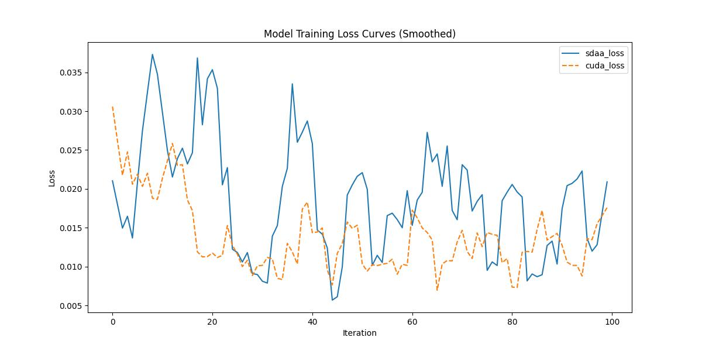

# ControlNet with Stable Diffusion v1.5 on Fill50K

## 🌟 模型概述

本项目基于 [lllyasviel/ControlNet](https://github.com/lllyasviel/ControlNet) 实现，结合 Stable Diffusion v1.5 模型，使用 **Fill50K 数据集** 进行微调训练，旨在实现图像条件控制生成。

Fill50K 是从 COCO 衍生的图像填充任务专用子集，包含遮挡图像、完整图像和文本提示，适用于条件图像生成任务。

模型特点：

- 使用 ControlNet 架构，增强对条件输入（如草图、边缘图等）的响应能力。
- 以 Stable Diffusion v1.5 为基础，结合文本引导生成图像。
- 支持 SDAA 自动加速框架，实现自动混合精度与显存迁移训练。

---

## ⚙️ 环境配置

```bash
conda activate torch_env_py310

# 安装依赖
pip install -r requirements.txt
open_clip相关包也可以从github安装依赖，此处不再提供。
```
# 安装加速与日志工具
```
pip install git+https://github.com/Rruown/lightning-Teco.git
pip install .
pip install git+https://gitee.com/xiwei777/tcap_dlloger.git
---

## 📂 数据集准备

### 1. 下载 Fill50K 数据集

```bash
git clone https://huggingface.co/lllyasviel/ControlNet
cd ControlNet/training
```

数据目录结构应为：

```
training/fill50k/
├── source/         # 遮挡图像（输入）
├── target/         # 完整图像（目标）
└── prompt.json     # 文本提示
```

检查数据完整性：

```bash
ls training/fill50k/source | wc -l    # 应为 5000
ls training/fill50k/target | wc -l    # 应为 5000
head -n 3 training/fill50k/prompt.json
```

示例内容：

```json
{"source": "source/000000.png", "target": "target/000000.jpg", "prompt": "a man riding a bicycle"}
```

---

### 2. 下载并转换 Stable Diffusion 权重

手动下载权重：

- 链接：[v1-5-pruned.ckpt](https://huggingface.co/runwayml/stable-diffusion-v1-5/resolve/main/v1-5-pruned.ckpt)
- 保存路径：

  ```
  ControlNet/models/v1-5-pruned.ckpt
  ```

- 转换为 ControlNet 格式：

```bash
cd ControlNet
python tool_add_control.py ./models/v1-5-pruned.ckpt ./models/control_sd15_ini.ckpt
```

输出示例：

```
Saving new checkpoint to ./models/control_sd15_ini.ckpt
Done.
```

---

### 3. 下载 CLIP 模型

前往以下链接下载 CLIP 模型文件：

链接：[https://huggingface.co/openai/clip-vit-large-patch14/tree/main](https://huggingface.co/openai/clip-vit-large-patch14/tree/main)

需要的文件：

```
config.json
merges.txt
model.safetensors
special_tokens_map.json
tokenizer_config.json
vocab.json
```

放置到模型目录中（路径视项目结构而定）。

---
s
## 🚀 启动训练

### 方法 1：手动执行

```bash
cd ControlNet
python tutorial_train.py
```
或者
```
python run_scripts/run_controlnet.py
```

### 方法 2：使用统一启动脚本

```bash
chmod +x run_scripts/run.sh
./run_scripts/run.sh
```

日志将保存为 `sdaa.log`，使用统一格式输出（兼容 TCAP_DLLogger）。

---

## 📊 训练结果

| 参数项             | 数值                                |
| ------------------ | ----------------------------------- |
| 模型结构            | ControlNet + Stable Diffusion v1.5 |
| 数据集             | Fill50K（源自 COCO）               |
| 训练迭代数           | 100                                |
| Batch Size         | 1                                  |
| Optimizer          | AdamW                              |
| Mixed Precision    | ✅ 使用 SDAA AMP                    |
| 加速框架            | torch_sdaa           |


---

## 📬 参考链接

- [ControlNet 官方仓库](https://github.com/lllyasviel/ControlNet)
- [Stable Diffusion v1.5 权重](https://huggingface.co/runwayml/stable-diffusion-v1-5)
- [CLIP 模型下载](https://huggingface.co/openai/clip-vit-large-patch14)
- [lightning-Teco 加速库](https://github.com/Rruown/lightning-Teco)
- [tcap_dllogger 日志库](https://gitee.com/xiwei777/tcap_dlloger)

---