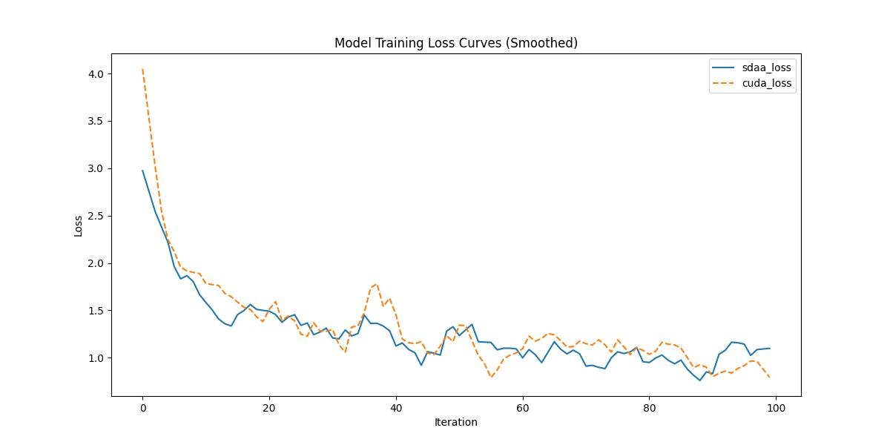

# CycleGAN
## 1. 模型概述  
CycleGAN 由美国加州大学伯克利分校（UC Berkeley）的计算机视觉团队提出，核心成员包括 Jun-Yan Zhu、Taesung Park、Phillip Isola 和 Alexei A. Efros。团队致力于无监督图像到图像的翻译任务，解决在缺乏成对训练样本时的图像域转换问题。研究方法采用生成对抗网络（GAN）架构，引入“循环一致性损失”确保图像可逆转换，从而训练模型在无配对数据下学习域映射。该方法可实现如照片与画作、白天与夜晚等风格间的转换，取得了令人瞩目的视觉效果，在图像增强、风格迁移等任务中广泛应用。  
> **论文链接**：https://arxiv.org/pdf/1703.10593.pdf  
> **仓库链接**：https://github.com/junyanz/pytorch-CycleGAN-and-pix2pix   

## 2. 快速开始  
使用本模型执行训练的主要流程如下：  
1. 基础环境安装：介绍训练前需要完成的基础环境检查和安装。  
2. 获取数据集：介绍如何获取训练所需的数据集。  
3. 构建环境：介绍如何构建模型运行所需要的环境。  
4. 启动训练：介绍如何运行训练。  

### 2.1 基础环境安装  

请参考基础环境安装章节，完成训练前的基础环境检查和安装。  

### 2.2 准备数据集  
> 下载训练集到指定文件夹：```/data/teco-data/maps/```。  
> 训练集下载链接：http://efrosgans.eecs.berkeley.edu/cyclegan/datasets/maps.zip  
> 解压训练集：```unzip /data/teco-data/maps.zip -d /data/teco-data/```   


### 2.3 构建环境

所使用的环境下已经包含PyTorch框架虚拟环境  
1. 执行以下命令，启动虚拟环境。  
    ```
    conda activate torch_env  
    ```
2. 安装python依赖  
    ```
    cd <ModelZoo_path>/PyTorch/contrib/Image_generation/CycleGAN
	pip install -r requirements.txt
    ```
### 2.4 启动训练  
1. 在构建好的环境中，进入训练脚本所在目录。  
    ```
    cd <ModelZoo_path>/PyTorch/contrib/Image_generation/CycleGAN/run_scripts
    export TORCH_SDAA_AUTOLOAD=cuda_migrate
    ```

2. 运行训练。该模型支持单机单卡。

    -  单机单卡
    ```
   python run_cyclegan.py --dataroot /data/teco-data/maps --name maps_cyclegan --model cycle_gan --print_freq 1 --max_iters 100
   ```
    更多训练参数参考[README](run_scripts/README.md)

### 2.5 训练结果
输出训练loss曲线及结果（参考使用[loss.py](./run_scripts/loss.py)）: 


MeanRelativeError: 0.13136865859553642
MeanAbsoluteError: 0.08825090646743775
