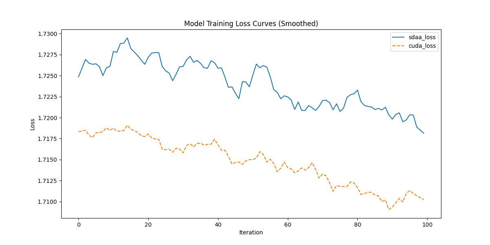

# **MAE（Masked Autoencoder）**
## 1. 模型概述  
MAE（Masked Autoencoder）是由Facebook AI Research（Kaiming He等）提出团队提出在视觉自监督预训练，通过掩码重建学习图像表征研究领域的成果。主要提出了非对称编解码器：编码器仅处理25%可见图像块，轻量解码器重构75%掩码区域；高掩码率（75%）策略：强制模型学习全局语义推理；像素级重建目标：增强细节建模能力。实验结果：ViT-Huge模型在ImageNet-1K微调后top-1精度达87.8%，训练速度比监督学习快3倍，迁移至下游任务（检测/分割）性能超越监督基线。
> **论文链接**：[ Masked Autoencoders Are Scalable Vision Learners](https://arxiv.org/abs/2111.06377)  
> **仓库链接**：https://github.com/facebookresearch/mae  

## 2. 快速开始  
使用本模型执行训练的主要流程如下：  
1. 基础环境安装：介绍训练前需要完成的基础环境检查和安装。  
2. 获取数据集：介绍如何获取训练所需的数据集。  
3. 构建环境：介绍如何构建模型运行所需要的环境。  
4. 启动训练：介绍如何运行训练。  

### 2.1 基础环境安装  

请参考基础环境安装章节，完成训练前的基础环境检查和安装。  

### 2.2 准备数据集  
#### 2.2.1 获取数据集  
> 下载MNIST数据到指定文件夹：```/data/teco-data/imagenet```。  
> 从http://image-net.org/下载并解压 ImageNet 训练集和验证集图片。  
> 目录结构是 torchvision 的标准布局，训练集和验证集数据分别位于train/文件夹 和val文件夹中：  
```
/path/to/imagenet/
  train/
    class1/
      img1.jpeg
    class2/
      img2.jpeg
  val/
    class1/
      img3.jpeg
    class2/
      img4.jpeg
```


### 2.3 构建环境

所使用的环境下已经包含PyTorch框架虚拟环境  
1. 执行以下命令，启动虚拟环境。  
    ```bash
    conda activate torch_env  
    ```
2. 安装python依赖  
    ```bash
    cd <ModelZoo_path>/PyTorch/contrib/Image_generation/mae
	pip install -r requirements.txt
    ```
3. 由于当前 PyTorch 版本对 `torch._six` 兼容性发生变化，需要对 `timm` 包进行修改：

   ```bash
    sed -i 's|^from torch\._six import container_abcs|import collections.abc as container_abcs|' \
    "$(python -m pip show timm | awk '/Location:/{print $2}')/timm/models/layers/helpers.py"
   ```
   
### 2.4 启动训练  
1. 在构建好的环境中，进入训练脚本所在目录。  
    ```bash
    cd <ModelZoo_path>/PyTorch/contrib/Image_generation/mae/run_scripts
    ```

2. 运行训练。该模型支持单机单卡。

    -  单机单卡
    ```bash
   python run_mae.py \
    --epochs 800 \
    --norm_pix_loss \
    --blr 1.5e-4 \
    --data_path /data/teco-data/imagenet \
    --device sdaa \
    --local_rank 0 \
    2>&1 | tee sdaa.log
    
   ```
    更多训练参数参考[README](run_scripts/README.md)

### 2.5 训练结果
输出训练loss曲线及结果（参考使用[loss.py](./run_scripts/loss.py)）: 


MeanRelativeError: 0.0053893668466633285
MeanAbsoluteError: 0.009240349531173706
Rule,mean_relative_error 0.0053893668466633285
pass mean_relative_error=0.0053893668466633285 <= 0.05 or mean_absolute_error=0.009240349531173706 <= 0.0002
