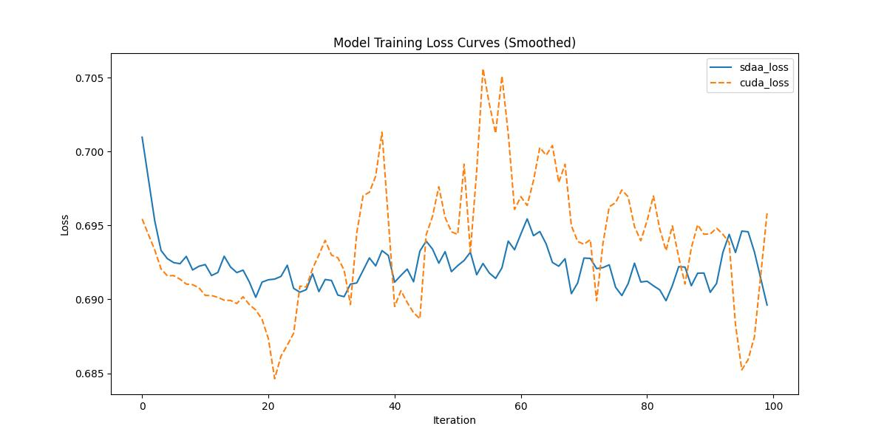

# MISF
## 1. 模型概述  
MISF（Multi-scale Interactive Segmentation under Varying Illumination）是由清华大学团队（论文作者：Qing Guo等）主导开发光照鲁棒医学图像分割领域的成果。MISF提出了一种新颖的高保真图像绘制方法。 具体来说，我们使用单个预测网络同时在图像级和深层特征级进行预测过滤。 图像级过滤是为了恢复细节，而深层特征级过滤则是为了完成语义信息，从而获得高保真的内绘效果。 在三个公共数据集上，我们的方法优于最先进的方法。
> **论文链接**：[MISF: Multi-level Interactive Siamese Filtering for High-Fidelity Image Inpainting in CVPR2022](https://arxiv.org/abs/2203.06304)  
> **仓库链接**：https://github.com/tsingqguo/misf   

## 2. 快速开始  
使用本模型执行训练的主要流程如下：  
1. 基础环境安装：介绍训练前需要完成的基础环境检查和安装。  
2. 获取数据集：介绍如何获取训练所需的数据集。  
3. 构建环境：介绍如何构建模型运行所需要的环境。  
4. 启动训练：介绍如何运行训练。  

### 2.1 基础环境安装  

请参考基础环境安装章节，完成训练前的基础环境检查和安装。  

### 2.2 准备数据集  
#### 2.2.1 获取数据集  
> 下载CelebA数据集到指定文件夹：```/data/teco-data/CelebA-MISF```。  
> 下载链接为：https://mmlab.ie.cuhk.edu.hk/projects/CelebA.html   
>  下载Mask数据集到指定文件夹：```/data/teco-data/CelebA-MISF```。  
>  下载链接为：https://drive.google.com/file/d/1cuw8QGfiop9b4K7yo5wPgPqXBIHjS6MI/view?usp=share_link  

#### 2.2.2 数据集预处理  
>  组织数据集：  
```
cd <ModelZoo_path>/PyTorch/contrib/Super_resulotion/misf/data
python convert_celeba_for_misf.py
```
> 数据结构如下图所示:
> 组织的数据集结构如下所示:
```shell
--CelebA
   --train
      --1-1.png
   --valid
      --1-1.png
   --test
      --1-1.png
   --mask-train
	  --1-1.png
   --mask-valid
      --1-1.png
   --mask-test
      --0%-20%
        --1-1.png
      --20%-40%
        --1-1.png
      --40%-60%
        --1-1.png
```

>  为数据集创建索引：
```
python data_list.py
```


### 2.3 构建环境

所使用的环境下已经包含PyTorch框架虚拟环境  
1. 执行以下命令，启动虚拟环境。  
    ```
    conda activate torch_env  
    ```
2. 安装python依赖  
    ```
    cd <ModelZoo_path>/PyTorch/contrib/Super_resulotion/misf
	pip install -r requirements.txt
    ```
### 2.4 启动训练  
1. 在构建好的环境中，进入训练脚本所在目录。  
    ```
    cd <ModelZoo_path>/PyTorch/contrib/Super_resulotion/misf/run_scripts
    ```

2. 运行训练。该模型支持单机单卡。

    -  单机单卡
    ```
   python run_misf.py \
    2>&1 | tee $log_file
    
   ```
    更多训练参数参考[README](run_scripts/README.md)

### 2.5 训练结果
输出训练loss曲线及结果（参考使用[loss.py](./run_scripts/loss.py)）: 


MeanRelativeError: -0.0018361764321747484
MeanAbsoluteError: -0.0013816618919372558
Rule,mean_relative_error -0.0018361764321747484
pass mean_relative_error=-0.0018361764321747484 <= 0.05 or mean_absolute_error=-0.0013816618919372558 <= 0.0002
