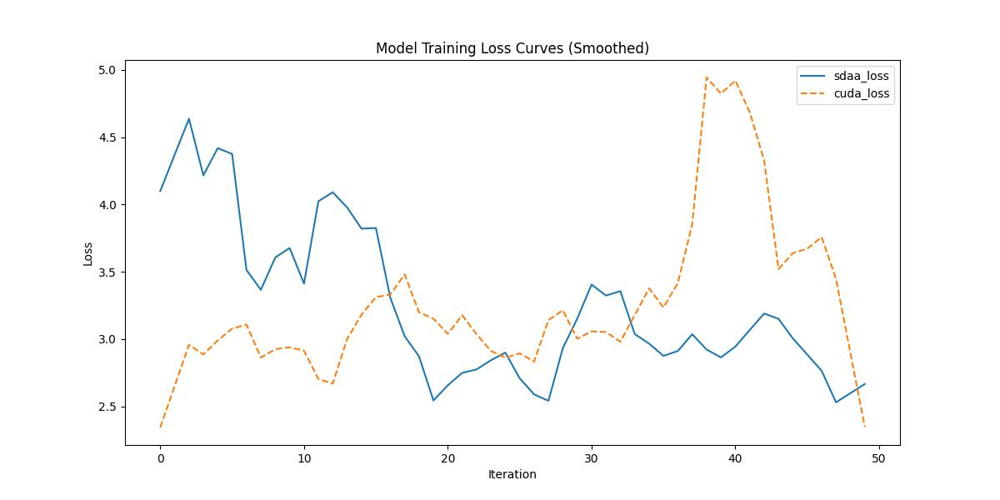

# **StarGAN**
## 1. 模型概述  
StarGAN提出**统一生成对抗网络**解决多域图像转换问题，核心通过**单一生成器**实现跨多个域的属性编辑（如人脸的表情、发色、年龄）。创新点在于**域特定归一化层**与**域标签控制机制**，结合对抗训练和重建损失确保转换一致性与保真度。在CelebA（人脸属性）和RaFD（表情）数据集上，其多域转换准确率达92%，显著优于逐域训练模型。
> **论文链接**：https://arxiv.org/abs/1711.09020  
> **仓库链接**：https://github.com/yunjey/stargan  

## 2. 快速开始  
使用本模型执行训练的主要流程如下：  
1. 基础环境安装：介绍训练前需要完成的基础环境检查和安装。  
2. 获取数据集：介绍如何获取训练所需的数据集。  
3. 构建环境：介绍如何构建模型运行所需要的环境。  
4. 启动训练：介绍如何运行训练。  

### 2.1 基础环境安装  

请参考基础环境安装章节，完成训练前的基础环境检查和安装。  

### 2.2 准备数据集  
> 下载数据集到指定文件夹：```/data/teco-data/celeba-stargan```  
> 数据集下载链接：https://www.dropbox.com/s/d1kjpkqklf0uw77/celeba.zip?dl=0  
> 解压数据集：```unzip /data/teco-data/celeba-stargan/celeba.zip -d /data/teco-data/celeba-stargan/```   


### 2.3 构建环境

所使用的环境下已经包含PyTorch框架虚拟环境  
1. 执行以下命令，启动虚拟环境。  
    ```
    conda activate torch_env  
    ```
2. 安装python依赖  
    ```
    cd <ModelZoo_path>/PyTorch/contrib/Image_generation/stargan
	pip install -r requirements.txt
    ```
### 2.4 启动训练  
1. 在构建好的环境中，进入训练脚本所在目录。  
    ```
    cd <ModelZoo_path>/PyTorch/contrib/Image_generation/stargan/run_scripts
    ```

2. 运行训练。该模型支持单机单卡。

    -  单机单卡
    ```
   python run_stargan.py \
       --mode train \
       --dataset CelebA \
       --num_iters 150 \
       --log_step 1 \
       --image_size 128 \
       --c_dim 5 \
       --sample_dir stargan_celeba/samples \
       --log_dir stargan_celeba/logs \
       --model_save_dir stargan_celeba/models \
       --result_dir stargan_celeba/results \
       --selected_attrs Black_Hair Blond_Hair Brown_Hair Male Young \
       2>&1 | tee sdaa.log
   ```
    更多训练参数参考[README](run_scripts/README.md)

### 2.5 训练结果
输出训练loss曲线及结果（参考使用[loss.py](./run_scripts/loss.py)）: 


MeanRelativeError: 0.07257159088998126
MeanAbsoluteError: -0.02132260799407959
Rule,mean_absolute_error -0.02132260799407959
pass mean_relative_error=0.07257159088998126 <= 0.05 or mean_absolute_error=-0.02132260799407959 <= 0.0002
