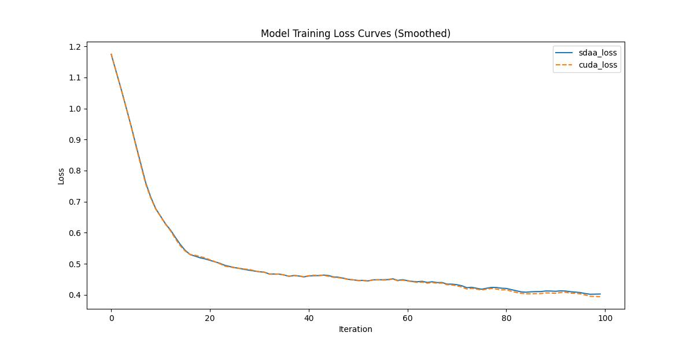

# **R2U-Net**
## 1. 模型概述  
VAE（变分自编码器）是一种概率生成模型，通过融合深度神经网络与变分推断，实现对复杂数据分布的高效建模。其核心思想是将输入数据编码为潜在空间的概率分布（而非固定点），并利用重参数化技巧从该分布采样，通过解码器重建数据。创新点在于变分下界（ELBO）优化，迫使潜在空间连续且结构化，支持数据生成与插值。应用于图像生成、数据补全、异常检测等领域，在MNIST和Frey人脸数据集上生成质量显著优于传统方法，为无监督学习奠定重要基础。
> **论文链接**：[Auto-Encoding Variational Bayes](https://arxiv.org/abs/1312.6114)  
> **仓库链接**：https://github.com/pytorch/examples/tree/main/vae   

## 2. 快速开始  
使用本模型执行训练的主要流程如下：  
1. 基础环境安装：介绍训练前需要完成的基础环境检查和安装。  
2. 获取数据集：介绍如何获取训练所需的数据集。  
3. 构建环境：介绍如何构建模型运行所需要的环境。  
4. 启动训练：介绍如何运行训练。  

### 2.1 基础环境安装  

请参考基础环境安装章节，完成训练前的基础环境检查和安装。  

### 2.2 准备数据集  
#### 2.2.1 获取数据集  
> 下载MNIST数据到指定文件夹：```/data/teco-data/MNIST```。  
> 自动从网上下载 MNIST： 
```
datasets.MNIST('../data', train=True, download=True, transform=transforms.ToTensor())

```


### 2.3 构建环境

所使用的环境下已经包含PyTorch框架虚拟环境  
1. 执行以下命令，启动虚拟环境。  
    ```
    conda activate torch_env  
    ```
2. 安装python依赖  
    ```
    cd <ModelZoo_path>/PyTorch/contrib/Super_resulotion/vae
	pip install -r requirements.txt
    ```
### 2.4 启动训练  
1. 在构建好的环境中，进入训练脚本所在目录。  
    ```
    cd <ModelZoo_path>/PyTorch/contrib/Super_resulotion/vae/run_scripts
    ```

2. 运行训练。该模型支持单机单卡。

    -  单机单卡
    ```
   python run_vae.py \
    2>&1 | tee sdaa.log
    
   ```
    更多训练参数参考[README](run_scripts/README.md)

### 2.5 训练结果
输出训练loss曲线及结果（参考使用[loss.py](./run_scripts/loss.py)）: 


MeanRelativeError: 0.004715536466837289
MeanAbsoluteError: 0.0020350690104166593
Rule,mean_absolute_error 0.0020350690104166593
pass mean_relative_error=0.004715536466837289 <= 0.05 or mean_absolute_error=0.0020350690104166593 <= 0.0002
