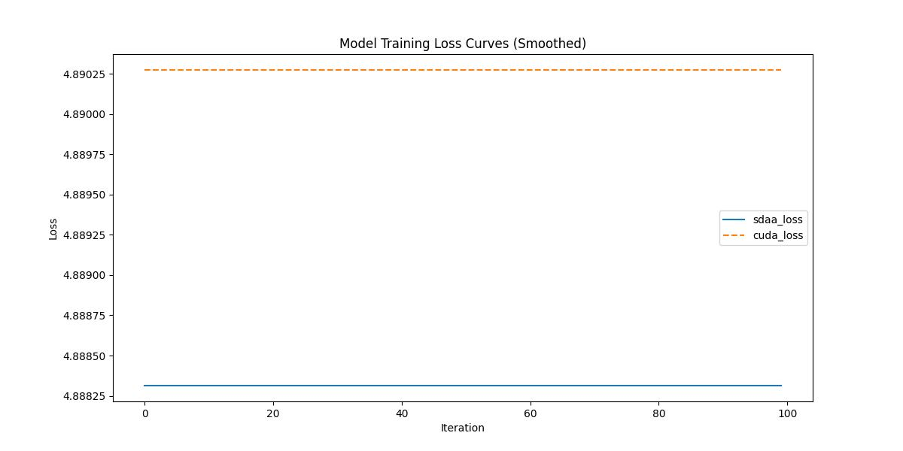

# OpenCLIP
## 1. 模型概述
OpenCLIP 是一个开源的对比语言-图像预训练（CLIP）模型实现，基于 OpenAI 的 CLIP 模型架构。该模型能够学习图像和文本之间的关联，实现零样本图像分类、图文检索等任务。

- 论文链接：[[Paper]](https://arxiv.org/abs/2212.07143) 

- 仓库链接：https://github.com/mlfoundations/open_clip
## 2. 快速开始
使用本模型执行训练的主要流程如下：
1. 基础环境安装：介绍训练前需要完成的基础环境检查和安装。
2. 获取数据集：介绍如何获取训练所需的数据集。
3. 构建环境：介绍如何构建模型运行所需要的环境。
4. 启动训练：介绍如何运行训练。

### 2.1 基础环境安装

请参考基础环境安装章节，完成训练前的基础环境检查和安装。

### 2.2 准备数据集
#### 2.2.1 获取数据集
OpenCLIP使用 COCO数据集，该数据集为开源数据集，可从 [COCO](http://images.cocodataset.org) 下载。

#### 2.2.2 处理数据集
# 下载训练集
```
wget http://images.cocodataset.org/zips/train2017.zip
wget http://images.cocodataset.org/annotations/annotations_trainval2017.zip

```
# 解压文件
```
unzip train2017.zip -d COCO
unzip annotations_trainval2017.zip -d COCO
```

# 修改create_coco_csv.py代码生成train_data.csv
替换路径
def create_coco_csv(
    annotations_file="/.../COCO/annotations/captions_train2017.json",
    images_dir="/.../COCO/train2017",
    output_csv="/.../COCO/train_data.csv"
):
### 2.3 构建环境

所使用的环境下已经包含PyTorch框架虚拟环境。
1. 执行以下命令，启动虚拟环境。
    ```
    conda activate torch_env_py310
    ```
2. 安装python依赖。
    ```
    pip install -U pip
    git clone https://github.com/mlfoundations/open_clip.git
    pip install 'open_clip_torch[training]
    mim install -e .
    pip install -r requirements.txt
    ```
### 2.4 启动训练

1. 在构建好的环境中，进入训练脚本所在目录。
    ```
    cd ./open_clip/run_scripts
    ```

2. 运行训练。该模型支持单机单卡。
    ```
   python run_open_clip.py --train-data="/data/teco-data/COCO/train_data.csv" --csv-img-key filepath --csv-caption-key title --csv-separator ","
   ```
   默认执行命令的参数如下： python ../src/open_clip_train/main.py --train-data /../COCO/train_data.csv --dataset-type auto --csv-separator , --csv-img-key filepath --csv-caption-key title --logs ./logs/ --workers 4 --batch-size 64 --epochs 32 --lr 0.0005 --beta1 0.9 --beta2 0.999 --eps 1e-08 --wd 0.2 --warmup 10000 --opt adamw --lr-scheduler cosine --lr-cooldown-end 0.0 --lr-cooldown-power 1.0 --save-frequency 1 --zeroshot-frequency 2 --val-frequency 1 --precision amp --model RN50 --pretrained  --lock-image-unlocked-groups 0 --accum-freq 1 --device sdaa --report-to  --wandb-notes  --wandb-project-name open-clip --seed 0 --lock-text-unlocked-layers 0 --log-every-n-steps 100 --coca-caption-loss-weight 2.0 --coca-contrastive-loss-weight 1.0 --remote-sync-frequency 300 --remote-sync-protocol s3
    更多训练参数参考 run_scripts/argument.py

### 2.5 训练结果
输出训练loss曲线及结果（参考使用[loss.py](./run_scripts/loss.py)）: 

MeanRelativeError: -0.000400949798603013
MeanAbsoluteError: -0.0019607543945996397
Rule,mean_absolute_error -0.0019607543945996397
pass mean_relative_error=-0.000400949798603013 <= 0.05 or mean_absolute_error=-0.0019607543945996397 <= 0.0002