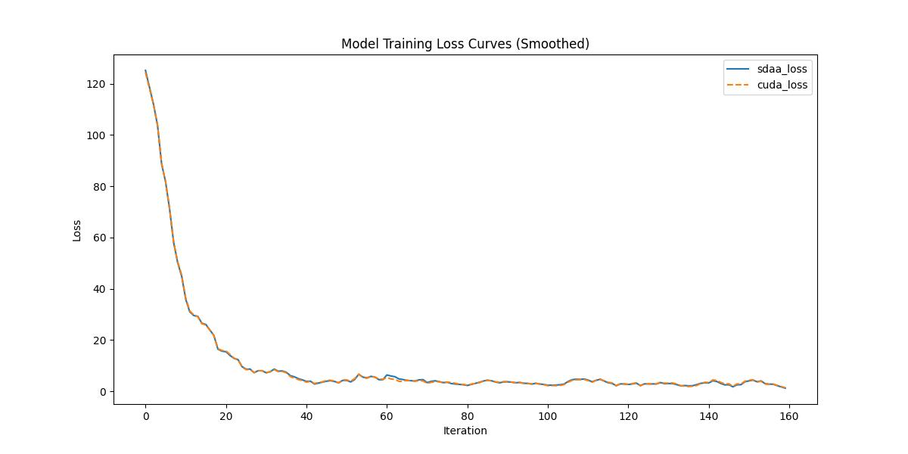

# **BERT-NER-Pytorch**
## 1. 模型概述  
BERT-NER-Pytorch是由独立开发者"lonePatient"实现并开源在基于BERT的命名实体识别，提供轻量级PyTorch实现方案领域的项目。该项目采用模块化设计：支持BERT/ALBERT/RoBERTa等预训练模型灵活接入；
工业级优化：集成CRF层增强标签序列约束，支持FP16训练与ONNX导出；即用型工具：内置CoNLL-2003/MSRA等数据集预处理脚本。在CoNLL-2003英文NER任务中F1达92.3%（与原论文一致），单GPU训练速度比TF版快18%，提供中文实体识别预训练模型。
> **仓库链接**：https://github.com/lonePatient/BERT-NER-Pytorch  

## 2. 快速开始  
使用本模型执行训练的主要流程如下：  
1. 基础环境安装：介绍训练前需要完成的基础环境检查和安装。  
2. 获取数据集：介绍如何获取训练所需的数据集。  
3. 构建环境：介绍如何构建模型运行所需要的环境。  
4. 启动训练：介绍如何运行训练。  

### 2.1 基础环境安装  

请参考基础环境安装章节，完成训练前的基础环境检查和安装。  

### 2.2 准备数据集  
#### 2.2.1 获取数据集  
> 下载训练数据到指定文件夹：```/data/teco-data/BERT-NER_Pytorch/datasets```。  
> 训练数据链接： https://github.com/CLUEbenchmark/CLUENER。  

#### 2.2.2 下载预训练模型  
> 下载预训练模型到指定文件夹：```/data/teco-data/BERT-NER_Pytorch/prev_trained_model```。  
> 预训练模型链接： https://hf-mirror.com/google-bert/bert-base-chinese/tree/main。


### 2.3 构建环境

所使用的环境下已经包含PyTorch框架虚拟环境  
1. 执行以下命令，启动虚拟环境。  
    ```
    conda activate torch_env  
    ```
2. 安装python依赖  
    ```
    cd <ModelZoo_path>/PyTorch/contrib/NLP/BERT-NER-Pytorch/
	pip install -r requirements.txt
    ```
### 2.4 启动训练  
1. 在构建好的环境中，进入训练脚本所在目录。  
    ```
    cd <ModelZoo_path>/PyTorch/contrib/NLP/BERT-NER-Pytorch/run_scripts
    ```

2. 运行训练。该模型支持单机单卡。

    -  单机单卡
    ```
   python run_BERT-NER-Pytorch.py \
    --model_type=bert \
    --model_name_or_path=/data/teco-data/BERT-NER_Pytorch/prev_trained_model/bert-base-chinese \
    --task_name="cner" \
    --do_train \
    --do_lower_case \
    --data_dir=/data/teco-data/BERT-NER_Pytorch/datasets/cner/ \
    --train_max_seq_length=128 \
    --eval_max_seq_length=512 \
    --per_gpu_train_batch_size=24 \
    --per_gpu_eval_batch_size=24 \
    --learning_rate=3e-5 \
    --crf_learning_rate=1e-3 \
    --max_steps=100 \
    --logging_steps=1 \
    --save_steps=-1 \
    --output_dir=./outputs/cner_output/ \
    --overwrite_output_dir \
    --seed=42 \
    --local_rank=0 \
    2>&1 | tee sdaa.log
    
   ```
    更多训练参数参考[README](run_scripts/README.md)

### 2.5 训练结果
输出训练loss曲线及结果（参考使用[loss.py](./run_scripts/loss.py)）: 



MeanRelativeError: 0.011810708199080264
MeanAbsoluteError: 0.012578979507088662
Rule,mean_relative_error 0.011810708199080264
pass mean_relative_error=0.011810708199080264 <= 0.05 or mean_absolute_error=0.012578979507088662 <= 0.0002
