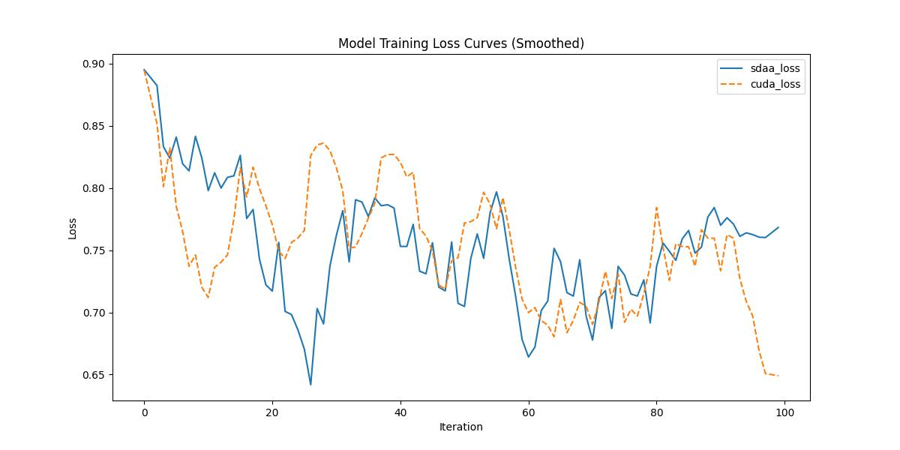

# **R2U-Net**
## 1. 模型概述  
Attention U-Net针对医学图像中小目标器官（如胰腺）分割难题，在U-Net基础上引入门控注意力机制。其核心通过门控信号（Gating Signal） 控制跳跃连接中的特征权重，使解码器自适应聚焦目标区域，抑制无关背景噪声。创新点在于门控注意力模块，通过Softmax生成空间注意力权重图，精准定位目标器官的细微结构。该模型在胰腺CT分割任务中Dice系数比原U-Net提升4.1%，并扩展至多器官分割（心脏、肿瘤）与细胞图像处理，显著提升复杂背景下小目标的分割鲁棒性。 
> **论文链接**：[Attention U-Net: Learning Where to Look for the Pancreas](https://arxiv.org/abs/1804.03999)  
> **仓库链接**：https://github.com/LeeJunHyun/Image_Segmentation   

## 2. 快速开始  
使用本模型执行训练的主要流程如下：  
1. 基础环境安装：介绍训练前需要完成的基础环境检查和安装。  
2. 获取数据集：介绍如何获取训练所需的数据集。  
3. 构建环境：介绍如何构建模型运行所需要的环境。  
4. 启动训练：介绍如何运行训练。  

### 2.1 基础环境安装  

请参考基础环境安装章节，完成训练前的基础环境检查和安装。  

### 2.2 准备数据集  
#### 2.2.1 获取数据集  
> 下载训练数据到指定文件夹：```/data/teco-data/ISIC2018```。  
> 训练数据链接： https://isic-challenge-data.s3.amazonaws.com/2018/ISIC2018_Task1-2_Training_Input.zip。  

> 下载GT数据到指定文件夹：```/data/teco-data/ISIC2018```  
> GT数据链接： https://isic-challenge-data.s3.amazonaws.com/2018/ISIC2018_Task1_Training_GroundTruth.zip  

#### 2.2.2 处理数据集  
> 解压训练数据：```unzip /data/teco-data/ISIC2018/ISIC2018_Task1-2_Training_Input.zip -d /data/teco-data/ISIC2018```   
> 解压GT数据：```unzip /data/teco-data/ISIC2018/ISIC2018_Task1_Training_GroundTruth.zip -d /data/teco-data/ISIC2018```   
> 解压后的文件结构应该为：```/data/teco-data/ISIC2018/ISIC2018_Task1-2_Training_Input``` | ```/data/teco-data/ISIC2018/ISIC2018_Task1_Training_GroundTruth```  
> 处理数据集：``` python dataset.py ```


### 2.3 构建环境

所使用的环境下已经包含PyTorch框架虚拟环境  
1. 执行以下命令，启动虚拟环境。  
    ```
    conda activate torch_env  
    ```
2. 安装python依赖  
    ```
    cd <ModelZoo_path>/PyTorch/contrib/Segmentation/AttU_Net
	pip install -r requirements.txt
    ```
### 2.4 启动训练  
1. 在构建好的环境中，进入训练脚本所在目录。  
    ```
    cd <ModelZoo_path>/PyTorch/contrib/Segmentation/AttU_Net/run_scripts
    ```

2. 运行训练。该模型支持单机单卡。

    -  单机单卡
    ```
   python run_AttU_Net.py \
    --model_type AttU_Net \
    --cuda_idx 0 \
    --nproc_per_node 1 \
    2>&1 | tee $log_file
    
   ```
    更多训练参数参考[README](run_scripts/README.md)

### 2.5 训练结果
输出训练loss曲线及结果（参考使用[loss.py](./run_scripts/loss.py)）: 



MeanRelativeError: 0.009063860641328176
MeanAbsoluteError: -0.0006081902980804443
Rule,mean_absolute_error -0.0006081902980804443
pass mean_relative_error=0.009063860641328176 <= 0.05 or mean_absolute_error=-0.0006081902980804443 <= 0.0002
