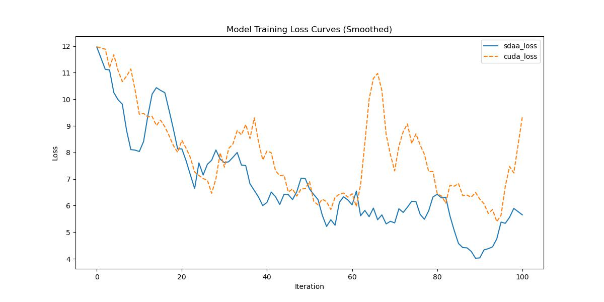

# BiseNetv2
## 1. 模型概述
在语义分割任务中，低层细节特征与高层语义信息具有同等重要性。然而现有方法为加速模型推理，往往牺牲空间细节特征，导致精度显著下降。我们提出通过解耦处理空间细节与类别语义来实现实时语义分割的高精度与高效率，为此构建了速度与精度均衡的双边分割网络BiSeNet V2。该架构包含：(1) 细节分支（宽通道浅层结构）用于捕捉低层细节并生成高分辨率特征表示；(2) 语义分支（窄通道深层结构）用于获取高层语义上下文，通过通道精简与快速下采样策略实现轻量化。我们设计了引导聚合层来强化特征交互与融合，并提出 booster 训练策略以零推理代价提升性能。
- 论文链接：[Bisenet v2: Bilateral Network with Guided Aggregation for Real-time Semantic Segmentation](https://arxiv.org/abs/2004.02147)
- 仓库链接：[https://github.com/open-mmlab/mmsegmentation/tree/main/configs/bisenetv2](https://github.com/open-mmlab/mmsegmentation/tree/main/configs/bisenetv2)

1.基础环境安装：介绍训练前需要完成的基础环境检查和安装。
2.获取数据集：介绍如何获取训练所需的数据集。
3.构建环境：介绍如何构建模型运行所需要的环境。
4.启动训练：介绍如何运行训练。

## 2.1 基础环境安装
请参考基础环境安装章节，完成训练前的基础环境检查和安装。
## 2.2 准备数据集
BiseNetv2使用Cityscapes数据集，该数据集为开源数据集，可从[CityScapes](https://www.cityscapes-dataset.com/login/)下载。
## 2.3 构建环境
所使用的环境下已经包含PyTorch框架虚拟环境。
1. 执行以下命令，启动虚拟环境。 
   ```
   conda activate torch_env
   ```
2. 安装python依赖。
   ```
   pip3 install  -U openmim 
   pip3 install git+https://gitee.com/xiwei777/mmengine_sdaa.git 
   pip3 install opencv_python mmcv --no-deps
   mim install -e .
   pip install -r requirements.txt
   ```
## 2.4 启动训练

1.在构建好的环境中，进入训练脚本所在目录。
   ```
   cd <ModelZoo_path>/PyTorch/contrib/Segmentation/BiseNetv2/run_scripts
   ``` 
2. 运行训练。该模型支持单机单卡。
   ```
   python run_bisenetv2.py --config ../configs/bisenetv2/bisenetv2_fcn_4xb4-160k_cityscapes-1024x1024.py \
    --launcher pytorch --nproc-per-node 1 --amp 2>&1 | tee sdaa.log
   ```
更多训练参数参考 run_scripts/argument.py

## 2.5 训练结果
输出训练loss曲线及结果:



MeanRelativeError: -0.160692431306258

MeanAbsoluteError: -1.7200564575195312

Rule,mean_absolute_error -1.7200564575195312

pass mean_relative_error=-0.160692431306258 <= 0.05 or mean_absolute_error=-1.7200564575195312 <= 0.0002

