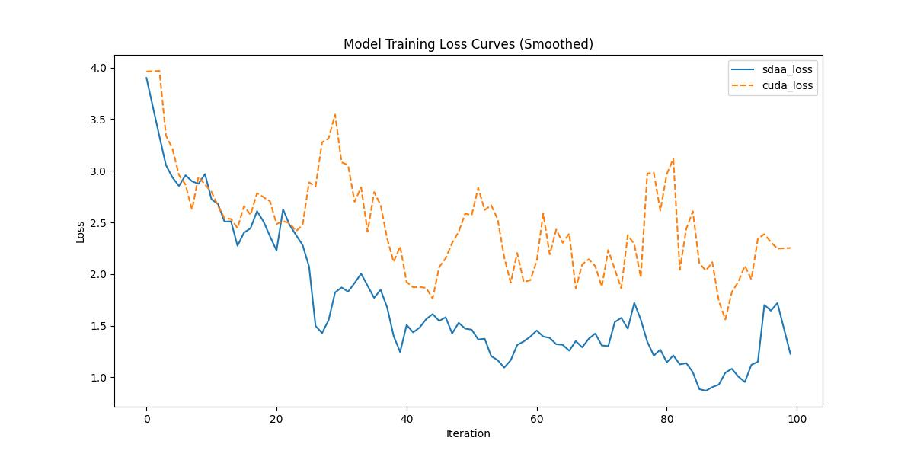

# DmNet
## 1. 模型概述
多尺度表示在语义分割中提供了一种有效的方式，用于应对目标和背景物体的尺度变化。以往的方法通常通过使用不同尺寸的卷积核、采用空洞卷积扩大感受野，或利用不同尺度的池化操作来构建多尺度表示，但这些滤波器的参数在训练后是固定的。这些方法往往存在计算开销大或参数量多的问题，而且在推理过程中无法根据输入图像自适应调整。本文提出了一种动态多尺度网络（Dynamic Multi-scale Network，DMNet），可以自适应地提取多尺度内容以预测像素级的语义标签。DMNet由多个动态卷积模块（Dynamic Convolutional Modules，DCMs）并行组成，每个模块利用上下文感知的滤波器来估计对应尺度下的语义表示。这些DCM模块的输出随后会被整合，用于最终的分割结果。- 论文链接：[Dynamic Multi-scale Filters for Semantic Segmentation](https://openaccess.thecvf.com/content_ICCV_2019/papers/He_Dynamic_Multi-Scale_Filters_for_Semantic_Segmentation_ICCV_2019_paper.pdf)
- 论文链接：[Dynamic Multi-scale Filters for Semantic Segmentation](https://openaccess.thecvf.com/content_ICCV_2019/papers/He_Dynamic_Multi-Scale_Filters_for_Semantic_Segmentation_ICCV_2019_paper.pdf)
- 仓库链接：[https://github.com/open-mmlab/mmsegmentation/tree/main/configs/dmnet](https://github.com/open-mmlab/mmsegmentation/tree/main/configs/dmnet)

1.基础环境安装：介绍训练前需要完成的基础环境检查和安装。

2.获取数据集：介绍如何获取训练所需的数据集。

3.构建环境：介绍如何构建模型运行所需要的环境。

4.启动训练：介绍如何运行训练。

## 2.1 基础环境安装
请参考基础环境安装章节，完成训练前的基础环境检查和安装。
## 2.2 准备数据集
DmNet使用Cityscapes数据集，该数据集为开源数据集，可从[CityScapes](https://www.cityscapes-dataset.com/login/)下载。
## 2.3 构建环境
所使用的环境下已经包含PyTorch框架虚拟环境。
1. 执行以下命令，启动虚拟环境。 
   ```
   conda activate torch_env
   ```
2. 安装python依赖。
   ```
   pip3 install  -U openmim 
   pip3 install git+https://gitee.com/xiwei777/mmengine_sdaa.git 
   pip3 install opencv_python mmcv --no-deps
   mim install -e .
   pip install -r requirements.txt
   ```
## 2.4 启动训练

1.在构建好的环境中，进入训练脚本所在目录。
   ```
   cd <ModelZoo_path>/PyTorch/contrib/Segmentation/DmNet/run_scripts
   ``` 
2. 运行训练。该模型支持单机单卡。
   ```
   python run_dmnet.py --config ../configs/dmnet/dmnet_r50-d8_4xb2-80k_cityscapes-512x1024.py \
    --launcher pytorch --nproc-per-node 1 --amp 2>&1 | tee sdaa.log
   ```
更多训练参数参考 run_scripts/argument.py

## 2.5 训练结果
输出训练loss曲线及结果:
   


MeanRelativeError:-0.32689508826094884

MeanAbsoluteError:-0.9667948031425476

Rule,mean absolute error -0.9667948031425476

pass mean relative error=-0.32689508826094884 <= 0.85 or mean absolute error=-8.9667948031425476 <= 0.0802
