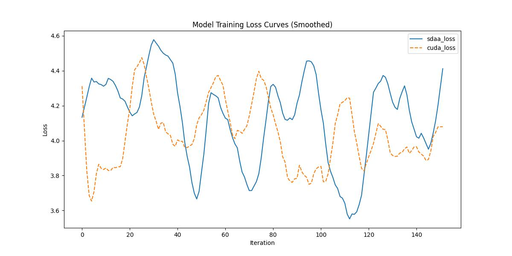

# DPT
## 1. 模型概述
本模型采用了基于视觉变换器（Vision Transformer, ViT）的架构，旨在改进密集预测任务的性能。与传统的卷积神经网络（CNN）相比，视觉变换器在处理图像时能够提供更广泛的感受野，并且能以较高的分辨率处理图像，逐步通过卷积解码器合成全分辨率预测。这使得本模型能够在密集预测任务中，尤其是在训练数据量较大时，提供更细粒度且全球一致的预测结果。通过实验验证，采用该架构的模型在多个任务上取得了显著的性能提升，特别是在单目深度估计和语义分割任务上，展示了相对于传统卷积网络的28%的性能提升。

- 仓库链接：[<a href="https://github.com/isl-org/DPT">Official Repo</a>](https://github.com/facebookresearch/deit)

## 2. 快速开始
使用本模型执行训练的主要流程如下：
1. 基础环境安装：介绍训练前需要完成的基础环境检查和安装。
2. 获取数据集：介绍如何获取训练所需的数据集。
3. 构建环境：介绍如何构建模型运行所需要的环境。
4. 启动训练：介绍如何运行训练。

### 2.1 基础环境安装

请参考基础环境安装章节，完成训练前的基础环境检查和安装。

### 2.2 准备数据集
#### 2.2.1 获取数据集

DPT使用 ADE20K数据集，ADE20K 的训练和验证集可以从这个[链接](http://data.csail.mit.edu/places/ADEchallenge/ADEChallengeData2016.zip)下载。
如果需要下载测试数据集，可以在[官网](http://host.robots.ox.ac.uk/)注册后，下载[测试集](http://host.robots.ox.ac.uk:8080/eval/downloads/VOC2010test.tar)。

#### 2.2.2

openmmlab在 `tools` 目录中提供了一个脚本 [`vit2mmseg.py`](../../tools/model_converters/vit2mmseg.py)，用于将 [timm](https://github.com/rwightman/pytorch-image-models/blob/master/timm/models/vision_transformer.py) 中的模型权重转换为 MMSegmentation 风格。

```shell
python tools/model_converters/vit2mmseg.py ${PRETRAIN_PATH} ${STORE_PATH}
```

如

```shell
python tools/model_converters/vit2mmseg.py https://github.com/rwightman/pytorch-image-models/releases/download/v0.1-vitjx/jx_vit_base_p16_224-80ecf9dd.pth pretrain/jx_vit_base_p16_224-80ecf9dd.pth
```

此脚本将从 `PRETRAIN_PATH` 转换模型，并将转换后的模型存储在 `STORE_PATH`。

### 2.3 构建环境

所使用的环境下已经包含PyTorch框架虚拟环境。
1. 执行以下命令，启动虚拟环境。
    ```
    conda activate torch_env
    ```
2. 安装python依赖。
    ```
    pip install -r requirements.txt
    pip install -e .
    ```
3. 添加环境变量。
    ```
    export TORCH_SDAA_AUTOLOAD=cuda_migrate
    ```

### 2.4 启动训练

1. 在构建好的环境中，进入训练脚本所在目录。
    ```
    cd <ModelZoo_path>/PyTorch/contrib/Segmentation/dpt/run_scripts
    ```

2. 运行训练。该模型支持单机单卡。
    ```
    python run_dpt.py --config ../configs/dpt/dpt_vit-b16_8xb2-160k_ade20k-512x512.py --launcher pytorch --nproc-per-node 4 --amp
    ```
     更多训练参数参考 run_scripts/argument.py

### 2.5 训练结果
输出训练loss曲线及结果（参考使用[loss.py](./run_scripts/loss.py)）: 



MeanRelativeError: 0.03745229097319054
MeanAbsoluteError: 0.13358400000000004
Rule,mean_relative_error 0.03745229097319054
pass mean_relative_error=0.03745229097319054 <= 0.05 or mean_absolute_error=0.13358400000000004 <= 0.0002