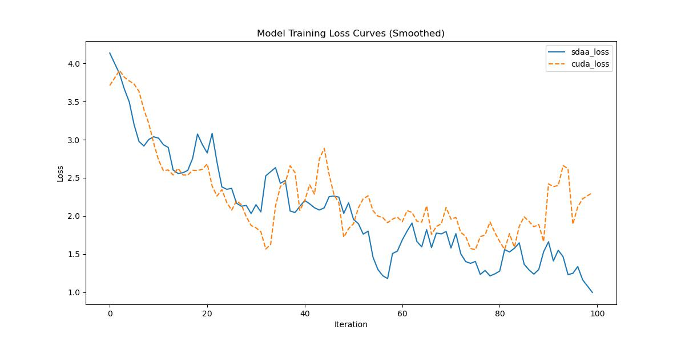

# EncNet
## 1. 模型概述
通过采用空洞卷积、利用多尺度特征及优化边界处理，在全卷积网络（FCN）框架下显著提升了像素级标注的空间分辨率。本文通过引入上下文编码模块，探索全局语境信息对语义分割的影响——该模块能捕捉场景的语义上下文，并选择性增强类别相关特征图。所提出的上下文编码模块仅需在FCN基础上增加少量计算成本，即可显著改善语义分割效果。
- 论文链接：[Context Encoding for Semantic Segmentation](https://arxiv.org/abs/1803.08904)
- 仓库链接：[https://github.com/open-mmlab/mmsegmentation/tree/main/configs/encnet](https://github.com/open-mmlab/mmsegmentation/tree/main/configs/encnet)

1.基础环境安装：介绍训练前需要完成的基础环境检查和安装。
2.获取数据集：介绍如何获取训练所需的数据集。
3.构建环境：介绍如何构建模型运行所需要的环境。
4.启动训练：介绍如何运行训练。

## 2.1 基础环境安装
请参考基础环境安装章节，完成训练前的基础环境检查和安装。
## 2.2 准备数据集
EncNet使用Cityscapes数据集，该数据集为开源数据集，可从[CityScapes](https://www.cityscapes-dataset.com/login/)下载。
## 2.3 构建环境
所使用的环境下已经包含PyTorch框架虚拟环境。
1. 执行以下命令，启动虚拟环境。 
   ```
   conda activate torch_env
   ```
2. 安装python依赖。
   ```
   pip3 install  -U openmim 
   pip3 install git+https://gitee.com/xiwei777/mmengine_sdaa.git 
   pip3 install opencv_python mmcv --no-deps
   mim install -e .
   pip install -r requirements.txt
   ```
## 2.4 启动训练

1.在构建好的环境中，进入训练脚本所在目录。
   ```
   cd <ModelZoo_path>/PyTorch/contrib/Segmentation/EncNet/run_scripts
   ``` 
2. 运行训练。该模型支持单机单卡。
   ```
   python run_encnet.py --config ../configs/encnet/encnet_r50-d8_4xb2-80k_cityscapes-512x1024.py \
    --launcher pytorch --nproc-per-node 1 --amp 2>&1 | tee sdaa.log
   ```
更多训练参数参考 run_scripts/argument.py

## 2.5 训练结果
输出训练loss曲线及结果:


MeanRelativeError:-0.19116692150429956

MeanAbsoluteError:-0.49424196600914

Rule,mean absolute error=-0.49424196600914

pass mean relative error=-0.19116692150429956 <= 0.05 or mean absolute error=-0.49424196600914 <= 0.0002