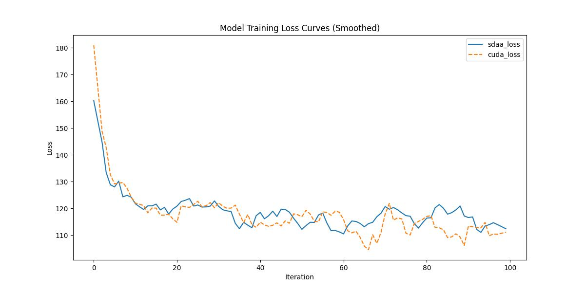

# **Mask2Former**
## 1. 模型概述  
Mask2Former是由Meta AI（FAIR）团队提出（Bowen Cheng等）通用图像分割架构，统一支持语义/实例/全景分割任务，解决复杂场景下小目标分割难题。该团队提出掩码注意力机制：替换标准交叉注意力，强制查询向量聚焦目标区域，提升小物体识别；多尺度特征优化：引入高分辨率特征细化模块，增强边界细节；高效训练策略：采用加权损失函数平衡多尺度预测误差。实验结果：在Cityscapes语义分割任务中mIoU达62.4%（比MaskFormer高4.3%），COCO全景分割PQ提升4.1%，推理速度加快18%（论文）。
> **论文链接**：https://arxiv.org/abs/2112.01527  
> **仓库链接**：https://github.com/open-mmlab/mmsegmentation/tree/main/configs/mask2former  

## 2. 快速开始  
使用本模型执行训练的主要流程如下：  
1. 基础环境安装：介绍训练前需要完成的基础环境检查和安装。  
2. 获取数据集：介绍如何获取训练所需的数据集。  
3. 构建环境：介绍如何构建模型运行所需要的环境。  
4. 启动训练：介绍如何运行训练。  

### 2.1 基础环境安装  

请参考基础环境安装章节，完成训练前的基础环境检查和安装。  

### 2.2 准备数据集  
> 下载数据集到指定文件夹：```/data/teco-data/ade/```  
> 数据集下载链接：https://data.csail.mit.edu/places/ADEchallenge/ADEChallengeData2016.zip  
> 解压数据集：```unzip /data/teco-data/ade/ADEChallengeData2016.zip -d /data/teco-data/ade/```   


### 2.3 构建环境

所使用的环境下已经包含PyTorch框架虚拟环境  
1. 执行以下命令，启动虚拟环境。  
    ```
    conda activate torch_env  
    ```
2. 安装python依赖  
    ```
    cd <ModelZoo_path>/PyTorch/contrib/Segmentation/Mask2Former
	pip install  -U openmim 
    pip install git+https://gitee.com/xiwei777/mmengine_sdaa.git 
    pip install opencv_python mmcv==2.1.0 --no-deps
    mim install -e .
    pip install -r requirements.txt
    ```
### 2.4 启动训练  
1. 在构建好的环境中，进入训练脚本所在目录。  
    ```
    cd <ModelZoo_path>/PyTorch/contrib/Segmentation/Mask2Former/run_scripts
    ```

2. 运行训练。该模型支持单机单卡。

    -  单机单卡
    ```
   python run_maskformer.py   ../configs/mask2former/mask2former_r50_8xb2-160k_ade20k-512x512.py \
    --launcher pytorch \
    --cfg-options "train_dataloader.dataset.data_root=/data/teco-data/ade/ADEChallengeData2016" "val_dataloader.dataset.data_root=/data/teco-data/ade/ADEChallengeData2016" "train_cfg.max_iters=100" \
     2>&1 | tee sdaa.log
   ```
    更多训练参数参考[README](run_scripts/README.md)

### 2.5 训练结果
输出训练loss曲线及结果（参考使用[loss.py](./run_scripts/loss.py)）: 


MeanRelativeError: 0.015846947914275326
MeanAbsoluteError: 1.0727244567871095
Rule,mean_relative_error 0.015846947914275326
pass mean_relative_error=0.015846947914275326 <= 0.05 or mean_absolute_error=1.0727244567871095 <= 0.0002
