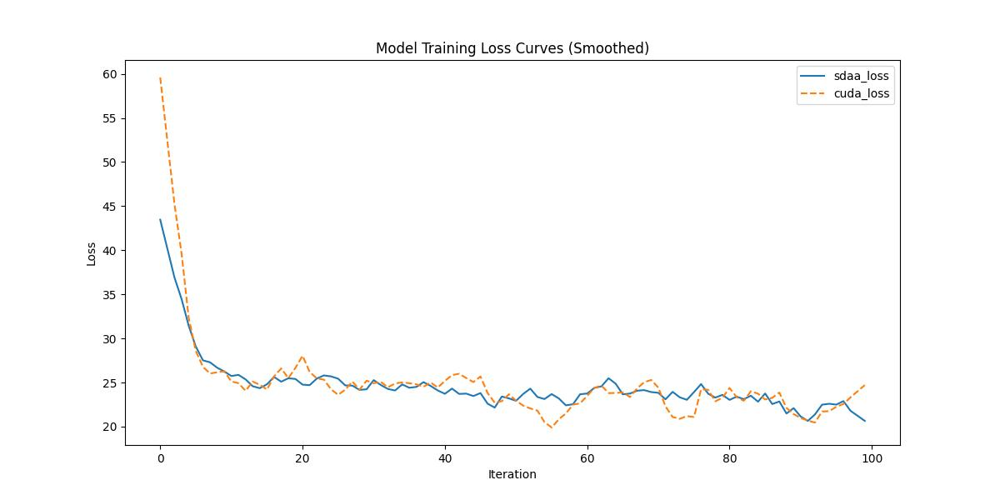

# **MaskFormer**
## 1. 模型概述  
MaskFormer是由Meta AI（FAIR）团队提出（Bowen Cheng等）在统一掩码分类框架，颠覆传统逐像素分类范式，实现语义/实例/全景分割三任务统一建模。该团队提出掩码分类机制：将分割任务转化为N个二值掩码预测与类别分配；Transformer解码器：通过可学习查询向量动态生成掩码特征；多尺度特征解耦：并行处理全局语义与局部细节。实验结果：在ADE20K语义分割任务中mIoU达58.1%（比逐像素模型高4.2%），全景分割PQ指标提升3.9%，支持多任务端到端训练。
> **论文链接**：https://arxiv.org/abs/2107.06278  
> **仓库链接**：https://github.com/open-mmlab/mmsegmentation/tree/main/configs/maskformer  

## 2. 快速开始  
使用本模型执行训练的主要流程如下：  
1. 基础环境安装：介绍训练前需要完成的基础环境检查和安装。  
2. 获取数据集：介绍如何获取训练所需的数据集。  
3. 构建环境：介绍如何构建模型运行所需要的环境。  
4. 启动训练：介绍如何运行训练。  

### 2.1 基础环境安装  

请参考基础环境安装章节，完成训练前的基础环境检查和安装。  

### 2.2 准备数据集  
> 下载数据集到指定文件夹：```/data/teco-data/ade/```  
> 数据集下载链接：https://data.csail.mit.edu/places/ADEchallenge/ADEChallengeData2016.zip  
> 解压数据集：```unzip /data/teco-data/ade/ADEChallengeData2016.zip -d /data/teco-data/ade/```   


### 2.3 构建环境

所使用的环境下已经包含PyTorch框架虚拟环境  
1. 执行以下命令，启动虚拟环境。  
    ```
    conda activate torch_env  
    ```
2. 安装python依赖  
    ```
    cd <ModelZoo_path>/PyTorch/contrib/Segmentation/MaskFormer
	pip install  -U openmim 
    pip install git+https://gitee.com/xiwei777/mmengine_sdaa.git 
    pip install opencv_python mmcv==2.1.0 --no-deps
    mim install -e .
    pip install -r requirements.txt
    ```
### 2.4 启动训练  
1. 在构建好的环境中，进入训练脚本所在目录。  
    ```
    cd <ModelZoo_path>/PyTorch/contrib/Segmentation/MaskFormer/run_scripts
    ```

2. 运行训练。该模型支持单机单卡。

    -  单机单卡
    ```
   python run_maskformer.py   ../configs/maskformer/maskformer_r50-d32_8xb2-160k_ade20k-512x512.py \
    --launcher pytorch \
    --cfg-options "train_dataloader.dataset.data_root=/data/teco-data/ade/ADEChallengeData2016" "val_dataloader.dataset.data_root=/data/teco-data/ade/ADEChallengeData2016" "train_cfg.max_iters=100" \
     2>&1 | tee sdaa.log
   ```
    更多训练参数参考[README](run_scripts/README.md)

### 2.5 训练结果
输出训练loss曲线及结果（参考使用[loss.py](./run_scripts/loss.py)）: 


MeanRelativeError: 0.010836834695985096
MeanAbsoluteError: -0.3247330665588379
Rule,mean_absolute_error -0.3247330665588379
pass mean_relative_error=0.010836834695985096 <= 0.05 or mean_absolute_error=-0.3247330665588379 <= 0.0002
