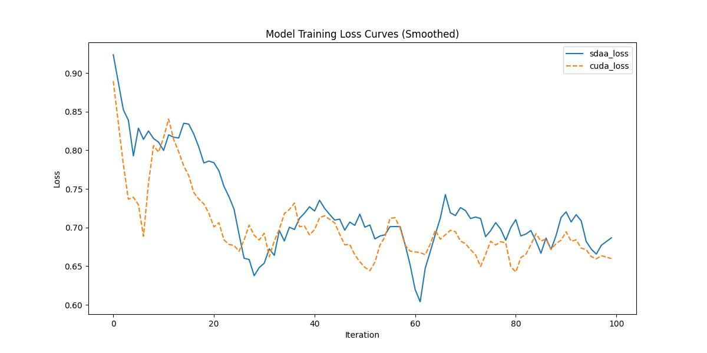

# **R2U-Net**
## 1. 模型概述  
R2U-Net通过融合**循环卷积（RCNN）**与**残差学习**改进U-Net架构，解决医学图像中边缘模糊和小目标分割难题。其核心采用**递归残差块**，在单层内多次循环优化特征提取，增强空间上下文建模能力；结合改进的跳跃连接传递多尺度循环特征，有效保留低级细节并提升边界精度。该模型在视网膜血管、肝脏肿瘤等分割任务中显著优于原U-Net（如DRIVE数据集Dice系数提升约3%），广泛应用于器官分割、病灶检测及细胞图像分析领域。 
> **论文链接**：[Recurrent Residual Convolutional Neural Network based on U-Net (R2U-Net) for Medical Image Segmentation](https://arxiv.org/abs/1802.06955)  
> **仓库链接**：https://github.com/LeeJunHyun/Image_Segmentation   

## 2. 快速开始  
使用本模型执行训练的主要流程如下：  
1. 基础环境安装：介绍训练前需要完成的基础环境检查和安装。  
2. 获取数据集：介绍如何获取训练所需的数据集。  
3. 构建环境：介绍如何构建模型运行所需要的环境。  
4. 启动训练：介绍如何运行训练。  

### 2.1 基础环境安装  

请参考基础环境安装章节，完成训练前的基础环境检查和安装。  

### 2.2 准备数据集  
#### 2.2.1 获取数据集  
> 下载训练数据到指定文件夹：```/data/teco-data/ISIC2018```。  
> 训练数据链接： https://isic-challenge-data.s3.amazonaws.com/2018/ISIC2018_Task1-2_Training_Input.zip。  

> 下载GT数据到指定文件夹：```/data/teco-data/ISIC2018```  
> GT数据链接： https://isic-challenge-data.s3.amazonaws.com/2018/ISIC2018_Task1_Training_GroundTruth.zip  

#### 2.2.2 处理数据集  
> 解压训练数据：```unzip /data/teco-data/ISIC2018/ISIC2018_Task1-2_Training_Input.zip -d /data/teco-data/ISIC2018```   
> 解压GT数据：```unzip /data/teco-data/ISIC2018/ISIC2018_Task1_Training_GroundTruth.zip -d /data/teco-data/ISIC2018```   
> 解压后的文件结构应该为：```/data/teco-data/ISIC2018/ISIC2018_Task1-2_Training_Input``` | ```/data/teco-data/ISIC2018/ISIC2018_Task1_Training_GroundTruth```  
> 处理数据集：``` python dataset.py ```


### 2.3 构建环境

所使用的环境下已经包含PyTorch框架虚拟环境  
1. 执行以下命令，启动虚拟环境。  
    ```
    conda activate torch_env  
    ```
2. 安装python依赖  
    ```
    cd <ModelZoo_path>/PyTorch/contrib/Segmentation/R2U_Net
	pip install -r requirements.txt
    ```
### 2.4 启动训练  
1. 在构建好的环境中，进入训练脚本所在目录。  
    ```
    cd <ModelZoo_path>/PyTorch/contrib/Segmentation/R2U_Net/run_scripts
    ```

2. 运行训练。该模型支持单机单卡。

    -  单机单卡
    ```
   python run_R2U_Net.py \
    --model_type R2U_Net \
    --cuda_idx 0 \
    --nproc_per_node 1 \
    2>&1 | tee $log_file
    
   ```
    更多训练参数参考[README](run_scripts/README.md)

### 2.5 训练结果
输出训练loss曲线及结果（参考使用[loss.py](./run_scripts/loss.py)）: 



MeanRelativeError: 0.012959141150718848
MeanAbsoluteError: 0.00530421257019043
Rule,mean_absolute_error 0.00530421257019043
pass mean_relative_error=0.012959141150718848 <= 0.05 or mean_absolute_error=0.00530421257019043 <= 0.0002
