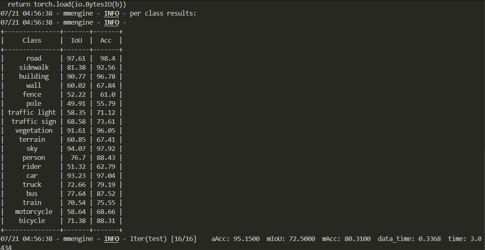
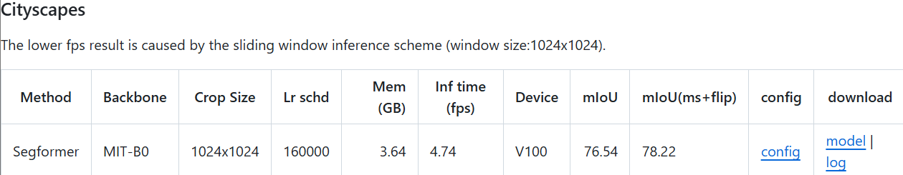

# SegFormer

## 1. 模型概述

SegFormer 是一种基于 Transformer 的高效图像分割模型，主要用于解决语义分割任务。该模型将 Transformer 强大的建模能力与深度卷积神经网络的高效性相结合，解决了传统卷积神经网络在处理图像分割时计算开销和细节丧失的问题。SegFormer 采用了多尺度特征融合的方法，使其在处理多尺寸目标时更加高效，同时具有较低的计算开销。

- 论文链接：[SegFormer: Simple and Efficient Design for Semantic Segmentation with Transformer](https://arxiv.org/abs/2105.15203)
- 仓库链接：https://github.com/segformer/SegFormer

## 2. 快速开始

使用本模型执行训练的主要流程如下：

1. 基础环境安装：介绍训练前需要完成的基础环境检查和安装。
2. 获取数据集：介绍如何获取训练所需的数据集。
3. 构建环境：介绍如何构建模型运行所需要的环境。
4. 启动训练：介绍如何运行训练。

### 2.1 基础环境安装

在开始训练之前，请确保你已经安装了以下基础环境：

- Python 3.6+
- PyTorch 1.7.0+
- torchvision 0.8.2+
- other dependencies（请参考`requirements.txt`）

执行以下命令安装所需的 Python 依赖：

```
bash
pip install -r requirements.txt
```

### 2.2 准备数据集

#### 2.2.1 获取数据集

SegFormer 使用 **ADE20K** 或 **Cityscapes** 数据集进行训练。你可以从以下链接下载数据集：

- **ADE20K**：[ADE20K dataset](https://groups.csail.mit.edu/vision/datasets/ADE20K/)
- **Cityscapes**：[Cityscapes dataset](https://www.cityscapes-dataset.com/)

#### 2.2.2 处理数据集

根据你选择的数据集，需要对数据进行一定的预处理。数据应组织为标准的文件夹结构，以便模型训练：

```
<dataset_root>/
    ├── train/
    ├── val/
    ├── test/
```

### 2.3 构建环境

为了构建环境，你可以使用 **conda** 创建一个虚拟环境，并安装必要的依赖。

1. 创建并激活虚拟环境：

   ```
   conda create -n segformer python=3.8
   conda activate segformer
   ```

2. 安装 PyTorch 和其他依赖：

   ```
   pip3 install  -U openmim 
   pip3 install git+https://gitee.com/xiwei777/mmengine_sdaa.git 
   pip install opencv-python==4.7.0.72
   pip install "mmcv==2.1.0"
   mim install -e .
   pip install -r requirements.txt
   pip3 install numpy==1.24.3
   ```

### 2.4 启动训练

1. 在构建好的环境中，进入训练脚本所在目录：

   ```
   cd <SegFormer_path>/train
   ```

2. 运行训练脚本。以下命令启动单机训练：

   ```
   python run_segformer.py --config ../configs/segformer/segformer_mit-b0_8xb1-160k_cityscapes-1024x1024.py \
       --launcher pytorch --nproc-per-node 4 --amp \
       --cfg-options "train_dataloader.dataset.data_root=<data_path>" "val_dataloader.dataset.data_root=<data_path>" 2>&1 | tee sdaa.log
   
   ```

   更多训练参数可以在 `train.py` 脚本中进行修改和查看。

### 2.5 训练结果

训练结束后，模型会输出训练的损失曲线以及性能评估结果。你可以通过查看 `logs` 文件夹中的日志文件来了解训练进度。



