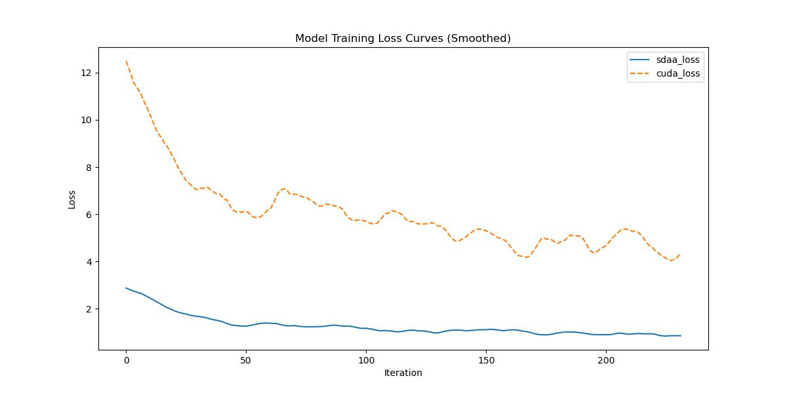

# CGNet

## 1. 模型概述 (Model Overview)

CGNet（Context Guided Network）是由 Wu Tianyi 等人于 2020 年提出的轻量级语义分割网络。通过引入上下文引导块（Context Guided Block, CG block），CGNet 能够联合学习局部特征和周围上下文信息，并结合全局上下文进一步提升特征表达能力。该模型专为资源受限的设备（如移动设备）设计，具有参数少、内存占用低的优势，同时保持较高的分割精度。

- **Paper Link**: [1811.08201] CGNet: A Light-weight Context Guided Network for Semantic Segmentation
- **Repository Link**: [wutianyiRosun/CGNet](https://github.com/wutianyiRosun/CGNet)

------

## 2. 快速开始 (Quick Start)

使用 CGNet 执行训练的主要流程如下：

1. **基础环境安装**：介绍训练前需要完成的基础环境检查和安装。
2. **获取数据集**：介绍如何获取训练所需的数据集。
3. **构建环境**：介绍如何构建模型运行所需要的环境。
4. **启动训练**：介绍如何运行训练。

------

### 2.1 基础环境安装 (Install Base Environment)

请参考基础环境安装章节，完成训练前的基础环境检查和安装。

------

### 2.2 准备数据集 (Prepare Dataset)

#### 2.2.1 获取数据集 (Acquire Dataset)

CGNet 使用 **Cityscapes** 和 **CamVid** 数据集进行训练和评估。这些数据集为开源数据集，可从以下链接下载：

- **Cityscapes**: [Cityscapes Dataset](https://www.cityscapes-dataset.com/)
- **CamVid**: [CamVid Dataset](http://mi.eng.cam.ac.uk/research/projects/VideoRec/CamVid/)

#### 2.2.2 处理数据集 (Process Dataset)

具体的数据集处理步骤可参考官方仓库的说明：[CGNet GitHub](https://github.com/wutianyiRosun/CGNet)。通常包括解压数据集、调整目录结构以及生成训练/验证分割文件。

------

### 2.3 构建环境 (Build Environment)

所使用的环境下已经包含 PyTorch 框架虚拟环境。执行以下命令：

1. **激活虚拟环境**：

   ```
   conda activate torch_env
   ```

2. **安装 Python 依赖**

   ```
   pip install -r requirements.txt
   ```

3. **设置环境变量**（如适用）：

   ```
   export CUDA_VISIBLE_DEVICES=0
   ```

------

### 2.4 启动训练 (Start Training)

1. **进入训练脚本目录**：

   ```
   cd <ModelZoo_path>/PyTorch/contrib/Segmentation/cgnet/run_scripts
   ```

2. **运行训练**：
    CGNet 支持单机单卡训练。使用以下命令启动：

   ```
   python run_cgnet.py --config ../configs/cgnet/cgnet_fcn_4xb4-60k_cityscapes-680x680.py\
       --launcher pytorch --nproc-per-node 4 --amp
   ```

   更多训练参数（如 crop size、学习率调度等）参考 `train.py` 中的说明。

### 2.5 训练结果



MeanRelativeError: -0.7833294054643908
MeanAbsoluteError: -5.727658
Rule,mean_absolute_error -5.727658
pass mean_relative_error=-0.7833294054643908 <= 0.05 or mean_absolute_error=-5.727658 <= 0.0002
