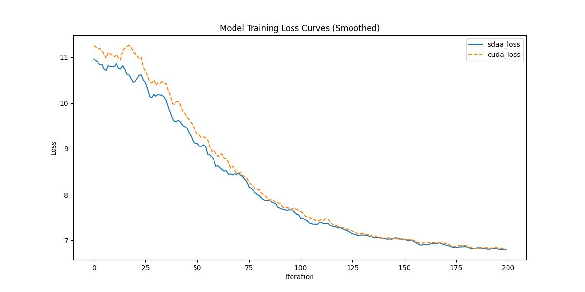

# **ContentVec**
## 1. 模型概述  
ContentVec由钱凯智、张阳、常世宇等（合作机构：MIT/UIUC/字节跳动）提出，是一种基于说话人分离的语音自监督学习模型。其核心创新在于改进HuBERT框架，引入说话人分离正则化机制：通过约束教师标签与学习到的表征，有效剥离说话人身份信息的同时最大程度保留语音内容。该方法在音素识别（TIMIT上PER降低2.1%）、语音识别（LibriSpeech上WER相对下降5.3%）等下游任务中均取得显著提升，且无需额外数据或参数，证明了说话人分离对语音内容表征学习的积极影响。
> **论文链接**：https://proceedings.mlr.press/v162/qian22b.html  
> **仓库链接**：https://github.com/auspicious3000/contentvec  

## 2. 快速开始  
使用本模型执行训练的主要流程如下：  
1. 基础环境安装：介绍训练前需要完成的基础环境检查和安装。  
2. 获取数据集：介绍如何获取训练所需的数据集。  
3. 构建环境：介绍如何构建模型运行所需要的环境。  
4. 启动训练：介绍如何运行训练。  

### 2.1 基础环境安装  

请参考基础环境安装章节，完成训练前的基础环境检查和安装。  

### 2.2 准备数据集  
> 下载数据集到指定文件夹：```/data/teco-data/LibriSpeech/```  
> 数据集下载链接：
```
https://ibm.box.com/s/zeyr94mkfs2g896oug31ml0gxv5ny43y
http://www.openslr.org/resources/12/dev-clean.tar.gz
http://www.openslr.org/resources/12/dev-other.tar.gz
http://www.openslr.org/resources/12/train-clean-100.tar.gz
http://www.openslr.org/resources/12/train-clean-360.tar.gz
http://www.openslr.org/resources/12/train-other-500.tar.gz
```
> 解压数据集：
```
unzip data.zip
tar -xvf dev-clean.tar.gz
tar -xvf dev-other.tar.gz
tar -xvf train-clean-100.tar.gz
tar -xvf train-clean-360.tar.gz
tar -xvf train-other-500.tar.gz
```
> 将train.tsv与vaild.tsv文件夹内的数据路径改为/data/teco-data/LibriSpeech/LibriSpeech路径   


### 2.3 构建环境

所使用的环境下已经包含PyTorch框架虚拟环境  
1. 执行以下命令，启动虚拟环境。  
    ```
    conda activate torch_env  
    ```
2. 安装python依赖  
    ```
    cd <ModelZoo_path>/PyTorch/contrib/Segmentation/contentvec
    python -m pip install --upgrade pip==24.0
    python -m pip install ninja
    python -m pip install --editable ./
    python setup.py build_ext --inplace    
    python -m pip install scipy
    python -m pip install soundfile
    python -m pip install praat-parselmouth
    python -m pip install tensorboardX
    python -m pip install numpy==1.26.4
    ```
### 2.4 启动训练  
1. 在构建好的环境中，进入训练脚本所在目录。  
    ```
    cd <ModelZoo_path>/PyTorch/contrib/Segmentation/contentvec/run_scripts
    ```

2. 运行训练。该模型支持单机单卡。

    -  单机单卡
    ```
    python run_san.py \
    --config_dir ./contentvec/config/contentvec \
    --config_name contentvec \
    --task.data /data/teco-data/LibriSpeech/metadata \
    --task.label_dir /data/teco-data/LibriSpeech/label \
    --task.spk2info /data/teco-data/LibriSpeech/metadata/spk2info.dict \
    --optimization.max_update 200 \
    2>&1 | tee sdaa.log
   ```
    更多训练参数参考[README](run_scripts/README.md)

### 2.5 训练结果
输出训练loss曲线及结果（参考使用[loss.py](./run_scripts/loss.py)）: 


MeanRelativeError: -0.013754749832953612
MeanAbsoluteError: -0.13293
Rule,mean_absolute_error -0.13293
pass mean_relative_error=-0.013754749832953612 <= 0.05 or mean_absolute_error=-0.13293 <= 0.0002
