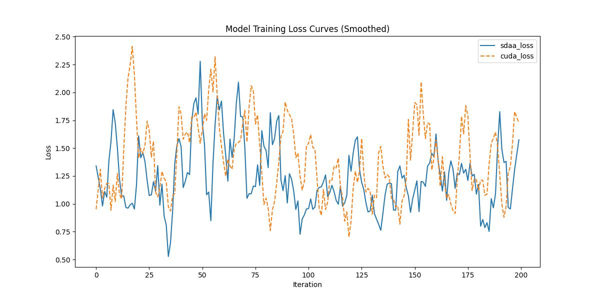

# **Mel-Band-Roformer**
## 1. 模型概述  
Mel-Band-Roformer引入了 BS-RoFormer 模型，该模型在前端继承了 BSRNN 中频带分割方案的思想，然后使用带有旋转位置嵌入 (RoPE) 的分层 Transformer 对频带内和频带间序列进行建模，以进行多频带掩模估计。提出了 Mel-RoFormer，它采用梅尔频带方案，根据梅尔尺度将频点映射到重叠的子带中。相比之下，BSRNN 和 BS-RoFormer 中的频带分割映射是不重叠的，并且基于启发式方法设计。使用 MUSDB18HQ 数据集进行实验，证明 Mel-RoFormer 在人声、鼓声和其他主干的分离任务中优于 BS-RoFormer。
> **论文链接**：https://arxiv.org/abs/2310.01809  
> **仓库链接**：https://github.com/ZFTurbo/Music-Source-Separation-Training  

## 2. 快速开始  
使用本模型执行训练的主要流程如下：  
1. 基础环境安装：介绍训练前需要完成的基础环境检查和安装。  
2. 获取数据集：介绍如何获取训练所需的数据集。  
3. 构建环境：介绍如何构建模型运行所需要的环境。  
4. 启动训练：介绍如何运行训练。  

### 2.1 基础环境安装  

请参考基础环境安装章节，完成训练前的基础环境检查和安装。  

### 2.2 准备数据集  
> 下载数据集到指定文件夹：```/data/teco-data/MUSDB18/```  
> 数据集下载链接：https://zenodo.org/records/1117372/files/musdb18.zip?download=1   
> 解压数据集：``` unzip musdb18.zip```
> 音乐源分离：```python mp42wav.py```   


### 2.3 构建环境

所使用的环境下已经包含PyTorch框架虚拟环境  
1. 执行以下命令，启动虚拟环境。  
    ```
    conda activate torch_env  
    ```
2. 安装python依赖  
    ```
    cd <ModelZoo_path>/PyTorch/contrib/Segmentation/mel_band_roformer
    apt-get install portaudio19-dev
    pip install -r requirements.txt
    ```
### 2.4 启动训练  
1. 在构建好的环境中，进入训练脚本所在目录。  
    ```
    cd <ModelZoo_path>/PyTorch/contrib/Segmentation/mel_band_roformer/run_scripts
    ```

2. 运行训练。该模型支持单机单卡。

    -  单机单卡
    ```
    python run_mel_band_roformer.py     --model_type bs_roformer    --config_path configs/config_musdb18_bs_roformer.yaml     --results_path results/     --data_path '/data/teco-data/MUSDB18-wav/train'     --valid_path /data/teco-data/MUSDB18-wav/test     --num_workers 4     --device_ids 0 2>&1 | tee sdaa.log
   ```
    更多训练参数参考[README](run_scripts/README.md)

### 2.5 训练结果
输出训练loss曲线及结果（参考使用[loss.py](./run_scripts/loss.py)）: 


MeanRelativeError: 0.24962935940805647
MeanAbsoluteError: -0.15329560782015317
Rule,mean_absolute_error -0.15329560782015317
pass mean_relative_error=0.24962935940805647 <= 0.05 or mean_absolute_error=-0.15329560782015317 <= 0.0002
