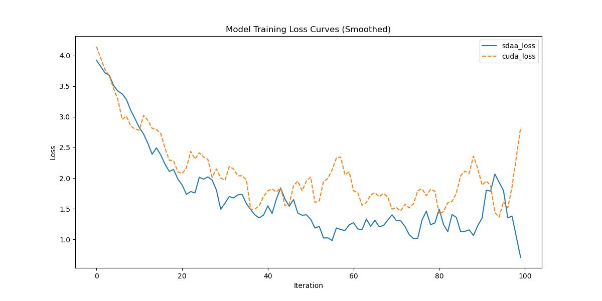

# EncNet
## 1. 模型概述
卷积运算和循环运算都是逐次处理局部邻域的基本操作单元。本文提出了一种通用的非局部操作模块家族，用于捕捉长程依赖关系。受计算机视觉中经典非局部均值方法的启发，我们的非局部操作通过计算所有位置特征的加权和来生成当前位置的响应。这一基础模块可灵活嵌入多种计算机视觉架构中。
- 论文链接：[Non-local Neural Networks](https://arxiv.org/abs/1711.07971)
- 仓库链接：[https://github.com/open-mmlab/mmsegmentation/tree/main/configs/nonlocal_net](https://github.com/open-mmlab/mmsegmentation/tree/main/configs/nonlocal_net)

1.基础环境安装：介绍训练前需要完成的基础环境检查和安装。

2.获取数据集：介绍如何获取训练所需的数据集。

3.构建环境：介绍如何构建模型运行所需要的环境。

4.启动训练：介绍如何运行训练。

## 2.1 基础环境安装
请参考基础环境安装章节，完成训练前的基础环境检查和安装。
## 2.2 准备数据集
nonlocal_net使用Cityscapes数据集，该数据集为开源数据集，可从[CityScapes](https://www.cityscapes-dataset.com/login/)下载。
## 2.3 构建环境
所使用的环境下已经包含PyTorch框架虚拟环境。

1. 执行以下命令，启动虚拟环境。 
   ```
   conda activate torch_env
   ```
2. 安装python依赖。
   ```
   pip3 install  -U openmim 
   pip3 install git+https://gitee.com/xiwei777/mmengine_sdaa.git 
   pip3 install opencv_python mmcv --no-deps
   mim install -e .
   pip install -r requirements.txt
   ```
## 2.4 启动训练

1.在构建好的环境中，进入训练脚本所在目录。
   ```
   cd <ModelZoo_path>/PyTorch/contrib/Segmentation/nonlocal_net/run_scripts
   ``` 
2. 运行训练。该模型支持单机单卡。
   ```
   python run_nonlocal.py --config ../configs/nonlocal_net/nonlocal_r50-d8_4xb2-80k_cityscapes-512x1024.py \
    --launcher pytorch --nproc-per-node 1 --amp 2>&1 | tee sdaa.log
   ```
更多训练参数参考 run_scripts/argument.py

## 2.5 训练结果

输出训练loss曲线及结果:



MeanRelativeError: -0.18100843039509773

MeanAbsoluteError: -0.5086312288045883

Rule,mean_absolute_error -0.5086312288045883

pass mean_relative_error=-0.18100843039509773 <= 0.05 or mean_absolute_error=-0.5086312288045883 <= 0.0002
