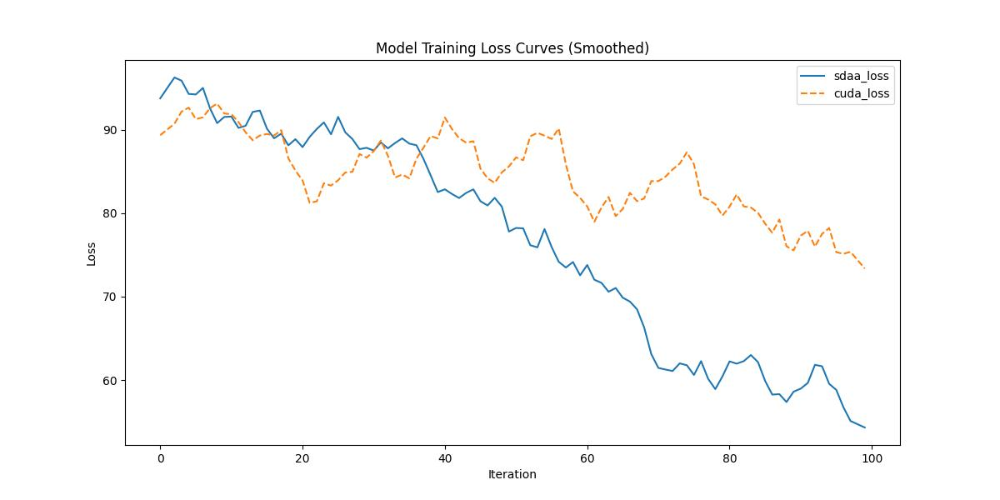

# **SAN**
## 1. 模型概述  
SAN (Side Adapter Network)是一种高效的开放词汇语义分割框架，官方代码集成于OpenMMLab。其核心思想是将分割任务重构为区域识别问题，并创新性地设计了一个连接到冻结CLIP模型的侧网络。该侧网络包含两个解耦分支：一个用于生成掩码候选区域，另一个预测注意力偏差图，后者作用于CLIP模型使其能够识别前者的类别。这种设计使得侧网络极其轻量，仅需少量可训练参数，并能进行端到端训练以生成CLIP感知的掩码。实验结果显示，该方法在多个基准测试中性能显著优于同类方法，且仅需1/18的可训练参数和实现19倍的推理加速，为开放词汇分割研究提供了一个强大而高效的基线方案。
> **论文链接**：https://arxiv.org/abs/2302.12242  
> **仓库链接**：https://github.com/open-mmlab/mmsegmentation/tree/main/configs/san 

## 2. 快速开始  
使用本模型执行训练的主要流程如下：  
1. 基础环境安装：介绍训练前需要完成的基础环境检查和安装。  
2. 获取数据集：介绍如何获取训练所需的数据集。  
3. 构建环境：介绍如何构建模型运行所需要的环境。  
4. 启动训练：介绍如何运行训练。  

### 2.1 基础环境安装  

请参考基础环境安装章节，完成训练前的基础环境检查和安装。  

### 2.2 准备数据集  
> 下载
```
mkdir coco_stuff164k && cd coco_stuff164k
wget http://images.cocodataset.org/zips/train2017.zip
wget http://images.cocodataset.org/zips/val2017.zip
wget http://calvin.inf.ed.ac.uk/wp-content/uploads/data/cocostuffdataset/stuffthingmaps_trainval2017.zip
```
> 解压
```
unzip train2017.zip -d images/
unzip val2017.zip -d images/
unzip stuffthingmaps_trainval2017.zip -d annotations/
```
> 预处理
```
python tools/dataset_converters/coco_stuff164k.py /path/to/coco_stuff164k --nproc 8
```

### 2.3 构建环境

所使用的环境下已经包含PyTorch框架虚拟环境  
1. 执行以下命令，启动虚拟环境。  
    ```
    conda activate torch_env  
    ```
2. 安装python依赖  
    ```
    cd <ModelZoo_path>/PyTorch/contrib/Segmentation/san
	pip install  -U openmim 
    pip install git+https://gitee.com/xiwei777/mmengine_sdaa.git 
    pip install opencv_python mmcv==2.1.0 --no-deps
    mim install -e .
    pip install -r requirements.txt
    ```
### 2.4 启动训练  
1. 在构建好的环境中，进入训练脚本所在目录。  
    ```
    cd <ModelZoo_path>/PyTorch/contrib/Segmentation/san/run_scripts
    ```

2. 运行训练。该模型支持单机单卡。

    -  单机单卡
    ```
    python run_san.py   ../configs/san/san-vit-b16_coco-stuff164k-640x640.py \
    --cfg-options "train_cfg.max_iters=100" \
    --launcher pytorch \
    2>&1 | tee sdaa.log
    
    ```
    更多训练参数参考[README](run_scripts/README.md)

### 2.5 训练结果
输出训练loss曲线及结果（参考使用[loss.py](./run_scripts/loss.py)）: 


MeanRelativeError: -0.09477038849230154
MeanAbsoluteError: -7.902152595520019
Rule,mean_absolute_error -7.902152595520019
pass mean_relative_error=-0.09477038849230154 <= 0.05 or mean_absolute_error=-7.902152595520019 <= 0.0002
