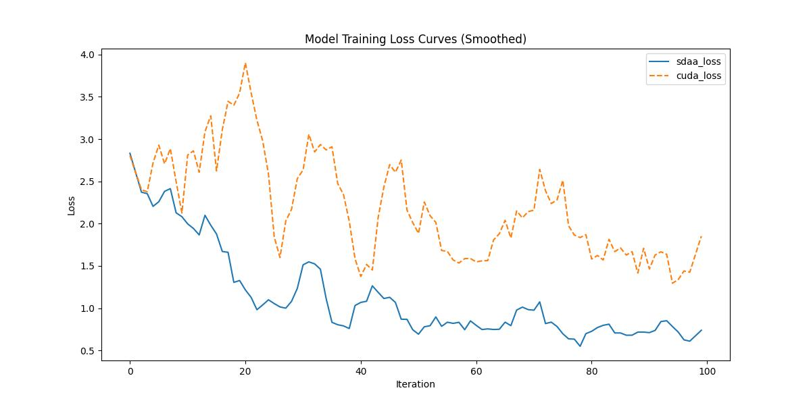

# EncNet
## 1. 模型概述
最新提出的全景分割任务重新激发了学界对统一实例分割（针对物体类别）与语义分割（针对背景类别）这两个任务的兴趣。然而，当前最先进的联合解决方案仍采用相互独立、结构迥异的网络分别处理实例分割和语义分割，未能实现任何计算共享。本研究致力于在架构层面统一这两种任务，设计单一网络完成双重目标。我们的方法是在流行的实例分割框架Mask R-CNN基础上，通过共享特征金字塔网络（FPN）主干，扩展出语义分割分支。令人惊讶的是，这种简单架构不仅保持了优异的实例分割性能，同时还构建了一个轻量且高性能的语义分割方案。本文对这个基于FPN的Mask R-CNN最小扩展版本——我们称之为Panoptic FPN——进行了详尽研究，证明其能作为两项任务的稳健而精确的基准模型。鉴于其卓越性能和概念简洁性，我们希望该方法能成为强有力的基准，推动全景分割领域的后续研究。
- 论文链接：[Panoptic Feature Pyramid Networks](https://arxiv.org/abs/1901.02446)
- 仓库链接：[Code](https://github.com/facebookresearch/detectron2)
## 2. 快速开始
使用本模型执行训练的主要流程如下：
1. 在构建好的环境中，进入训练脚本所在目录。
   ```
   cd <ModelZoo_path>/PyTorch/contrib/Segmentation/sem_fpn/run_scripts
   ```
2. 运行训练。该模型支持单机单卡。
   ```
   python run_encnet.py --config ../configs/sem_fpn/fpn_r50_4xb2-80k_cityscapes-512x1024.py \
    --launcher pytorch --nproc-per-node 1 --amp 2>&1 | tee sdaa.log
   ```
   


MeanRelativeError:-0.504298686442843

MeanAbsoluteError:-1.0190949773788451

Rule,mean absolute error -1.0190949773788451

pass mean relative error=-0.584298686442843 <= 0.05 or mean absolute error=-1.0190949773788451 <= 0.0002