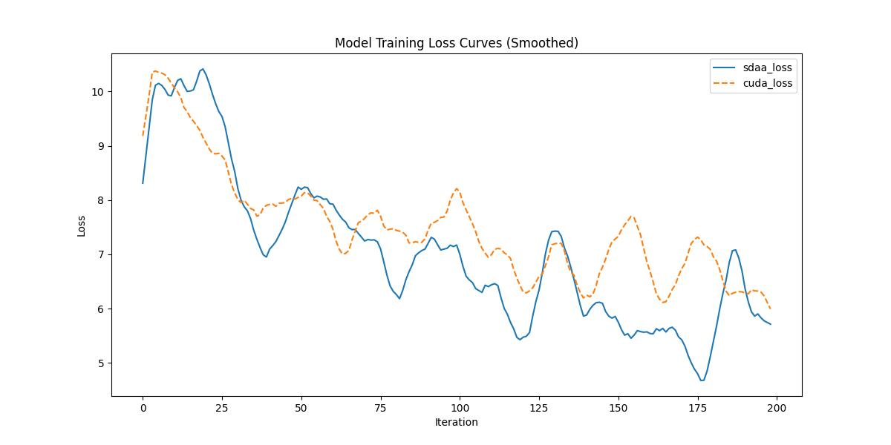

# SETR

## 1. 模型概述

近年来，语义分割大多数方法采用了全卷积网络（FCN）架构，该架构包含编码器-解码器结构。编码器逐步减少空间分辨率，并通过更大的感受野学习更抽象的视觉概念。由于上下文建模在分割任务中的重要性，最新的工作大多集中在通过扩张卷积或插入注意力模块来增大感受野。然而，基于编码器-解码器的FCN架构本身未发生改变。在本文中，我们提出了一个替代视角，将语义分割视为一个序列到序列的预测任务。具体来说，我们采用纯变换器（即不使用卷积和分辨率降维）来将图像编码为一系列补丁。由于变换器的每一层都能建模全局上下文，该编码器可以与一个简单的解码器结合，提供一个强大的分割模型——SEgmentation TRansformer（SETR）。大量实验表明，SETR在ADE20K（50.28% mIoU）、Pascal Context（55.83% mIoU）上达到了新的最先进水平，并在Cityscapes上也取得了具有竞争力的结果。特别地，在提交当天，我们在竞争激烈的ADE20K测试服务器排行榜上位居第一。

- 仓库链接：[官方仓库](https://github.com/fudan-zvg/SETR)

## 2. 快速开始

使用本模型进行训练的主要步骤如下：

1. **基础环境安装**：介绍训练前需要完成的基础环境检查和安装。
2. **获取数据集**：介绍如何获取训练所需的数据集。
3. **构建环境**：介绍如何构建运行模型所需的环境。
4. **启动训练**：介绍如何运行训练。

### 2.1 基础环境安装

请参考基础环境安装章节，完成训练前的基础环境检查和安装。

### 2.2 准备数据集

#### 2.2.1 获取数据集

SETR 使用 **ADE20K** 数据集，ADE20K 的训练和验证集可以从这个 [链接](http://data.csail.mit.edu/places/ADEchallenge/ADEChallengeData2016.zip) 下载。如果需要下载测试数据集，可以在 [官网](http://host.robots.ox.ac.uk/) 注册后，下载 [测试集](http://host.robots.ox.ac.uk:8080/eval/downloads/VOC2010test.tar)。

#### 2.2.2 转换预训练模型

在 `tools` 目录中，openmmlab 提供了一个脚本 [`vit2mmseg.py`](../../tools/model_converters/vit2mmseg.py)，用于将 [timm](https://github.com/rwightman/pytorch-image-models/blob/master/timm/models/vision_transformer.py) 中的模型权重转换为 MMSegmentation 风格。

```
python tools/model_converters/vit2mmseg.py ${PRETRAIN_PATH} ${STORE_PATH}
```

例如：

```
python tools/model_converters/vit2mmseg.py https://github.com/rwightman/pytorch-image-models/releases/download/v0.1-vitjx/jx_vit_large_p16_384-b3be5167.pth pretrain/vit_large_p16.pth
```

此脚本将从 `PRETRAIN_PATH` 转换模型，并将转换后的模型存储在 `STORE_PATH`。

### 2.3 构建环境

该模型使用的环境已包含 PyTorch 框架虚拟环境。

1. 执行以下命令，启动虚拟环境。

   ```
   conda activate torch_env
   ```

2. 安装 Python 依赖。

   ```
   pip install -r requirements.txt
   pip install -e .
   ```

3. 添加环境变量。

   ```
   export TORCH_SDAA_AUTOLOAD=cuda_migrate
   ```

### 2.4 启动训练

1. 在构建好的环境中，进入训练脚本所在目录。

   ```
   cd <ModelZoo_path>/PyTorch/contrib/Segmentation/setr/run_scripts
   ```

2. 运行训练。该模型支持单机单卡。

   ```
   python run_setr.py --config ../configs/setr/setr_vit-l_naive_8xb2-160k_ade20k-512x512.py --launcher pytorch --nproc-per-node 4 --amp
   ```

   更多训练参数可参考 `run_scripts/argument.py`。

### 2.5 训练结果

输出训练过程的损失曲线及结果（参考使用 [loss.py](./run_scripts/loss.py)）：



- MeanRelativeError: -0.016024786985027767
- MeanAbsoluteError: -0.11713799999999998
- Rule,mean_absolute_error -0.11713799999999998
- pass mean_relative_error=-0.016024786985027767 <= 0.05 or mean_absolute_error=-0.11713799999999998 <= 0.0002