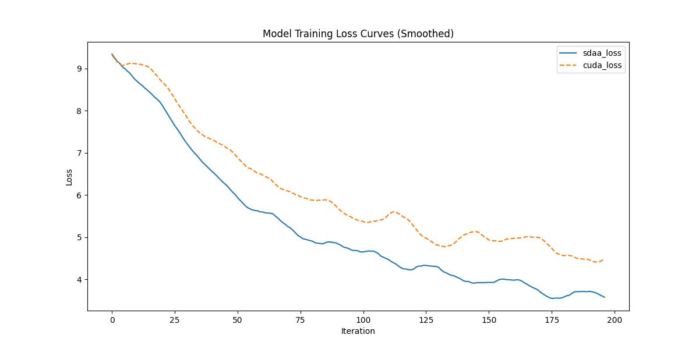

# STDC

## 1. 模型概述

BiSeNet 已被证明是一个广泛使用的双流网络，适用于实时语义分割。然而，它通过添加额外路径来编码空间信息的原理是耗时的，且从预训练任务（如图像分类）借用的骨干网络可能在图像分割任务中效率不高，因为它们缺乏针对任务的设计。为了解决这些问题，我们提出了一种新的高效结构，名为短期密集连接网络（STDC 网络），通过去除结构冗余来优化网络。具体来说，我们逐步减少特征图的维度，并使用它们的聚合来表示图像，这形成了 STDC 网络的基本模块。在解码器中，我们提出了一个细节聚合模块，通过单流的方式将空间信息的学习集成到低层次的特征中。最终，将低层次的特征和深层特征融合，以预测最终的分割结果。我们在 Cityscapes 和 CamVid 数据集上的大量实验验证了我们方法的有效性，展示了分割准确性与推理速度之间的良好平衡。在 Cityscapes 数据集上，我们在测试集上达到了 71.9% 的 mIoU，推理速度为 250.4 FPS（使用 NVIDIA GTX 1080Ti），比最新方法快 45.2%，并且在更高分辨率图像上推理时，取得了 76.8% mIoU 和 97.0 FPS。

- 仓库链接：[官方仓库](https://github.com/MichaelFan01/STDC-Seg)

## 2. 快速开始

使用本模型进行训练的主要步骤如下：

1. **基础环境安装**：介绍训练前需要完成的基础环境检查和安装。
2. **获取数据集**：介绍如何获取训练所需的数据集。
3. **构建环境**：介绍如何构建运行模型所需的环境。
4. **启动训练**：介绍如何运行训练。

### 2.1 基础环境安装

请参考基础环境安装章节，完成训练前的基础环境检查和安装。

### 2.2 准备数据集

#### 2.2.1 获取数据集

STDC 使用 **Cityscapes** 数据集，Cityscapes 的训练和验证集可以从这个 [链接](https://www.cityscapes-dataset.com/downloads/) 下载。

#### 2.2.2 转换预训练模型

在 `tools` 目录中，openmmlab 提供了一个脚本 [`stdc2mmseg.py`](../../tools/model_converters/stdc2mmseg.py)，用于将 [官方仓库](https://github.com/MichaelFan01/STDC-Seg) 中的模型权重转换为 MMSegmentation 风格。

```
python tools/model_converters/stdc2mmseg.py ${PRETRAIN_PATH} ${STORE_PATH} ${STDC_TYPE}
```

例如：

```
python tools/model_converters/stdc2mmseg.py ./STDCNet813M_73.91.tar ./pretrained/stdc1.pth STDC1

python tools/model_converters/stdc2mmseg.py ./STDCNet1446_76.47.tar ./pretrained/stdc2.pth STDC2
```

此脚本将从 `PRETRAIN_PATH` 转换模型，并将转换后的模型存储在 `STORE_PATH`。

### 2.3 构建环境

该模型使用的环境已包含 PyTorch 框架虚拟环境。

1. 执行以下命令，启动虚拟环境：

   ```
   cona activate 
   ```

2. 安装 Python 依赖：

   ```
   pip install -r requirements.txt
   pip install -e .
   ```

3. 添加环境变量：

   ```
   export TORCH_SDAA_AUTOLOAD=cuda_migrate
   ```

### 2.4 启动训练

1. 在构建好的环境中，进入训练脚本所在目录：

   ```
   cd <ModelZoo_path>/PyTorch/contrib/Segmentation/stdc/run_scripts
   ```
   
2. 运行训练。该模型支持单机单卡：

   ```
   python run_stdc.py --config ../configs/stdc/stdc1_4xb12-80k_cityscapes-512x1024.py \
       --launcher pytorch --nproc-per-node 4 --amp
   ```

   更多训练参数可参考 `run_scripts/argument.py`。

### 2.5 训练结果

输出训练过程的损失曲线及结果（参考使用 [loss.py](./run_scripts/loss.py)）：



- MeanRelativeError: -0.10834122923159355
- MeanAbsoluteError: -0.7188399999999998
- Rule,mean_absolute_error -0.7188399999999998
- pass mean_relative_error=-0.10834122923159355 <= 0.05 or mean_absolute_error=-0.7188399999999998 <= 0.0002