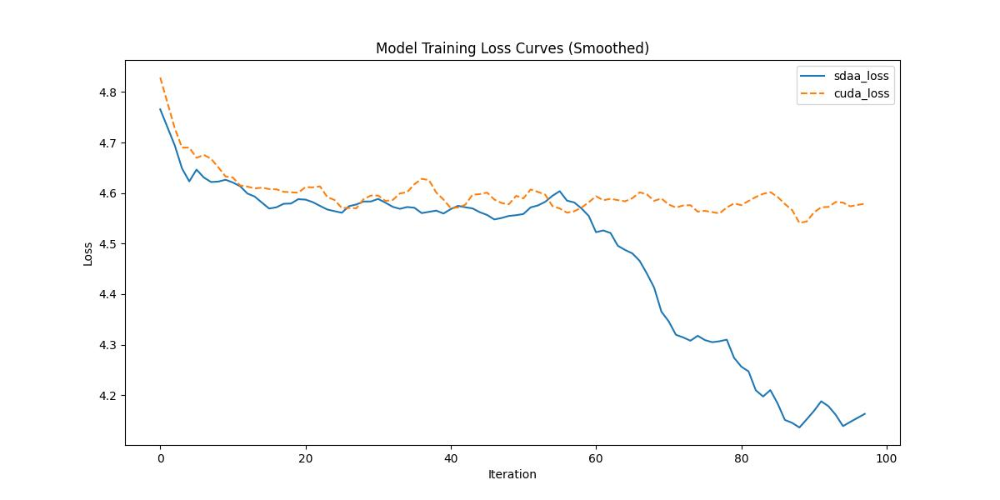

# **hubert**
## 1. 模型概述  
hubert由 Benjamin van Niekerk 等人提出，主要用于语音转换任务中提取内容编码器（content encoder）。它基于 HuBERT 网络架构，将连续语音信号转换为“软单位”（soft units）或“离散单位”（discrete units），从而支持语音内容的高质量编码。核心创新在于对比“离散语音单位”与“软语音单位”两种表征方式，将其应用于语音转换，从而提升转换语音的可懂度与自然度。
> **论文链接**：https://ieeexplore.ieee.org/abstract/document/9746484
> **仓库链接**：https://github.com/bshall/hubert  

## 2. 快速开始  
使用本模型执行训练的主要流程如下：  
1. 基础环境安装：介绍训练前需要完成的基础环境检查和安装。  
2. 获取数据集：介绍如何获取训练所需的数据集。  
3. 构建环境：介绍如何构建模型运行所需要的环境。  
4. 启动训练：介绍如何运行训练。  

### 2.1 基础环境安装  

请参考基础环境安装章节，完成训练前的基础环境检查和安装。  

### 2.2 准备数据集  

### Step 1: Dataset Preparation

Download and extract the [LibriSpeech](https://www.openslr.org/12) corpus. The training script expects the following tree structure for the dataset directory:

```
│   lengths.json
│
└───wavs
    ├───dev-*
    │   ├───84
    │   ├───...
    │   └───8842
    └───train-*
        ├───19
        ├───...
        └───8975
```

The `train-*` and `dev-*` directories should contain the training and validation splits respectively. Note that there can be multiple `train` and `dev` folders e.g., `train-clean-100`, `train-other-500`, etc. Finally, the `lengths.json` file should contain key-value pairs with the file path and number of samples:

```json
{
    "dev-clean/1272/128104/1272-128104-0000": 93680,
    "dev-clean/1272/128104/1272-128104-0001": 77040,
}
```

### Step 2: Extract Discrete Speech Units

Encode LibriSpeech using the HuBERT-Discrete model and `encode.py` script:

```
usage: encode.py [-h] [--extension EXTENSION] {soft,discrete} in-dir out-dir

Encode an audio dataset.

positional arguments:
  {soft,discrete}       available models (HuBERT-Soft or HuBERT-Discrete)
  in-dir                path to the dataset directory.
  out-dir               path to the output directory.

optional arguments:
  -h, --help            show this help message and exit
  --extension EXTENSION
                        extension of the audio files (defaults to .flac).
```

for example:

```
python encode.py discrete path/to/LibriSpeech/wavs path/to/LibriSpeech/discrete
```

At this point the directory tree should look like:

```
│   lengths.json
│
├───discrete
│   ├───...
└───wavs
    ├───...
```

### 2.3 构建环境

所使用的环境下已经包含PyTorch框架虚拟环境  
1. 执行以下命令，启动虚拟环境。  
    ```
    conda activate torch_env  
    ```
2. 安装python依赖  
    ```
    cd <ModelZoo_path>/PyTorch/contrib/Speech/hubert/
    pip install -r requirements.txt
    ```
### 2.4 启动训练  
1. 在构建好的环境中，进入训练脚本所在目录。  
    ```
    cd <ModelZoo_path>/PyTorch/contrib/Speech/hubert/run_scripts
    ```

2. 运行训练。该模型支持单机单卡。

    -  单机单卡
    ```
    python run_hubert.py \
    "/data/teco-data/hubert/LibriSpeech" \
    "./checkpoint/" \ 
     2>&1 | tee sdaa.log
   ```
    更多训练参数参考[README](run_scripts/README.md)

### 2.5 训练结果
输出训练loss曲线及结果（参考使用[loss.py](./run_scripts/loss.py)）: 


MeanRelativeError: -0.02738993136044763
MeanAbsoluteError: -0.12567663192749023
Rule,mean_absolute_error -0.12567663192749023
pass mean_relative_error=-0.02738993136044763 <= 0.05 or mean_absolute_error=-0.12567663192749023 <= 0.0002
